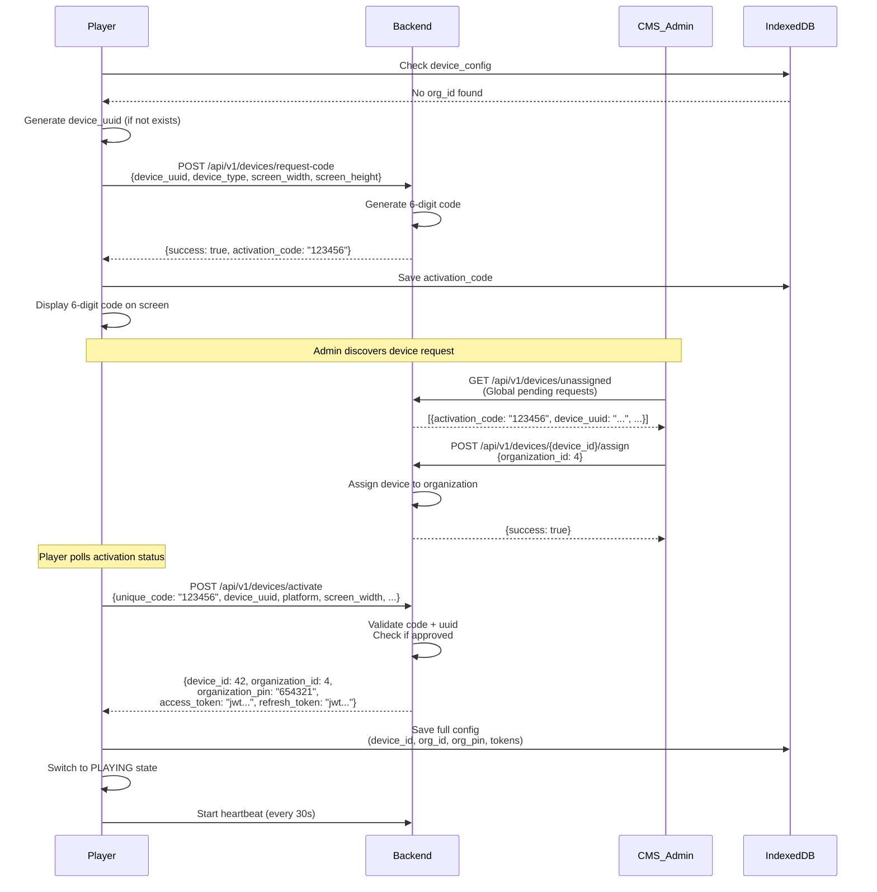
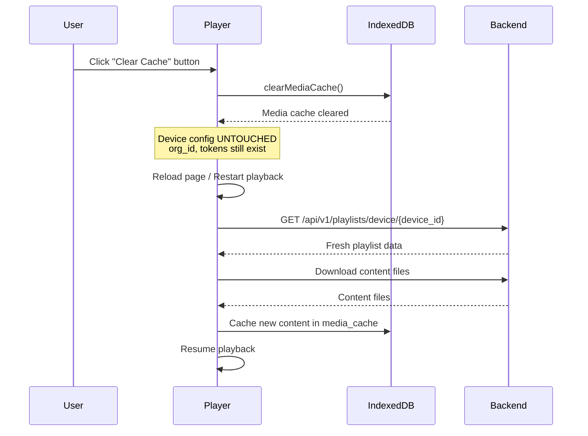
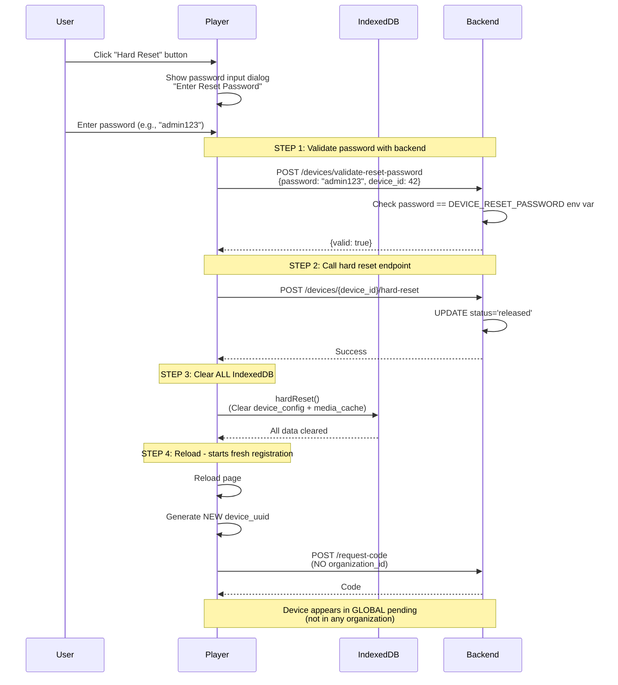
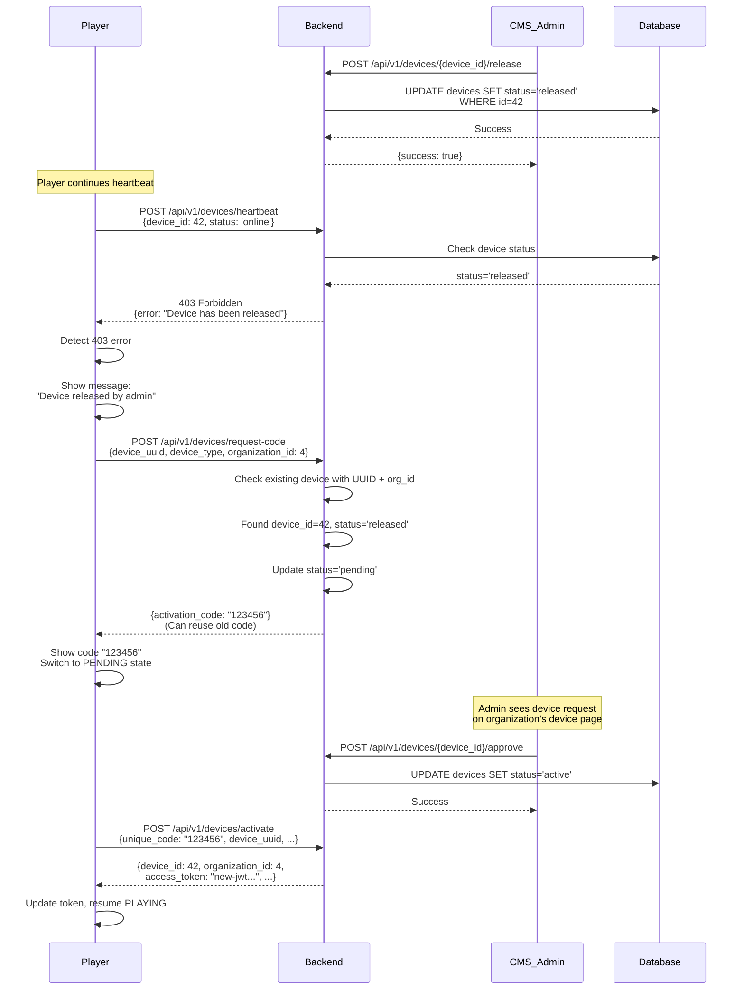
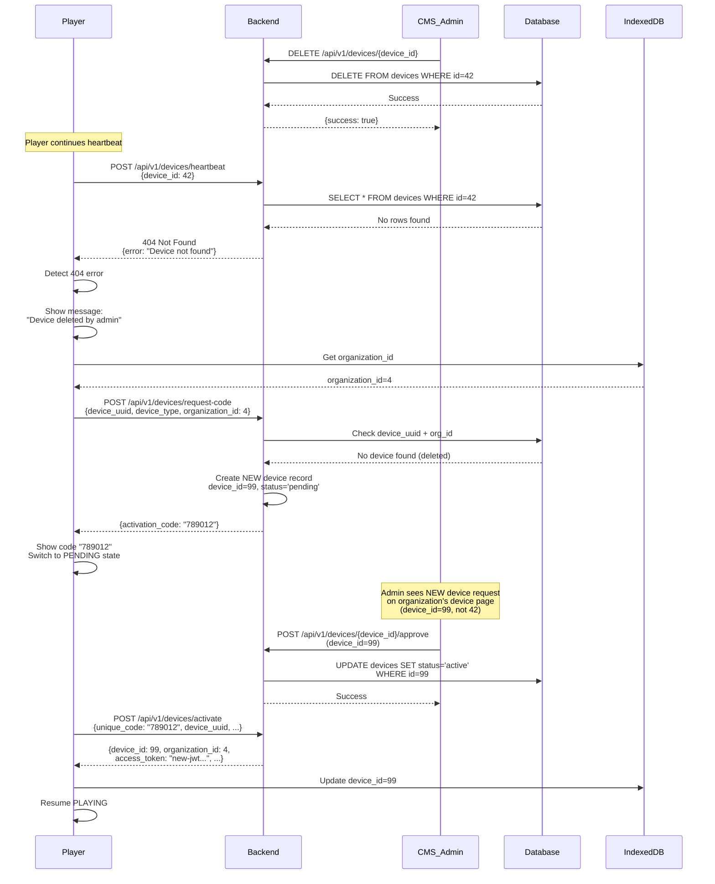
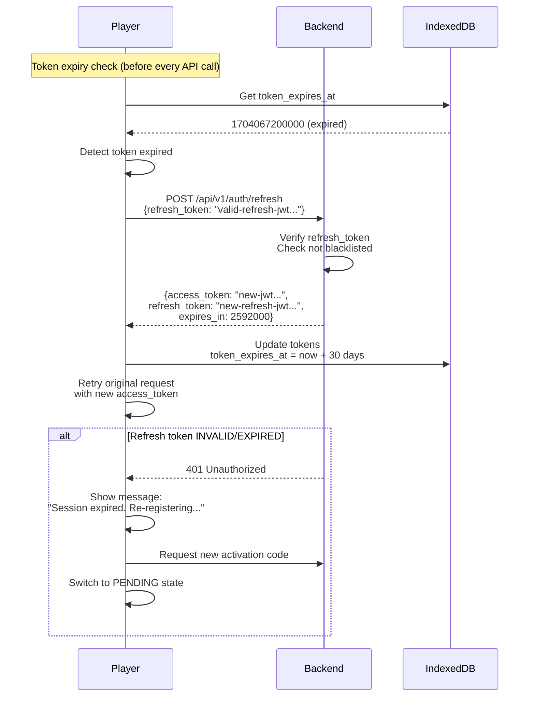
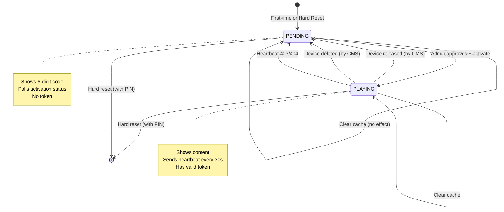

# Device Flow Documentation
## Comprehensive Reference for Player-Backend Integration

**Version**: 2.0 (CORRECTED)
**Date**: 2025-01-14
**Author**: System Documentation
**Status**: Reference Implementation Guide
**Last Update**: Hard Reset & Release flows corrected

---

## Table of Contents

1. [Overview](#overview)
2. [Storage Strategy](#storage-strategy)
3. [Flow Scenarios](#flow-scenarios)
4. [Backend API Specifications](#backend-api-specifications)
5. [Player Implementation](#player-implementation)
6. [CMS UI Specifications](#cms-ui-specifications)
7. [State Transitions](#state-transitions)
8. [Security Considerations](#security-considerations)
9. [Error Handling](#error-handling)

---

## Overview

### Core Concepts

This document defines the authoritative device management flow for the Smart TV Digital Signage system, clarifying the relationship between player devices, backend API, and CMS admin interface.

**Key Principles**:
- **Persistent Storage**: IndexedDB (NOT localStorage) - survives browser cache clear
- **Multi-Tenant**: Organization-based device isolation
- **Token Lifecycle**: 30-day JWT with automatic refresh
- **Organization PIN**: 6-digit password for hard reset protection
- **Device States**: PENDING (showing code) vs PLAYING (showing content)

### Terminology

| Term | Definition |
|------|------------|
| **Hard Reset (Factory Reset)** | Password-protected action that clears ALL IndexedDB data + backend sets status='released'. Device re-registers to GLOBAL pending (no org). |
| **Clear Cache** | Clears media/content cache only, preserves org_id, tokens, and all device config. |
| **CMS Release Device (Soft Release)** | Admin action in CMS - backend sets status='released', player clears tokens but KEEPS org_id. Device re-registers to SAME org pending. |
| **Delete Device** | CMS action - device record removed from CMS database completely. |
| **Reset Password** | Single password (env var) validated by backend for hard reset. Used to prevent unauthorized factory reset. |
| **Organization PIN** | 6-digit PIN returned in activation response, currently NOT used (reserved for future use). |
| **Device UUID** | Persistent unique identifier (crypto.randomUUID()) for tracking device across re-registrations. |
| **Activation Code** | 6-digit code shown on player screen, admin enters in CMS to approve device. |

---

## Storage Strategy

### IndexedDB Schema

**Database Name**: `signage-player-db`
**Version**: 1

```typescript
interface DeviceConfigStore {
  id: 'device_config';  // Single record, always same ID
  device_uuid: string;  // Persistent UUID (generated once)
  device_id: number | null;  // Backend-assigned device ID
  organization_id: number | null;  // Organization ID (survives clear cache)
  organization_pin: string | null;  // 6-digit PIN for hard reset
  access_token: string | null;  // JWT access token
  refresh_token: string | null;  // JWT refresh token
  token_expires_at: number | null;  // Timestamp when token expires
  device_name: string | null;  // Device name
  device_type: string | null;  // 'webos' | 'browser' | 'android'
  last_activation_code: string | null;  // Last 6-digit code
  created_at: number;  // Timestamp when first created
  updated_at: number;  // Timestamp when last updated
}

interface MediaCacheStore {
  id: string;  // content_id or media URL
  content_type: string;  // 'image' | 'video'
  blob_data: Blob;  // Cached media file
  cached_at: number;  // Timestamp
  expires_at: number;  // Cache expiry
}
```

**Implementation**:
```typescript
// src/player/storage/device-config-storage.ts
import { openDB, DBSchema, IDBPDatabase } from 'idb';

interface SignagePlayerDB extends DBSchema {
  device_config: {
    key: string;
    value: DeviceConfigStore;
  };
  media_cache: {
    key: string;
    value: MediaCacheStore;
  };
}

class DeviceConfigStorage {
  private db: IDBPDatabase<SignagePlayerDB> | null = null;

  async init(): Promise<void> {
    this.db = await openDB<SignagePlayerDB>('signage-player-db', 1, {
      upgrade(db) {
        if (!db.objectStoreNames.contains('device_config')) {
          db.createObjectStore('device_config', { keyPath: 'id' });
        }
        if (!db.objectStoreNames.contains('media_cache')) {
          db.createObjectStore('media_cache', { keyPath: 'id' });
        }
      },
    });
  }

  async getDeviceConfig(): Promise<DeviceConfigStore | null> {
    if (!this.db) await this.init();
    return (await this.db!.get('device_config', 'device_config')) || null;
  }

  async setDeviceConfig(config: Partial<DeviceConfigStore>): Promise<void> {
    if (!this.db) await this.init();
    const existing = await this.getDeviceConfig();
    const updated: DeviceConfigStore = {
      id: 'device_config',
      device_uuid: existing?.device_uuid || crypto.randomUUID(),
      device_id: config.device_id ?? existing?.device_id ?? null,
      organization_id: config.organization_id ?? existing?.organization_id ?? null,
      organization_pin: config.organization_pin ?? existing?.organization_pin ?? null,
      access_token: config.access_token ?? existing?.access_token ?? null,
      refresh_token: config.refresh_token ?? existing?.refresh_token ?? null,
      token_expires_at: config.token_expires_at ?? existing?.token_expires_at ?? null,
      device_name: config.device_name ?? existing?.device_name ?? null,
      device_type: config.device_type ?? existing?.device_type ?? null,
      last_activation_code: config.last_activation_code ?? existing?.last_activation_code ?? null,
      created_at: existing?.created_at || Date.now(),
      updated_at: Date.now(),
    };
    await this.db!.put('device_config', updated);
  }

  async clearMediaCache(): Promise<void> {
    if (!this.db) await this.init();
    await this.db!.clear('media_cache');
  }

  async hardReset(): Promise<void> {
    if (!this.db) await this.init();
    await this.db!.clear('device_config');
    await this.db!.clear('media_cache');
  }

  // Helper methods
  async getDeviceUUID(): Promise<string> {
    const config = await this.getDeviceConfig();
    if (config?.device_uuid) return config.device_uuid;

    // Generate new UUID
    const uuid = crypto.randomUUID();
    await this.setDeviceConfig({ device_uuid: uuid });
    return uuid;
  }

  async getOrganizationId(): Promise<number | null> {
    const config = await this.getDeviceConfig();
    return config?.organization_id || null;
  }

  async getAccessToken(): Promise<string | null> {
    const config = await this.getDeviceConfig();
    return config?.access_token || null;
  }

  async isTokenExpired(): Promise<boolean> {
    const config = await this.getDeviceConfig();
    if (!config?.token_expires_at) return true;
    return Date.now() >= config.token_expires_at;
  }
}

export const deviceConfigStorage = new DeviceConfigStorage();
```

---

## Flow Scenarios

### FLOW 1: First-Time Registration (Hard Reset - No Organization)

**Scenario**: Brand new device or device after hard reset with no previous organization.

**Player State**:
```typescript
{
  device_uuid: "generated-once-uuid-1234",
  device_id: null,
  organization_id: null,  // ← KEY: No organization
  organization_pin: null,
  access_token: null,
  refresh_token: null
}
```

**Step-by-Step Flow**:



**Code Implementation**:

```typescript
// src/shell/services/shell-registration.ts
async function requestActivationCode(): Promise<string> {
  const deviceUuid = await deviceConfigStorage.getDeviceUUID();
  const organizationId = await deviceConfigStorage.getOrganizationId();

  const requestBody = {
    device_uuid: deviceUuid,
    device_type: this.mapPlatformToDeviceType(platformInfo.type),
    screen_width: window.screen.width,
    screen_height: window.screen.height,
    organization_id: organizationId || undefined,  // Include if exists
  };

  const response = await SharedAPIClient.post<{activation_code: string}>(
    '/api/v1/devices/request-code',
    requestBody
  );

  await deviceConfigStorage.setDeviceConfig({
    last_activation_code: response.activation_code,
  });

  return response.activation_code;
}

// src/shell/services/shell-activation-poll.ts
async function pollActivation(activationCode: string): Promise<boolean> {
  const deviceUuid = await deviceConfigStorage.getDeviceUUID();
  const platformInfo = await this.platformService.getPlatformInfo();

  const activationData = {
    unique_code: activationCode,
    device_uuid: deviceUuid,
    platform: platformInfo.type,
    screen_width: window.screen.width,
    screen_height: window.screen.height,
    os_version: platformInfo.osVersion,
    app_version: platformInfo.appVersion,
  };

  try {
    const response = await SharedAPIClient.post<ActivationResponse>(
      '/api/v1/devices/activate',
      activationData
    );

    if (response.device_id) {
      // Success! Save to IndexedDB
      await deviceConfigStorage.setDeviceConfig({
        device_id: response.device_id,
        organization_id: response.organization_id,
        organization_pin: response.organization_pin,
        access_token: response.access_token,
        refresh_token: response.refresh_token,
        token_expires_at: Date.now() + (30 * 24 * 60 * 60 * 1000), // 30 days
        device_name: response.device_name,
      });

      return true;  // Activation successful
    }

    return false;  // Still pending
  } catch (error) {
    if (error.status === 404 || error.status === 403) {
      return false;  // Still pending or rejected
    }
    throw error;
  }
}
```

---

### FLOW 2: Clear Cache (Organization Preserved)

**Scenario**: User clicks "Clear Cache" button to refresh content without losing registration.

**Player State BEFORE Clear Cache**:
```typescript
{
  device_uuid: "uuid-1234",
  device_id: 42,
  organization_id: 4,  // ← Preserved
  organization_pin: "654321",  // ← Preserved
  access_token: "jwt...",  // ← Preserved
  refresh_token: "jwt..."  // ← Preserved
}
```

**Step-by-Step Flow**:



**Code Implementation**:

```typescript
// src/player/services/player-cache-manager.ts
class CacheManager {
  async clearCache(): Promise<void> {
    console.log('Clearing media cache...');

    // Clear ONLY media cache
    await deviceConfigStorage.clearMediaCache();

    // Device config remains intact (org_id, tokens, etc.)
    const config = await deviceConfigStorage.getDeviceConfig();
    console.log('Config after clear cache:', {
      device_id: config?.device_id,
      organization_id: config?.organization_id,  // ← Still present
      has_token: !!config?.access_token,  // ← Still present
    });

    // Trigger content re-fetch
    this.eventBus.emit('cache-cleared');
  }
}

// UI Button
<button onClick={() => cacheManager.clearCache()}>
  Clear Cache & Refresh Content
</button>
```

**Important**: This flow does NOT generate a new activation code. Device remains PLAYING state.

---

### FLOW 3: Hard Reset (Factory Reset - Password Protected)

**Scenario**: User wants to completely factory reset device (e.g., moving to different organization, selling device).

**Player State BEFORE Hard Reset**:
```typescript
{
  device_uuid: "uuid-1234",
  device_id: 42,
  organization_id: 4,
  organization_pin: "654321",  // ← NOT used for validation
  access_token: "jwt...",
  refresh_token: "jwt..."
}
```

**Step-by-Step Flow**:



**Code Implementation**:

```typescript
// src/shell/components/settings/hard-reset-dialog.tsx
import React, { useState } from 'react';
import { deviceConfigStorage } from '@/player/storage/device-config-storage';
import { SharedAPIClient } from '@/shared/api';

export function HardResetDialog({ open, onClose }: HardResetDialogProps) {
  const [password, setPassword] = useState('');
  const [error, setError] = useState('');
  const [loading, setLoading] = useState(false);

  async function handleHardReset() {
    setLoading(true);
    setError('');

    try {
      const config = await deviceConfigStorage.getDeviceConfig();

      if (!config?.device_id) {
        setError('Device not registered');
        setLoading(false);
        return;
      }

      // STEP 1: Validate password with backend
      const validateResponse = await SharedAPIClient.post<{valid: boolean, message: string}>(
        '/api/v1/devices/validate-reset-password',
        {
          password: password,
          device_id: config.device_id
        }
      );

      if (!validateResponse.valid) {
        setError('Invalid password. Please try again.');
        setLoading(false);
        return;
      }

      // STEP 2: Call backend hard reset endpoint
      await SharedAPIClient.post(
        `/api/v1/devices/${config.device_id}/hard-reset`,
        {}
      );

      // STEP 3: Clear ALL IndexedDB (including org_id, org_pin, tokens, EVERYTHING)
      await deviceConfigStorage.hardReset();

      console.log('[HardReset] ✅ Factory reset completed - All data cleared');

      // STEP 4: Reload to start fresh registration (no org_id)
      window.location.reload();

    } catch (err) {
      console.error('Hard reset failed:', err);
      setError('Failed to reset device. Please try again.');
      setLoading(false);
    }
  }

  return (
    <Dialog open={open} onClose={onClose}>
      <DialogTitle>🔴 Factory Reset Device</DialogTitle>
      <DialogContent>
        <p className="text-sm text-red-600 font-semibold mb-2">
          ⚠️ WARNING: This will completely reset the device!
        </p>
        <p className="text-sm text-gray-600 mb-4">
          All data will be erased including organization settings.
          You will need to register the device again from scratch.
          The device will appear in the global pending list (no organization).
        </p>

        <input
          type="password"
          value={password}
          onChange={(e) => {
            setPassword(e.target.value);
            setError('');
          }}
          placeholder="Enter reset password"
          className="w-full px-4 py-2 border rounded"
          autoFocus
        />

        {error && (
          <p className="text-sm text-red-600 mt-2">{error}</p>
        )}
      </DialogContent>
      <DialogActions>
        <Button onClick={onClose} disabled={loading}>
          Cancel
        </Button>
        <Button
          onClick={handleHardReset}
          variant="destructive"
          disabled={!password || loading}
        >
          {loading ? 'Resetting...' : 'Factory Reset'}
        </Button>
      </DialogActions>
    </Dialog>
  );
}
```

**Security Note**:
1. Password validated by **BACKEND** (not client-side) for security
2. Single password for all devices (stored in env var `DEVICE_RESET_PASSWORD`)
3. Backend sets device status='released' to track hard reset in audit log
4. Player clears ALL IndexedDB data (including org_id)
5. Device re-registers as NEW device to global pending (no organization)

---

### FLOW 4: CMS Release Device (Soft Release)

**Scenario**: Admin releases device from CMS (e.g., device temporarily not needed, maintenance, reassignment).

**This is DIFFERENT from Hard Reset**:
- Hard Reset: Player clears ALL data → device goes to GLOBAL pending (no org)
- CMS Release: Player clears tokens only → device stays in SAME org pending

**Backend State BEFORE Release**:
```sql
-- devices table
id=42, organization_id=4, status='active', activation_code='123456'
```

**Backend State AFTER Release**:
```sql
-- devices table (record STAYS in database)
id=42, organization_id=4, status='released', activation_code='123456'
```

**Step-by-Step Flow**:



**Key Differences from First-Time**:
1. Device record **stays in database** (not deleted)
2. Player **remembers organization_id** in IndexedDB
3. Request appears in **organization's device page** (not global pending)
4. Can **reuse existing activation_code** (backend decision)

**Code Implementation**:

```typescript
// src/player/services/player-heartbeat.ts
class HeartbeatService {
  async sendHeartbeat() {
    try {
      const config = await deviceConfigStorage.getDeviceConfig();

      const response = await SharedAPIClient.post(
        '/api/v1/devices/heartbeat',
        {
          device_id: config.device_id,
          status: 'online',
          current_content_id: this.getCurrentContentId(),
          system_info: this.collectSystemInfo(),
        }
      );

      // Heartbeat successful
      console.log('Heartbeat sent successfully');
    } catch (error) {
      if (error.status === 403) {
        // Device has been released or deleted
        console.warn('Device released/deleted by admin');
        await this.handleDeviceReleased();
      } else if (error.status === 404) {
        // Device not found (deleted)
        console.warn('Device deleted by admin');
        await this.handleDeviceDeleted();
      } else {
        console.error('Heartbeat failed:', error);
      }
    }
  }

  async handleDeviceReleased() {
    // Device released by CMS admin - request re-registration with org_id PRESERVED
    const config = await deviceConfigStorage.getDeviceConfig();

    // Clear tokens but KEEP org_id (soft release)
    await deviceConfigStorage.setDeviceConfig({
      access_token: null,
      refresh_token: null,
      token_expires_at: null,
      device_id: null,  // Clear device_id to trigger new registration
    });

    // Clear media cache
    await deviceConfigStorage.clearMediaCache();

    // Request new activation code (WITH org_id from IndexedDB)
    const activationCode = await this.registrationService.requestActivationCode();

    // Show message and code to user
    this.uiService.showMessage('Device released by admin. Re-registering to same organization...');
    this.uiService.showActivationCode(activationCode);

    // Switch to PENDING state
    this.stateManager.setState('PENDING');
  }

  async handleDeviceDeleted() {
    // Device deleted - similar flow to release
    // But backend may not find device by device_id
    // Player should request code with device_uuid + org_id
    // Backend will create NEW device record but link to same org
    await this.handleDeviceReleased();
  }
}
```

---

### FLOW 5: CMS Delete Device

**Scenario**: Admin deletes device from CMS (e.g., device permanently removed).

**Backend State BEFORE Delete**:
```sql
-- devices table
id=42, organization_id=4, status='active', activation_code='123456'
```

**Backend State AFTER Delete**:
```sql
-- devices table (record DELETED)
-- No record with id=42 exists
```

**Step-by-Step Flow**:



**Key Differences from Release**:
1. Device record is **permanently deleted** from database
2. Backend creates **NEW device record** with new device_id
3. Request still appears in **organization's device page** (player has org_id)
4. Device gets **new device_id** (99 instead of 42)

**Code Implementation**: Same as FLOW 4 (`handleDeviceDeleted()` method).

---

### FLOW 6: Token Expired (30 Days)

**Scenario**: Device token expires after 30 days, needs refresh.

**Player State**:
```typescript
{
  device_id: 42,
  organization_id: 4,
  access_token: "expired-jwt...",  // ← Expired
  refresh_token: "valid-refresh-jwt...",  // ← Still valid
  token_expires_at: 1704067200000  // ← Past timestamp
}
```

**Step-by-Step Flow**:



**Code Implementation**:

```typescript
// src/shared/api/shared-api-client.ts
class SharedAPIClient {
  async request<T>(url: string, options: RequestOptions): Promise<T> {
    // Check token expiry BEFORE every request
    const isExpired = await deviceConfigStorage.isTokenExpired();

    if (isExpired && !options.skipAuth) {
      // Try to refresh token
      const refreshed = await this.refreshToken();

      if (!refreshed) {
        // Refresh failed, need re-registration
        throw new Error('TOKEN_EXPIRED_REFRESH_FAILED');
      }
    }

    // Add access token to headers
    const token = await deviceConfigStorage.getAccessToken();
    if (token && !options.skipAuth) {
      options.headers = {
        ...options.headers,
        Authorization: `Bearer ${token}`,
      };
    }

    // Make request
    const response = await fetch(url, options);

    if (response.status === 401) {
      // Token rejected, try refresh once
      const refreshed = await this.refreshToken();
      if (refreshed) {
        // Retry request with new token
        return this.request<T>(url, options);
      } else {
        throw new Error('TOKEN_REFRESH_FAILED');
      }
    }

    return response.json();
  }

  private async refreshToken(): Promise<boolean> {
    try {
      const config = await deviceConfigStorage.getDeviceConfig();

      if (!config?.refresh_token) {
        console.error('No refresh token available');
        return false;
      }

      const response = await fetch('/api/v1/auth/refresh', {
        method: 'POST',
        headers: { 'Content-Type': 'application/json' },
        body: JSON.stringify({
          refresh_token: config.refresh_token,
        }),
      });

      if (!response.ok) {
        console.error('Token refresh failed:', response.status);
        return false;
      }

      const data = await response.json();

      // Save new tokens
      await deviceConfigStorage.setDeviceConfig({
        access_token: data.access_token,
        refresh_token: data.refresh_token,
        token_expires_at: Date.now() + (data.expires_in * 1000),
      });

      console.log('Token refreshed successfully');
      return true;
    } catch (error) {
      console.error('Token refresh error:', error);
      return false;
    }
  }
}
```

**Important**: Player should check token expiry **before every API call**, not just on heartbeat.

---

## Backend API Specifications

### Required Endpoints

#### 1. POST /api/v1/devices/request-code

**Purpose**: Request activation code for device registration.

**Request**:
```typescript
{
  device_uuid: string;           // Persistent UUID from player
  device_type: 'webos' | 'browser' | 'android';
  screen_width: number;
  screen_height: number;
  organization_id?: number;      // Include if device has org_id (released/deleted)
}
```

**Response**:
```typescript
{
  success: true,
  activation_code: string;       // 6-digit code
}
```

**Logic**:
```python
# backend-python/services/device/use_cases/request_code.py
def execute(self, device_uuid: str, device_type: str, organization_id: Optional[int] = None) -> str:
    # Check if device already exists with this UUID
    existing_device = self.device_repo.get_by_uuid(device_uuid)

    if existing_device:
        if existing_device.organization_id == organization_id:
            # Released/deleted device from same org - reuse code or generate new
            if existing_device.status == 'released':
                # Reuse existing code
                return existing_device.activation_code
            else:
                # Device deleted, create new record
                pass  # Fall through to create new device

    # Generate new 6-digit code
    activation_code = self.generate_code()

    # Create device record
    device = self.device_repo.create(
        device_uuid=device_uuid,
        device_type=device_type,
        activation_code=activation_code,
        organization_id=organization_id,  # May be None
        status='pending',
    )

    return activation_code
```

---

#### 2. POST /api/v1/devices/activate

**Purpose**: Activate device after admin approval.

**Request**:
```typescript
{
  unique_code: string;           // 6-digit activation code
  device_uuid: string;
  platform: string;
  screen_width: number;
  screen_height: number;
  os_version?: string;
  app_version?: string;
}
```

**Response** (Success):
```typescript
{
  device_id: number;
  device_name: string;
  organization_id: number;
  organization_pin: string;      // 6-digit PIN for hard reset
  access_token: string;          // JWT access token
  refresh_token: string;         // JWT refresh token
  expires_in: number;            // Seconds (2592000 = 30 days)
}
```

**Response** (Pending):
```typescript
{
  status: 'pending',
  message: 'Device awaiting approval'
}
```

**Response** (Error):
```typescript
{
  status: 'error',
  message: 'Invalid activation code'
}
```

**Logic**:
```python
# backend-python/services/device/use_cases/activate_device.py
def execute(self, unique_code: str, device_uuid: str, **kwargs) -> ActivationResult:
    # Find device by code + uuid
    device = self.device_repo.get_by_code_and_uuid(unique_code, device_uuid)

    if not device:
        raise ValueError("Invalid activation code or device UUID")

    if device.status == 'pending':
        # Still awaiting admin approval
        return ActivationResult(status='pending', message='Device awaiting approval')

    if device.status == 'active':
        # Already approved by admin, generate tokens

        # Get organization details
        organization = self.org_repo.get_by_id(device.organization_id)

        # Generate JWT tokens
        access_token = self.auth_service.create_access_token(device.id, device.organization_id)
        refresh_token = self.auth_service.create_refresh_token(device.id)

        # Update device details
        device.status = 'active'
        device.last_seen_at = datetime.now(timezone.utc)
        self.device_repo.update(device)

        return ActivationResult(
            status='success',
            device_id=device.id,
            device_name=device.device_name,
            organization_id=device.organization_id,
            organization_pin=organization.activation_pin,  # 6-digit PIN
            access_token=access_token,
            refresh_token=refresh_token,
            expires_in=2592000,  # 30 days in seconds
        )

    raise ValueError(f"Device in invalid state: {device.status}")
```

---

#### 3. GET /api/v1/devices/unassigned

**Purpose**: Get devices with no organization (global pending requests).

**Query Parameters**: None (only for SUPER_ADMIN or system admin)

**Response**:
```typescript
{
  items: [
    {
      id: number;
      device_uuid: string;
      activation_code: string;
      device_type: string;
      screen_width: number;
      screen_height: number;
      created_at: string;
      status: 'pending';
      organization_id: null;
    }
  ],
  total: number;
}
```

---

#### 4. POST /api/v1/devices/{device_id}/assign

**Purpose**: Assign unassigned device to organization.

**Request**:
```typescript
{
  organization_id: number;
}
```

**Response**:
```typescript
{
  success: true,
  message: 'Device assigned to organization'
}
```

**Logic**:
```python
def assign_device_to_organization(self, device_id: int, organization_id: int) -> bool:
    device = self.device_repo.get_by_id(device_id)

    if not device:
        raise ValueError("Device not found")

    if device.organization_id is not None:
        raise ValueError("Device already assigned to an organization")

    device.organization_id = organization_id
    device.status = 'pending'  # Needs approval from org admin
    self.device_repo.update(device)

    return True
```

---

#### 5. POST /api/v1/devices/{device_id}/release

**Purpose**: Release device by CMS admin (soft release - keeps data, clears tokens only).

**Called By**: CMS Admin only

**Request**: None (uses JWT authentication from admin)

**Response**:
```typescript
{
  success: true,
  message: 'Device released successfully'
}
```

**Logic**:
```python
# backend-python/services/device/routes.py
def release_device(self, device_id: int, organization_id: int) -> bool:
    """
    Release device by CMS admin (soft release)

    Backend: Sets status='released'
    Player: Heartbeat gets 403 → clears tokens, KEEPS org_id → re-registers to SAME org
    """
    device = self.device_repo.get_by_id(device_id)

    if not device or device.organization_id != organization_id:
        raise ValueError("Device not found")

    # Keep device record, change status to released
    device.status = 'released'
    device.released_at = datetime.now(timezone.utc)
    self.device_repo.update(device)

    return True
```

---

#### 5b. POST /api/v1/devices/validate-reset-password

**Purpose**: Validate password for player hard reset (factory reset).

**Called By**: Player device

**Request**:
```typescript
{
  password: string;       // User-entered password
  device_id: number;      // Device ID
}
```

**Response**:
```typescript
{
  valid: boolean;
  message: string;
}
```

**Logic**:
```python
# backend-python/services/device/routes.py
def validate_reset_password(request: ValidateResetPasswordRequest):
    """
    Validate password for hard reset

    Security:
    - Password stored in environment variable DEVICE_RESET_PASSWORD
    - Single password for all devices (simple but secure)
    - Logs failed attempts for audit
    """
    import os

    reset_password = os.getenv('DEVICE_RESET_PASSWORD', 'admin123')

    if request.password == reset_password:
        return {"valid": True, "message": "Password correct"}
    else:
        # Log failed attempt for security audit
        log_failed_reset_attempt(request.device_id)
        return {"valid": False, "message": "Incorrect password"}
```

---

#### 5c. POST /api/v1/devices/{device_id}/hard-reset

**Purpose**: Factory reset device (called by player after password validation).

**Called By**: Player device (after password validated)

**Request**: None (public endpoint - no auth required)

**Response**:
```typescript
{
  success: true,
  message: 'Device factory reset completed'
}
```

**Logic**:
```python
# backend-python/services/device/routes.py
def hard_reset_device(device_id: int) -> bool:
    """
    Hard reset (factory reset) - called by player after password validation

    Backend: Sets status='released' (same as CMS release)
    Player: Clears ALL IndexedDB (including org_id) → re-registers to GLOBAL pending

    NOTE: Public endpoint (no auth) because:
    - Player already validated password in previous step
    - Device is being factory reset anyway
    - Want to release even if token expired
    """
    device = self.device_repo.get_by_id(device_id)

    if not device:
        raise ValueError("Device not found")

    # Set status to released (same action as CMS release)
    device.status = 'released'
    device.released_at = datetime.now(timezone.utc)
    self.device_repo.update(device)

    # Audit log
    log_hard_reset(device_id)

    return True
```

**Key Differences Between 2 Types of Release**:

| Aspect | CMS Release (Soft) | Player Hard Reset (Factory) |
|--------|-------------------|----------------------------|
| **Trigger** | Admin button in CMS | User button in player |
| **Password** | ❌ No (admin already auth'd) | ✅ YES (backend validates) |
| **Backend Endpoint** | POST /devices/{id}/release | POST /devices/{id}/hard-reset |
| **Backend Action** | status='released' | status='released' (same) |
| **Player IndexedDB** | Clear tokens, **KEEP org_id** | **Clear EVERYTHING** |
| **Player Re-registration** | With org_id (SAME org pending) | Without org_id (GLOBAL pending) |

---

#### 6. POST /api/v1/devices/heartbeat

**Purpose**: Receive heartbeat from device.

**Request**:
```typescript
{
  device_id: number;
  status: 'online';
  current_content_id?: number;
  system_info?: {
    cpu_usage: number;
    memory_usage: number;
    disk_usage: number;
  };
}
```

**Response** (Success):
```typescript
{
  success: true,
  command?: string;  // Optional command from CMS
}
```

**Response** (Device Released/Deleted):
```typescript
// HTTP 403 Forbidden
{
  error: 'Device has been released',
  code: 'DEVICE_RELEASED'
}

// HTTP 404 Not Found
{
  error: 'Device not found',
  code: 'DEVICE_NOT_FOUND'
}
```

**Logic**:
```python
def receive_heartbeat(self, device_id: int, **kwargs) -> HeartbeatResult:
    device = self.device_repo.get_by_id(device_id)

    if not device:
        raise HTTPException(status_code=404, detail="Device not found")

    if device.status == 'released':
        raise HTTPException(status_code=403, detail="Device has been released")

    if device.status == 'deleted':
        raise HTTPException(status_code=404, detail="Device not found")

    # Update device
    device.last_seen_at = datetime.now(timezone.utc)
    device.status = 'active'
    self.device_repo.update(device)

    # Check for pending commands
    command = self.device_repo.get_pending_command(device_id)

    return HeartbeatResult(success=True, command=command)
```

---

#### 7. POST /api/v1/auth/refresh

**Purpose**: Refresh access token using refresh token.

**Request**:
```typescript
{
  refresh_token: string;
}
```

**Response**:
```typescript
{
  access_token: string;
  refresh_token: string;  // New refresh token (token rotation)
  expires_in: number;     // 2592000 (30 days)
}
```

**Logic**:
```python
def refresh_token(self, refresh_token: str) -> TokenResponse:
    # Verify refresh token
    payload = self.jwt_service.verify_token(refresh_token)

    if not payload or payload.get('type') != 'refresh':
        raise HTTPException(status_code=401, detail="Invalid refresh token")

    device_id = payload.get('device_id')

    # Check if token is blacklisted
    if self.token_blacklist.is_blacklisted(refresh_token):
        raise HTTPException(status_code=401, detail="Token has been revoked")

    # Get device
    device = self.device_repo.get_by_id(device_id)

    if not device or device.status != 'active':
        raise HTTPException(status_code=401, detail="Device not active")

    # Generate new tokens (token rotation)
    new_access_token = self.jwt_service.create_access_token(device.id, device.organization_id)
    new_refresh_token = self.jwt_service.create_refresh_token(device.id)

    # Blacklist old refresh token
    self.token_blacklist.add(refresh_token)

    return TokenResponse(
        access_token=new_access_token,
        refresh_token=new_refresh_token,
        expires_in=2592000,
    )
```

---

## Player Implementation

### Required Components

#### 1. IndexedDB Storage Layer

**File**: `src/player/storage/device-config-storage.ts`
**Status**: NEW FILE (create this)

See complete implementation in [Storage Strategy](#storage-strategy) section above.

---

#### 2. Registration Service Updates

**File**: `src/shell/services/shell-registration.ts`
**Changes Needed**:

```typescript
// BEFORE (WRONG):
const requestBody = {
  code: activationCode,  // ❌ Backend doesn't use this
  platform: platformInfo.type,
};

// AFTER (CORRECT):
const requestBody = {
  device_uuid: await deviceConfigStorage.getDeviceUUID(),
  device_type: this.mapPlatformToDeviceType(platformInfo.type),
  screen_width: window.screen.width,
  screen_height: window.screen.height,
  organization_id: await deviceConfigStorage.getOrganizationId(), // May be null
};

// Map platform to device_type
private mapPlatformToDeviceType(platform: string): string {
  const mapping: Record<string, string> = {
    'webos': 'webos',
    'tizen': 'tizen',
    'browser': 'browser',
    'electron': 'browser',
    'android': 'android',
  };
  return mapping[platform] || 'browser';
}

// Generate device name
private generateDeviceName(): string {
  const platform = this.platformService.getPlatformInfo().type;
  const timestamp = Date.now();
  return `${platform}-${timestamp}`;
}
```

---

#### 3. Activation Polling Service Updates

**File**: `src/shell/services/shell-activation-poll.ts`
**Changes Needed**:

```typescript
// BEFORE (BROKEN - endpoint doesn't exist):
const data = await SharedAPIClient.get<ActivationCheckResponse>(
  `${config.api.baseURL}/api/v1/devices/check-activation/${activationCode}`
);

// AFTER (CORRECT - use activate endpoint):
async function pollActivation(activationCode: string): Promise<boolean> {
  const deviceUuid = await deviceConfigStorage.getDeviceUUID();
  const platformInfo = await this.platformService.getPlatformInfo();

  const activationData = {
    unique_code: activationCode,
    device_uuid: deviceUuid,
    platform: platformInfo.type,
    screen_width: window.screen.width,
    screen_height: window.screen.height,
    os_version: platformInfo.osVersion,
    app_version: platformInfo.appVersion,
  };

  try {
    const response = await SharedAPIClient.post<ActivationResponse>(
      '/api/v1/devices/activate',
      activationData
    );

    if (response.device_id) {
      // Success! Save to IndexedDB
      await deviceConfigStorage.setDeviceConfig({
        device_id: response.device_id,
        organization_id: response.organization_id,
        organization_pin: response.organization_pin,
        access_token: response.access_token,
        refresh_token: response.refresh_token,
        token_expires_at: Date.now() + (response.expires_in * 1000),
        device_name: response.device_name,
      });

      return true;  // Activation successful
    }

    return false;  // Still pending
  } catch (error) {
    if (error.status === 404 || error.status === 403) {
      return false;  // Still pending or rejected
    }
    throw error;
  }
}
```

---

#### 4. Heartbeat Service Updates

**File**: `src/player/services/player-heartbeat.ts`
**Changes Needed**:

```typescript
async function sendHeartbeat() {
  try {
    const config = await deviceConfigStorage.getDeviceConfig();

    const response = await SharedAPIClient.post(
      '/api/v1/devices/heartbeat',
      {
        device_id: config.device_id,
        status: 'online',
        current_content_id: this.getCurrentContentId(),
        system_info: this.collectSystemInfo(),
      }
    );

    // Heartbeat successful
    console.log('Heartbeat sent successfully');
  } catch (error) {
    // Handle device released/deleted
    if (error.status === 403) {
      console.warn('Device released by admin');
      await this.handleDeviceReleased();
    } else if (error.status === 404) {
      console.warn('Device deleted by admin');
      await this.handleDeviceDeleted();
    } else {
      console.error('Heartbeat failed:', error);
    }
  }
}

async function handleDeviceReleased() {
  // Clear tokens but keep org_id
  await deviceConfigStorage.setDeviceConfig({
    access_token: null,
    refresh_token: null,
    token_expires_at: null,
  });

  // Request new activation code (with org_id)
  const activationCode = await this.registrationService.requestActivationCode();

  // Show message and code
  this.uiService.showMessage('Device released by admin. Please re-register.');
  this.uiService.showActivationCode(activationCode);

  // Switch to PENDING state
  this.stateManager.setState('PENDING');
}

async function handleDeviceDeleted() {
  // Same as release - player still has org_id
  await this.handleDeviceReleased();
}
```

---

#### 5. API Client Token Refresh

**File**: `src/shared/api/shared-api-client.ts`
**Changes Needed**:

See complete implementation in [FLOW 6: Token Expired](#flow-6-token-expired-30-days) section above.

**Key Points**:
- Check token expiry **before every request**
- Automatically refresh if expired
- Retry original request after refresh
- Handle refresh failure (trigger re-registration)

---

### UI Components Needed

#### 1. Clear Cache Button

**File**: `src/shell/components/settings/cache-manager.tsx`

```typescript
import React from 'react';
import { Button } from '@/shared/components/ui/button';
import { deviceConfigStorage } from '@/player/storage/device-config-storage';

export function CacheManager() {
  const [clearing, setClearing] = React.useState(false);

  async function handleClearCache() {
    setClearing(true);
    try {
      await deviceConfigStorage.clearMediaCache();

      // Trigger content refresh
      window.location.reload();
    } catch (error) {
      console.error('Failed to clear cache:', error);
      alert('Failed to clear cache. Please try again.');
    } finally {
      setClearing(false);
    }
  }

  return (
    <div className="p-4">
      <h2 className="text-lg font-semibold mb-2">Cache Management</h2>
      <p className="text-sm text-gray-600 mb-4">
        Clear media cache to refresh content. This will not affect your device registration.
      </p>

      <Button onClick={handleClearCache} disabled={clearing}>
        {clearing ? 'Clearing...' : 'Clear Cache & Refresh'}
      </Button>
    </div>
  );
}
```

---

#### 2. Hard Reset Dialog

**File**: `src/shell/components/settings/hard-reset-dialog.tsx`

See complete implementation in [FLOW 3: Hard Reset](#flow-3-hard-reset-password-protected) section above.

---

## CMS UI Specifications

### Organization Devices Page

**URL**: `/organizations/{org_id}/devices`

**Layout**:
```
┌─────────────────────────────────────────────────────────┐
│ Devices                                                 │
├─────────────────────────────────────────────────────────┤
│ Tabs: [ Active ] [ Pending ] [ Released ]              │
├─────────────────────────────────────────────────────────┤
│                                                         │
│ ACTIVE TAB:                                            │
│ ┌───────────────────────────────────────────────────┐  │
│ │ Device Name    Status   Last Seen    Actions      │  │
│ ├───────────────────────────────────────────────────┤  │
│ │ Lobby Display  🟢 Online  2 min ago   [Release]   │  │
│ │ Floor 2 TV     🔴 Offline 2 hours ago [Release]   │  │
│ └───────────────────────────────────────────────────┘  │
│                                                         │
│ PENDING TAB:                                           │
│ ┌───────────────────────────────────────────────────┐  │
│ │ Code    Device Type  Requested      Actions       │  │
│ ├───────────────────────────────────────────────────┤  │
│ │ 123456  WebOS TV    5 min ago  [Approve][Reject] │  │
│ │ 789012  Browser     1 hour ago [Approve][Reject] │  │
│ └───────────────────────────────────────────────────┘  │
│                                                         │
│ RELEASED TAB:                                          │
│ ┌───────────────────────────────────────────────────┐  │
│ │ Device Name    Released At   Actions               │  │
│ ├───────────────────────────────────────────────────┤  │
│ │ Old TV        2 days ago     [Delete][Reactivate] │  │
│ └───────────────────────────────────────────────────┘  │
└─────────────────────────────────────────────────────────┘
```

**API Calls**:
- Active: `GET /api/v1/devices?status=active&organization_id={org_id}`
- Pending: `GET /api/v1/devices?status=pending&organization_id={org_id}`
- Released: `GET /api/v1/devices?status=released&organization_id={org_id}`

---

### Global Pending Requests Page

**URL**: `/devices/unassigned` (SUPER_ADMIN only)

**Layout**:
```
┌─────────────────────────────────────────────────────────┐
│ Unassigned Devices (Global Pending)                    │
├─────────────────────────────────────────────────────────┤
│ ┌───────────────────────────────────────────────────┐  │
│ │ Code    Device Type  UUID       Requested Actions │  │
│ ├───────────────────────────────────────────────────┤  │
│ │ 456789  Browser     abc-123... 10 min  [Assign]  │  │
│ │ 111222  WebOS TV    def-456... 1 hour  [Assign]  │  │
│ └───────────────────────────────────────────────────┘  │
└─────────────────────────────────────────────────────────┘
```

**API Call**: `GET /api/v1/devices/unassigned`

**Assign Modal**:
```
┌─────────────────────────────────────┐
│ Assign Device to Organization      │
├─────────────────────────────────────┤
│ Device: Browser (abc-123...)        │
│ Code: 456789                        │
│                                     │
│ Select Organization:                │
│ [Dropdown: Hotel A, Hotel B, ...]  │
│                                     │
│ [Cancel]  [Assign]                 │
└─────────────────────────────────────┘
```

**API Call**: `POST /api/v1/devices/{device_id}/assign` with `{organization_id: 4}`

---

## State Transitions

### Device State Machine



**State Definitions**:

| State | Description | UI | IndexedDB | Backend |
|-------|-------------|----|-----------|------------|
| PENDING | Awaiting admin approval | Shows 6-digit code | Has device_uuid, may have org_id | status='pending' |
| PLAYING | Actively playing content | Shows playlist content | Has device_id, org_id, tokens | status='active' |

**Transitions**:

| From | To | Trigger | Player Action | Backend Action |
|------|----|---------|--------------|-----------------|
| - | PENDING | First boot | Generate UUID, request code | Create device record |
| PENDING | PLAYING | Admin approve | Poll /activate, save tokens | Update status='active' |
| PLAYING | PENDING | **CMS Release (Soft)** | Clear tokens, **KEEP org_id**, request code | UPDATE status='released' |
| PLAYING | PENDING | **Hard Reset (Factory)** | Clear ALL data (no org_id), request code | UPDATE status='released' |
| PLAYING | PENDING | CMS delete | Request new code (with org_id) | DELETE device record |
| PLAYING | PLAYING | Token expires | Refresh token | Return new tokens |
| PLAYING | PLAYING | Clear cache | Clear media_cache store only | No change |

---

### Release Flow Comparison Summary

**IMPORTANT**: There are 2 different "release" flows with different outcomes:

| Aspect | CMS Release (Soft) | Player Hard Reset (Factory) |
|--------|-------------------|----------------------------|
| **Initiated By** | Admin in CMS | User in Player |
| **Password Required** | ❌ No (admin authenticated) | ✅ YES (env var password) |
| **Backend Endpoint** | POST /devices/{id}/release | POST /devices/{id}/hard-reset |
| **Backend Action** | status='released' | status='released' (same) |
| **Player Trigger** | Heartbeat returns 403 | User clicks "Hard Reset" button |
| **Player IndexedDB** | Clear: tokens, device_id<br/>**KEEP**: org_id, org_pin, device_uuid | Clear: **EVERYTHING**<br/>All stores deleted |
| **Player Re-registration** | POST /request-code<br/>**WITH org_id** | POST /request-code<br/>**WITHOUT org_id** |
| **Device Appears In** | **SAME** organization's pending list | **GLOBAL** pending list (unassigned) |
| **Use Case** | Temporary disable<br/>Maintenance<br/>Re-assign within org | Move to different org<br/>Sell device<br/>Complete factory reset |

**Visual Flow Difference**:

```
CMS RELEASE (Soft):
Player IndexedDB: [device_uuid, org_id=4, tokens]
    ↓ (Admin clicks Release in CMS)
Backend: status='released'
    ↓ (Heartbeat returns 403)
Player IndexedDB: [device_uuid, org_id=4] (tokens cleared)
    ↓ (Request code WITH org_id=4)
Appears in: Organization 4's pending list


HARD RESET (Factory):
Player IndexedDB: [device_uuid, org_id=4, tokens]
    ↓ (User enters password & clicks Hard Reset)
Backend: Validates password → status='released'
    ↓ (Player clears ALL data)
Player IndexedDB: [] (completely empty)
    ↓ (Generate NEW device_uuid, request code WITHOUT org_id)
Appears in: Global pending list (unassigned)
```

---

## Security Considerations

### Token Security

**Access Token**:
- **Lifetime**: 30 days (2,592,000 seconds)
- **Storage**: IndexedDB (NOT localStorage for security)
- **Usage**: Sent in Authorization header for all API calls
- **Validation**: Backend verifies signature + expiry
- **Revocation**: Blacklist refresh token → access token becomes useless

**Refresh Token**:
- **Lifetime**: 30 days (same as access token for simplicity)
- **Storage**: IndexedDB
- **Usage**: Only sent to /auth/refresh endpoint
- **Token Rotation**: Each refresh generates NEW refresh token, old one blacklisted
- **Validation**: Backend checks signature + expiry + blacklist

### Hard Reset PIN Protection

**Why 6 digits is acceptable**:
1. PIN is stored client-side (IndexedDB) - attacker with physical access can extract it anyway
2. Hard reset clears all data including PIN itself
3. Device cannot perform unauthorized actions after reset (token cleared)
4. Backend still controls device approval (not bypassed by PIN)
5. Main purpose: prevent accidental hard reset, not defend against sophisticated attacks

**Stronger Security Option (if needed)**:
- Store hashed PIN in IndexedDB
- Validate hash on client-side
- Require backend verification for hard reset
- Backend endpoint: `POST /api/v1/devices/{device_id}/verify-reset` with signature

### Organization Isolation

**Database Level**:
```sql
-- Always filter by organization_id
SELECT * FROM devices WHERE organization_id = :org_id;

-- Row-level security (RLS) option
CREATE POLICY devices_isolation ON devices
  FOR ALL
  TO app_user
  USING (organization_id = current_setting('app.current_organization_id')::INTEGER);
```

**API Level**:
```python
# Extract organization_id from JWT
def get_current_user(token: str) -> CurrentUser:
    payload = verify_token(token)
    return CurrentUser(
        id=payload['user_id'],
        organization_id=payload['organization_id'],  # ← Enforced
        role=payload['role'],
    )

# All queries filter by organization_id
devices = device_repo.get_by_organization(current_user.organization_id)
```

**Player Level**:
- Device token contains `organization_id` in JWT payload
- Backend verifies `organization_id` matches device record
- Player cannot access devices from other organizations

---

## Error Handling

### Player Error Scenarios

#### 1. Network Error During Registration

**Scenario**: Player cannot reach backend during `/request-code` or `/activate`.

**Handling**:
```typescript
try {
  const activationCode = await registrationService.requestActivationCode();
} catch (error) {
  if (error.name === 'NetworkError' || error.code === 'ECONNREFUSED') {
    // Show user-friendly message
    this.uiService.showError('Cannot connect to server. Please check network connection.');

    // Retry after delay
    setTimeout(() => this.requestActivationCode(), 5000);
  } else {
    // Other error
    this.uiService.showError('Registration failed. Please contact support.');
    console.error('Registration error:', error);
  }
}
```

---

#### 2. Token Refresh Failed

**Scenario**: Refresh token is invalid or expired.

**Handling**:
```typescript
async function refreshToken(): Promise<boolean> {
  try {
    const response = await fetch('/api/v1/auth/refresh', {
      method: 'POST',
      body: JSON.stringify({ refresh_token: await deviceConfigStorage.getRefreshToken() }),
    });

    if (!response.ok) {
      // Refresh failed - need re-registration
      console.error('Token refresh failed:', response.status);

      // Clear tokens but keep org_id
      await deviceConfigStorage.setDeviceConfig({
        access_token: null,
        refresh_token: null,
        token_expires_at: null,
      });

      // Show message
      this.uiService.showError('Session expired. Re-registering device...');

      // Request new activation code (with org_id)
      const activationCode = await this.registrationService.requestActivationCode();
      this.uiService.showActivationCode(activationCode);
      this.stateManager.setState('PENDING');

      return false;
    }

    // Success
    const data = await response.json();
    await deviceConfigStorage.setDeviceConfig({
      access_token: data.access_token,
      refresh_token: data.refresh_token,
      token_expires_at: Date.now() + (data.expires_in * 1000),
    });

    return true;
  } catch (error) {
    console.error('Token refresh error:', error);
    return false;
  }
}
```

---

#### 3. Heartbeat 403/404 (Device Released/Deleted)

**Scenario**: CMS admin released or deleted device, heartbeat returns 403/404.

**Handling**: See [FLOW 4](#flow-4-cms-release-device) and [FLOW 5](#flow-5-cms-delete-device) above.

---

#### 4. Invalid Hard Reset PIN

**Scenario**: User enters wrong PIN for hard reset.

**Handling**:
```typescript
async function handleHardReset(pin: string) {
  const config = await deviceConfigStorage.getDeviceConfig();

  if (!config?.organization_pin) {
    this.uiService.showError('No organization PIN found. Please contact admin.');
    return;
  }

  if (pin !== config.organization_pin) {
    this.uiService.showError('Invalid PIN. Please try again.');

    // Track failed attempts
    this.failedAttempts++;

    if (this.failedAttempts >= 5) {
      this.uiService.showError('Too many failed attempts. Please contact admin.');
      // Lock hard reset for 1 hour
      localStorage.setItem('hard_reset_locked_until', String(Date.now() + 3600000));
    }

    return;
  }

  // PIN correct, proceed
  await deviceConfigStorage.hardReset();
  window.location.reload();
}
```

---

#### 5. IndexedDB Quota Exceeded (Media Cache)

**Scenario**: Media cache exceeds browser storage quota.

**Handling**:
```typescript
async function cacheMedia(contentId: string, blob: Blob) {
  try {
    await this.db.put('media_cache', {
      id: contentId,
      content_type: blob.type,
      blob_data: blob,
      cached_at: Date.now(),
      expires_at: Date.now() + (7 * 24 * 60 * 60 * 1000), // 7 days
    });
  } catch (error) {
    if (error.name === 'QuotaExceededError') {
      console.warn('Storage quota exceeded, clearing old cache...');

      // Clear expired items
      await this.clearExpiredCache();

      // Retry
      try {
        await this.db.put('media_cache', {...});
      } catch (retryError) {
        // Still failing, clear entire cache
        console.error('Failed to cache media even after cleanup');
        await deviceConfigStorage.clearMediaCache();
      }
    }
  }
}

async function clearExpiredCache() {
  const now = Date.now();
  const allItems = await this.db.getAll('media_cache');

  for (const item of allItems) {
    if (item.expires_at < now) {
      await this.db.delete('media_cache', item.id);
    }
  }
}
```

---

### Backend Error Responses

#### Standard Error Format

```typescript
{
  error: string;        // Human-readable error message
  code: string;         // Machine-readable error code
  details?: any;        // Additional error details (optional)
}
```

**Example Error Codes**:
- `DEVICE_NOT_FOUND`: Device ID not found in database
- `DEVICE_RELEASED`: Device has been released by admin
- `INVALID_ACTIVATION_CODE`: Activation code doesn't exist or expired
- `INVALID_PIN`: Organization PIN is incorrect
- `TOKEN_EXPIRED`: Access token has expired
- `REFRESH_TOKEN_INVALID`: Refresh token is invalid or blacklisted
- `ORGANIZATION_MISMATCH`: Device organization_id doesn't match request

---

## Summary Checklist

### Backend Implementation

- [ ] Add `organization_id` parameter to `POST /devices/request-code`
- [ ] Return `organization_pin` in `POST /devices/activate` response
- [ ] Add `refresh_token` to activation response
- [ ] Implement `POST /auth/refresh` endpoint for token renewal
- [ ] Add `GET /devices/unassigned` endpoint for global pending requests
- [ ] Add `POST /devices/{id}/assign` endpoint for assigning to organization
- [ ] Update heartbeat to return 403 when device released
- [ ] Update heartbeat to return 404 when device deleted
- [ ] Implement token blacklist for refresh token rotation
- [ ] Add device UUID to database schema
- [ ] Add logic to handle device re-registration with org_id

### Player Implementation

- [ ] Create IndexedDB storage layer (`device-config-storage.ts`)
- [ ] Update registration to send correct request format
- [ ] Replace activation polling with POST /activate
- [ ] Add device UUID generation (crypto.randomUUID())
- [ ] Implement token refresh logic in API client
- [ ] Update heartbeat to handle 403/404 errors
- [ ] Add hard reset with PIN validation dialog
- [ ] Create clear cache button (separate from hard reset)
- [ ] Update API client to check token expiry before requests
- [ ] Add error handling for all network failures

### CMS UI

- [ ] Add "Pending" tab to organization devices page
- [ ] Add "Released" tab to organization devices page
- [ ] Create global unassigned devices page (SUPER_ADMIN)
- [ ] Add "Assign to Organization" modal
- [ ] Add "Release Device" button on active devices
- [ ] Add "Reactivate" button on released devices
- [ ] Update device status indicators (online/offline/released)
- [ ] Add device approval workflow UI

### Testing

- [ ] Test first-time registration flow (no org_id)
- [ ] Test device release → re-registration flow
- [ ] Test device delete → re-registration flow
- [ ] Test clear cache (should NOT generate new code)
- [ ] Test hard reset with correct PIN
- [ ] Test hard reset with incorrect PIN (should fail)
- [ ] Test token expiry → auto refresh
- [ ] Test refresh token expiry → re-registration
- [ ] Test heartbeat 403/404 handling
- [ ] Test multi-tenant isolation (device A cannot access org B data)

---

## Conclusion

This document provides the **authoritative reference** for device management flow in the Smart TV Digital Signage system. All implementation decisions should refer back to this document to ensure consistency between player, backend, and CMS.

**Key Takeaways**:

1. **IndexedDB for persistence** - survives browser cache clear
2. **Clear Cache ≠ Hard Reset** - cache clear keeps org_id, hard reset requires PIN
3. **Release ≠ Delete** - release keeps data, delete removes it (but player still has org_id)
4. **30-day token with auto-refresh** - player should refresh automatically, not re-register
5. **Organization-based device requests** - released/deleted devices appear in org's page, not global pending

**Next Steps**:
1. Backend team implements 7 new/updated endpoints
2. Player team implements IndexedDB storage + fixes
3. CMS team implements UI for pending/released tabs
4. QA tests all flows against this spec

---

**Document Version**: 1.0
**Last Updated**: 2025-01-14
**Maintained By**: Development Team
