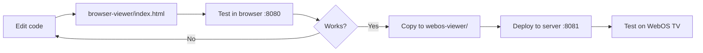

# Port Separation Strategy

Dokumentasi pemisahan port untuk environment testing dan production.

## 🎯 Overview

Kita pisahkan viewer ke 2 port berbeda untuk isolasi environment:

| Port | Environment | Directory | Purpose |
|------|-------------|-----------|---------|
| **8080** | Browser Testing | `browser-viewer/` | Development & quick testing di browser |
| **8081** | WebOS Production | `webos-viewer/` | Production WebOS TV app |

## 🏗️ Architecture

```
┌─────────────────────────────────────────────────────────────────────┐
│                  192.168.5.12 Server                                 │
│                                                                      │
│  ┌────────────────────────────────┐  ┌──────────────────────────┐  │
│  │   Port 8080                    │  │   Port 8081              │  │
│  │   browser-viewer/              │  │   webos-viewer/          │  │
│  │   ════════════════             │  │   ══════════════         │  │
│  │                                │  │                          │  │
│  │   📋 Purpose:                  │  │   📋 Purpose:            │  │
│  │   - Browser testing            │  │   - WebOS TV production  │  │
│  │   - Quick development          │  │   - Stable version       │  │
│  │   - DevTools debugging         │  │   - TV deployment        │  │
│  │                                │  │                          │  │
│  │   🔧 Features:                 │  │   🔧 Features:           │  │
│  │   - Hot reload testing         │  │   - Hosted app           │  │
│  │   - Console logs visible       │  │   - Remote updates       │  │
│  │   - Rapid iteration            │  │   - No IPK reinstall     │  │
│  │                                │  │                          │  │
│  │   👥 Users:                    │  │   👥 Users:              │  │
│  │   - Developers                 │  │   - WebOS TVs            │  │
│  │   - Testers                    │  │   - Production monitors  │  │
│  └────────────────────────────────┘  └──────────────────────────┘  │
│              ↓                                   ↓                   │
│    Chrome/Firefox/Edge                    LG WebOS TV               │
└─────────────────────────────────────────────────────────────────────┘
                                ↓
                ┌───────────────────────────────┐
                │   Backend API (Port 8001)     │
                │   - Device registration       │
                │   - Content management        │
                │   - Playlist sync             │
                └───────────────────────────────┘
```

## 📂 Directory Structure

```
signage/
├── browser-viewer/           # Port 8080 (Browser Testing)
│   ├── index.html           # Viewer code
│   └── README.md            # Testing docs
│
├── webos-viewer/            # Port 8081 (WebOS Production)
│   ├── index.html           # Same as browser-viewer
│   ├── start-server.sh      # Server start script
│   └── README.md            # Production docs
│
└── webos-app/               # WebOS App Package
    ├── appinfo.json         # Points to port 8081 ← Important!
    ├── package.sh           # Build IPK
    ├── deploy.sh            # Deploy to TV
    └── icons/               # App icons
```

## 🚀 Server Status

### Current Running Servers

```bash
# Check running servers
ssh gzjbbk@192.168.5.12 "lsof -i :8080 -i :8081"

# Expected output:
# COMMAND     PID   USER   FD   TYPE  DEVICE      SIZE/OFF NODE NAME
# python3 xxxxxxx gzjbbk    3u  IPv4 xxxxxxxxxx      0t0  TCP *:8080 (LISTEN)
# python3 2208514 gzjbbk    3u  IPv4 1118460742      0t0  TCP *:8081 (LISTEN)
```

### Server Control

#### Port 8080 (Browser Testing)
```bash
# Start
cd /home/gzjbbk/signage/browser-viewer
python3 -m http.server 8080

# Or in background
nohup python3 -m http.server 8080 > viewer.log 2>&1 &

# Stop
kill $(lsof -t -i:8080)
```

#### Port 8081 (WebOS Production)
```bash
# Start (with script)
cd /home/gzjbbk/signage/webos-viewer
./start-server.sh

# Or manually
python3 -m http.server 8081

# Or in background
nohup python3 -m http.server 8081 > viewer.log 2>&1 &

# Stop
kill $(lsof -t -i:8081)
```

## 🔄 Workflow

### Development Workflow



### Step-by-Step

1. **Development** (Local)
   ```bash
   # Edit viewer code
   code browser-viewer/index.html

   # Test in browser
   open http://localhost:8080
   ```

2. **Testing** (Browser - Port 8080)
   ```bash
   # Open browser DevTools (F12)
   # Test features:
   # - UUID generation
   # - Device registration
   # - Content playback
   # - Offline caching
   ```

3. **Promotion to Production** (Port 8081)
   ```bash
   # If tests pass, copy to webos-viewer
   cp browser-viewer/index.html webos-viewer/

   # Deploy to server
   scp webos-viewer/index.html gzjbbk@192.168.5.12:/home/gzjbbk/signage/webos-viewer/
   ```

4. **WebOS Deployment** (TV)
   ```bash
   # No need to reinstall IPK! Hosted app auto-updates
   # Just refresh app on TV or wait for next content refresh
   ```

## 🎯 Use Cases

### When to Use Port 8080 (Browser Testing)

✅ **Good for:**
- Quick code changes and testing
- Debugging with DevTools
- Testing UUID generation
- Testing offline caching (IndexedDB)
- API integration testing
- Rapid iteration

❌ **Not suitable for:**
- Production deployment
- WebOS-specific features testing
- TV resolution testing (without DevTools)

### When to Use Port 8081 (WebOS Production)

✅ **Good for:**
- Production WebOS TV deployment
- Stable, tested version
- WebOS-specific features (platform detection)
- Real TV hardware testing
- Client demos

❌ **Not suitable for:**
- Active development
- Frequent code changes
- Debugging (harder without DevTools)

## 📱 WebOS App Configuration

### appinfo.json

```json
{
  "id": "com.signage.viewer",
  "version": "1.0.0",
  "vendor": "Smart TV Digital Signage",
  "type": "web",
  "main": "http://192.168.5.12:8081/index.html",  ← Port 8081
  "title": "Digital Signage Viewer",
  "resolution": "1920x1080"
}
```

**Important**: WebOS app **HARUS** point ke port 8081 (production).

### Packaging and Deployment

```bash
cd webos-app

# Package IPK
./package.sh
# Creates: ../build/com.signage.viewer_1.0.0_all.ipk

# Deploy to TV
./deploy.sh mytv
# Installs and launches app
# App will load: http://192.168.5.12:8081/index.html
```

## 🔧 Sync Strategy

### Content Synchronization

Kedua file (`browser-viewer/index.html` dan `webos-viewer/index.html`) harus **identik** untuk production.

#### Manual Sync

```bash
# Local: Copy browser-viewer to webos-viewer
cp browser-viewer/index.html webos-viewer/

# To server: Sync webos-viewer
scp webos-viewer/index.html gzjbbk@192.168.5.12:/home/gzjbbk/signage/webos-viewer/
```

#### Automated Sync (Optional)

Create sync script:

```bash
#!/bin/bash
# sync-to-webos.sh

echo "Syncing browser-viewer to webos-viewer..."

# Copy locally
cp browser-viewer/index.html webos-viewer/

# Upload to server
scp webos-viewer/index.html gzjbbk@192.168.5.12:/home/gzjbbk/signage/webos-viewer/

echo "✅ Sync complete!"
echo "WebOS TVs will load updated version on next refresh."
```

## 🧪 Testing Checklist

### Browser Testing (Port 8080)

- [ ] Open `http://192.168.5.12:8080`
- [ ] Check DevTools Console (F12)
- [ ] Verify UUID generation: `localStorage.getItem('device_uuid')`
- [ ] Test device registration (activation code appears)
- [ ] Test playlist loading
- [ ] Test content playback (images/videos)
- [ ] Test offline caching (IndexedDB)
- [ ] Check cache in DevTools → Application → IndexedDB

### WebOS Testing (Port 8081)

- [ ] Package WebOS app: `cd webos-app && ./package.sh`
- [ ] Deploy to TV: `./deploy.sh mytv`
- [ ] Verify app loads from port 8081
- [ ] Check WebOS platform detection in logs
- [ ] Test UUID persistence across TV restart
- [ ] Test content playback on TV
- [ ] Verify offline caching works on TV

## 🐛 Troubleshooting

### Port 8080 Not Working

```bash
# Check if port is in use
lsof -i :8080

# Kill process
kill $(lsof -t -i:8080)

# Restart server
cd browser-viewer
python3 -m http.server 8080
```

### Port 8081 Not Working

```bash
# Check if port is in use
lsof -i :8081

# Kill process
kill $(lsof -t -i:8081)

# Restart server
cd webos-viewer
./start-server.sh
```

### WebOS App Not Loading

1. **Check port 8081 is running on server**
   ```bash
   ssh gzjbbk@192.168.5.12 "lsof -i :8081"
   ```

2. **Check appinfo.json points to correct port**
   ```bash
   grep "main" webos-app/appinfo.json
   # Should show: "main": "http://192.168.5.12:8081/index.html"
   ```

3. **Reinstall WebOS app**
   ```bash
   cd webos-app
   ./package.sh
   ./deploy.sh mytv
   ```

### Files Out of Sync

**Symptom**: Browser version works, but WebOS TV has issues

**Solution**: Sync files
```bash
# Ensure both files are identical
diff browser-viewer/index.html webos-viewer/index.html

# If different, copy
cp browser-viewer/index.html webos-viewer/

# Deploy to server
scp webos-viewer/index.html gzjbbk@192.168.5.12:/home/gzjbbk/signage/webos-viewer/
```

## 🔐 Security Considerations

### Port Access

Both ports serve same origin content:
- Same backend API (192.168.5.12:8001)
- Same CORS policy
- Same authentication flow

### Network Security

```bash
# Optional: Restrict port 8080 to local network only
iptables -A INPUT -p tcp --dport 8080 -s 192.168.5.0/24 -j ACCEPT
iptables -A INPUT -p tcp --dport 8080 -j DROP

# Port 8081 open for WebOS TVs (same network)
```

## 📊 Benefits Summary

| Benefit | Description |
|---------|-------------|
| **Isolation** | Testing doesn't affect production |
| **Rollback** | Easy to revert production without affecting dev |
| **Performance** | Separate traffic for dev and production |
| **Debugging** | Browser DevTools for port 8080 |
| **Stability** | Production (8081) runs stable version |
| **Flexibility** | Can have different versions per port if needed |

## 🎯 Current Status

### Servers Running

✅ **Port 8080**: Browser Testing Environment
- Status: Running
- PID: Check with `lsof -i :8080`
- Access: http://192.168.5.12:8080

✅ **Port 8081**: WebOS Production Environment
- Status: Running
- PID: 2208514
- Access: http://192.168.5.12:8081

### WebOS App Configuration

✅ **appinfo.json**: Updated to port 8081
✅ **Server**: Running on port 8081
✅ **Files**: Synced to server
⏳ **Testing**: Ready for WebOS deployment

## 🚀 Next Steps

1. **Test Browser (Port 8080)**
   ```bash
   open http://192.168.5.12:8080
   ```

2. **Package WebOS App**
   ```bash
   cd webos-app
   ./package.sh
   ```

3. **Deploy to TV**
   ```bash
   ./deploy.sh mytv
   ```

4. **Verify App Loads from Port 8081**
   - Check TV logs for: "Loading from http://192.168.5.12:8081"

---

**Environment**: ✅ Production Ready
**Port 8080**: ✅ Browser Testing
**Port 8081**: ✅ WebOS Production
**Documentation**: ✅ Complete
