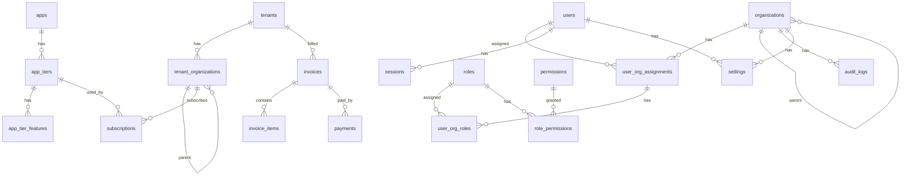

# Database Schema: Platform & Community

> **Date**: 2025-12-07
> **Decisions**: #106 - #116
> **Status**: Draft

---

## Overview

```
┌─────────────────────────────────────────────────────────────────────────┐
│                         DATABASE ARCHITECTURE                            │
├─────────────────────────────────────────────────────────────────────────┤
│                                                                         │
│  ┌─────────────────────────────────────────────────────────────────┐   │
│  │  PLATFORM DB (Owner System)                                      │   │
│  │  - Tenant management                                             │   │
│  │  - App catalog & subscriptions                                   │   │
│  │  - Billing & payments                                            │   │
│  │  - Owner team management                                         │   │
│  └─────────────────────────────────────────────────────────────────┘   │
│                                                                         │
│  ┌─────────────────────────────────────────────────────────────────┐   │
│  │  COMMUNITY DB (Shared Infrastructure)                            │   │
│  │  - Users (all users, all tenants)                                │   │
│  │  - Organizations (linked to tenants)                             │   │
│  │  - RBAC (roles, permissions)                                     │   │
│  │  - Audit & settings                                              │   │
│  └─────────────────────────────────────────────────────────────────┘   │
│                                                                         │
│  ┌─────────────────────────────────────────────────────────────────┐   │
│  │  TENANT DBs (Per tenant, app-specific)                           │   │
│  │  - PMS schema                                                    │   │
│  │  - POS schema                                                    │   │
│  │  - Accounting schema                                             │   │
│  │  - HRM schema                                                    │   │
│  │  - etc.                                                          │   │
│  └─────────────────────────────────────────────────────────────────┘   │
│                                                                         │
└─────────────────────────────────────────────────────────────────────────┘
```

---

## Standards Applied (Auto)

| Standard | Value | Reference |
|----------|-------|-----------|
| Monetary precision | `DECIMAL(18,4)` | Decision #79 |
| Soft delete | `is_deleted` + `deleted_at` + `deleted_by_id` | Decision #81 |
| Audit columns | `created_at`, `updated_at`, `created_by_id`, `updated_by_id` | Dev Standards |
| Timestamps | `TIMESTAMP WITH TIME ZONE`, `_at` suffix | Decision #42 |
| Boolean naming | `is_`, `has_`, `can_` prefix | Decision #43 |
| FK naming | `_id` suffix | Decision #39 |
| Primary key | `id INTEGER GENERATED ALWAYS AS IDENTITY` | Dev Standards |

---

## Part 1: Platform Database (Owner System)

### 1.1 Tenants (Root Organizations)

```sql
-- ============================================================
-- TENANTS: Root level organizations that subscribe to platform
-- ============================================================
CREATE TABLE tenants (
    -- Primary Key
    id INTEGER PRIMARY KEY GENERATED ALWAYS AS IDENTITY,

    -- Tenant Info
    code VARCHAR(20) NOT NULL UNIQUE,           -- 'HTL-001'
    name VARCHAR(200) NOT NULL,                  -- 'PT. Hotel Group Indonesia'
    legal_name VARCHAR(300),                     -- Full legal name
    tax_id VARCHAR(50),                          -- NPWP

    -- Contact
    email VARCHAR(255) NOT NULL,
    phone VARCHAR(30),
    website VARCHAR(255),

    -- Address
    address TEXT,
    city VARCHAR(100),
    province VARCHAR(100),
    country VARCHAR(100) DEFAULT 'Indonesia',
    postal_code VARCHAR(20),

    -- Status (Decision #106)
    status VARCHAR(20) DEFAULT 'pending' NOT NULL,
    -- 'pending', 'trial', 'active', 'suspended', 'closed'

    -- Trial (Decision #107)
    trial_days INTEGER DEFAULT 14,               -- Configurable per tenant
    trial_started_at TIMESTAMP WITH TIME ZONE,
    trial_ends_at TIMESTAMP WITH TIME ZONE,

    -- Billing (Decision #109)
    billing_cycle VARCHAR(20) DEFAULT 'monthly', -- 'monthly', 'yearly'
    billing_email VARCHAR(255),
    billing_address TEXT,

    -- Settings
    timezone VARCHAR(50) DEFAULT 'Asia/Jakarta',
    locale VARCHAR(10) DEFAULT 'id',
    currency_code VARCHAR(3) DEFAULT 'IDR',

    -- Metadata
    logo_url VARCHAR(500),
    settings JSONB DEFAULT '{}',
    metadata JSONB DEFAULT '{}',

    -- Soft Delete
    is_deleted BOOLEAN DEFAULT FALSE NOT NULL,
    deleted_at TIMESTAMP WITH TIME ZONE,
    deleted_by_id INTEGER,

    -- Audit
    created_at TIMESTAMP WITH TIME ZONE DEFAULT NOW() NOT NULL,
    updated_at TIMESTAMP WITH TIME ZONE,
    created_by_id INTEGER,
    updated_by_id INTEGER
);

-- Indexes
CREATE INDEX idx_tenants_code ON tenants(code) WHERE is_deleted = FALSE;
CREATE INDEX idx_tenants_status ON tenants(status) WHERE is_deleted = FALSE;
CREATE INDEX idx_tenants_email ON tenants(email) WHERE is_deleted = FALSE;

-- Comments
COMMENT ON TABLE tenants IS 'Root level organizations (customers) that subscribe to platform';
COMMENT ON COLUMN tenants.status IS 'pending, trial, active, suspended, closed';
COMMENT ON COLUMN tenants.trial_days IS 'Configurable trial period per tenant (Decision #107)';
```

### 1.2 Tenant Hierarchy (Decision #110)

```sql
-- ============================================================
-- TENANT_ORGANIZATIONS: Hierarchy within tenant (3 levels max)
-- Level 1: Holding/HQ, Level 2: Regional, Level 3: Property/Branch
-- ============================================================
CREATE TABLE tenant_organizations (
    -- Primary Key
    id INTEGER PRIMARY KEY GENERATED ALWAYS AS IDENTITY,

    -- Tenant Reference
    tenant_id INTEGER NOT NULL REFERENCES tenants(id) ON DELETE CASCADE,

    -- Hierarchy
    parent_id INTEGER REFERENCES tenant_organizations(id) ON DELETE CASCADE,
    hierarchy_level INTEGER NOT NULL DEFAULT 1,   -- 1, 2, or 3
    hierarchy_path TEXT,                          -- '1/5/12' for quick queries

    -- Organization Info
    code VARCHAR(30) NOT NULL,                    -- 'JKT-001'
    name VARCHAR(200) NOT NULL,                   -- 'Hotel Jakarta'
    short_name VARCHAR(50),                       -- 'Jakarta'
    type VARCHAR(50),                             -- 'holding', 'regional', 'property'

    -- Contact
    email VARCHAR(255),
    phone VARCHAR(30),

    -- Address
    address TEXT,
    city VARCHAR(100),
    province VARCHAR(100),
    country VARCHAR(100) DEFAULT 'Indonesia',
    postal_code VARCHAR(20),
    latitude DECIMAL(10, 8),
    longitude DECIMAL(11, 8),

    -- Status
    is_active BOOLEAN DEFAULT TRUE NOT NULL,

    -- Settings (can override tenant settings)
    timezone VARCHAR(50),                         -- NULL = inherit from tenant
    locale VARCHAR(10),
    currency_code VARCHAR(3),
    settings JSONB DEFAULT '{}',

    -- Branding
    logo_url VARCHAR(500),

    -- Soft Delete
    is_deleted BOOLEAN DEFAULT FALSE NOT NULL,
    deleted_at TIMESTAMP WITH TIME ZONE,
    deleted_by_id INTEGER,

    -- Audit
    created_at TIMESTAMP WITH TIME ZONE DEFAULT NOW() NOT NULL,
    updated_at TIMESTAMP WITH TIME ZONE,
    created_by_id INTEGER,
    updated_by_id INTEGER,

    -- Constraints
    UNIQUE(tenant_id, code),
    CHECK (hierarchy_level BETWEEN 1 AND 3)
);

-- Indexes
CREATE INDEX idx_tenant_orgs_tenant ON tenant_organizations(tenant_id) WHERE is_deleted = FALSE;
CREATE INDEX idx_tenant_orgs_parent ON tenant_organizations(parent_id) WHERE is_deleted = FALSE;
CREATE INDEX idx_tenant_orgs_level ON tenant_organizations(hierarchy_level) WHERE is_deleted = FALSE;
CREATE INDEX idx_tenant_orgs_path ON tenant_organizations(hierarchy_path) WHERE is_deleted = FALSE;

-- Comments
COMMENT ON TABLE tenant_organizations IS 'Hierarchy within tenant: Holding → Regional → Property (3 levels max)';
COMMENT ON COLUMN tenant_organizations.hierarchy_path IS 'Materialized path for quick ancestor/descendant queries';
```

### 1.3 Apps (Product Catalog)

```sql
-- ============================================================
-- APPS: Product catalog of available applications
-- ============================================================
CREATE TABLE apps (
    -- Primary Key
    id INTEGER PRIMARY KEY GENERATED ALWAYS AS IDENTITY,

    -- App Info
    code VARCHAR(20) NOT NULL UNIQUE,             -- 'pms', 'pos', 'acc'
    name VARCHAR(100) NOT NULL,                   -- 'Property Management System'
    short_name VARCHAR(30),                       -- 'PMS'
    description TEXT,

    -- Categorization
    category VARCHAR(50),                         -- 'hospitality', 'retail', 'finance'

    -- Pricing Base (Decision #108: Hybrid)
    base_price_monthly DECIMAL(18,4) DEFAULT 0,   -- Base fee per month
    base_price_yearly DECIMAL(18,4) DEFAULT 0,    -- Base fee per year
    price_per_user_monthly DECIMAL(18,4) DEFAULT 0,
    price_per_user_yearly DECIMAL(18,4) DEFAULT 0,

    -- Status
    is_active BOOLEAN DEFAULT TRUE NOT NULL,
    is_public BOOLEAN DEFAULT TRUE NOT NULL,      -- Shown in catalog

    -- Metadata
    icon_url VARCHAR(500),
    banner_url VARCHAR(500),
    documentation_url VARCHAR(500),

    -- Version
    current_version VARCHAR(20),

    -- Order for display
    display_order INTEGER DEFAULT 0,

    -- Settings
    settings JSONB DEFAULT '{}',

    -- Soft Delete
    is_deleted BOOLEAN DEFAULT FALSE NOT NULL,
    deleted_at TIMESTAMP WITH TIME ZONE,
    deleted_by_id INTEGER,

    -- Audit
    created_at TIMESTAMP WITH TIME ZONE DEFAULT NOW() NOT NULL,
    updated_at TIMESTAMP WITH TIME ZONE,
    created_by_id INTEGER,
    updated_by_id INTEGER
);

-- Comments
COMMENT ON TABLE apps IS 'Product catalog of available applications';
COMMENT ON COLUMN apps.base_price_monthly IS 'Hybrid pricing: base fee component (Decision #108)';
```

### 1.4 App Tiers (Decision #114)

```sql
-- ============================================================
-- APP_TIERS: Basic/Pro/Enterprise tiers per app
-- ============================================================
CREATE TABLE app_tiers (
    -- Primary Key
    id INTEGER PRIMARY KEY GENERATED ALWAYS AS IDENTITY,

    -- App Reference
    app_id INTEGER NOT NULL REFERENCES apps(id) ON DELETE CASCADE,

    -- Tier Info
    code VARCHAR(20) NOT NULL,                    -- 'basic', 'pro', 'enterprise'
    name VARCHAR(50) NOT NULL,                    -- 'Basic', 'Professional', 'Enterprise'
    description TEXT,

    -- Pricing (overrides app base price)
    price_monthly DECIMAL(18,4) NOT NULL,
    price_yearly DECIMAL(18,4) NOT NULL,
    price_per_user_monthly DECIMAL(18,4) DEFAULT 0,
    price_per_user_yearly DECIMAL(18,4) DEFAULT 0,

    -- Limits
    max_users INTEGER,                            -- NULL = unlimited
    max_records INTEGER,                          -- NULL = unlimited
    max_storage_gb INTEGER,                       -- NULL = unlimited

    -- Status
    is_active BOOLEAN DEFAULT TRUE NOT NULL,
    is_default BOOLEAN DEFAULT FALSE NOT NULL,    -- Default tier when subscribing

    -- Order for display
    display_order INTEGER DEFAULT 0,

    -- Soft Delete
    is_deleted BOOLEAN DEFAULT FALSE NOT NULL,
    deleted_at TIMESTAMP WITH TIME ZONE,
    deleted_by_id INTEGER,

    -- Audit
    created_at TIMESTAMP WITH TIME ZONE DEFAULT NOW() NOT NULL,
    updated_at TIMESTAMP WITH TIME ZONE,
    created_by_id INTEGER,
    updated_by_id INTEGER,

    -- Constraints
    UNIQUE(app_id, code)
);

-- Comments
COMMENT ON TABLE app_tiers IS 'Tier-based pricing: Basic/Pro/Enterprise per app (Decision #114)';
```

### 1.5 App Tier Features

```sql
-- ============================================================
-- APP_TIER_FEATURES: Features included in each tier
-- ============================================================
CREATE TABLE app_tier_features (
    -- Primary Key
    id INTEGER PRIMARY KEY GENERATED ALWAYS AS IDENTITY,

    -- References
    app_tier_id INTEGER NOT NULL REFERENCES app_tiers(id) ON DELETE CASCADE,

    -- Feature Info
    feature_code VARCHAR(50) NOT NULL,            -- 'advanced_reporting'
    feature_name VARCHAR(100) NOT NULL,           -- 'Advanced Reporting'
    description TEXT,

    -- Feature Type
    feature_type VARCHAR(20) DEFAULT 'boolean',   -- 'boolean', 'limit', 'text'
    feature_value VARCHAR(100),                   -- 'true', '100', 'unlimited'

    -- Display
    display_order INTEGER DEFAULT 0,
    is_highlighted BOOLEAN DEFAULT FALSE,         -- Show in tier comparison

    -- Audit
    created_at TIMESTAMP WITH TIME ZONE DEFAULT NOW() NOT NULL,
    updated_at TIMESTAMP WITH TIME ZONE,

    -- Constraints
    UNIQUE(app_tier_id, feature_code)
);

-- Comments
COMMENT ON TABLE app_tier_features IS 'Features included in each tier for comparison';
```

### 1.6 Subscriptions (Decision #111)

```sql
-- ============================================================
-- SUBSCRIPTIONS: Tenant org subscribes to app tier
-- Per App per Sub-org (not per tenant)
-- ============================================================
CREATE TABLE subscriptions (
    -- Primary Key
    id INTEGER PRIMARY KEY GENERATED ALWAYS AS IDENTITY,

    -- References (Decision #111: per app per sub-org)
    tenant_org_id INTEGER NOT NULL REFERENCES tenant_organizations(id) ON DELETE CASCADE,
    app_id INTEGER NOT NULL REFERENCES apps(id) ON DELETE RESTRICT,
    app_tier_id INTEGER NOT NULL REFERENCES app_tiers(id) ON DELETE RESTRICT,

    -- Subscription Period
    billing_cycle VARCHAR(20) NOT NULL,           -- 'monthly', 'yearly'
    started_at TIMESTAMP WITH TIME ZONE NOT NULL,
    expires_at TIMESTAMP WITH TIME ZONE,

    -- Status
    status VARCHAR(20) DEFAULT 'active' NOT NULL,
    -- 'pending', 'active', 'suspended', 'cancelled', 'expired'

    -- Pricing Snapshot (at time of subscription)
    price_base DECIMAL(18,4) NOT NULL,
    price_per_user DECIMAL(18,4) DEFAULT 0,
    user_count INTEGER DEFAULT 1,
    total_price DECIMAL(18,4) NOT NULL,
    currency_code VARCHAR(3) DEFAULT 'IDR',

    -- Discount
    discount_percent DECIMAL(5,2) DEFAULT 0,
    discount_amount DECIMAL(18,4) DEFAULT 0,
    discount_reason VARCHAR(200),

    -- Auto-renewal
    is_auto_renew BOOLEAN DEFAULT TRUE NOT NULL,

    -- Cancellation
    cancelled_at TIMESTAMP WITH TIME ZONE,
    cancellation_reason TEXT,

    -- Metadata
    notes TEXT,
    metadata JSONB DEFAULT '{}',

    -- Soft Delete
    is_deleted BOOLEAN DEFAULT FALSE NOT NULL,
    deleted_at TIMESTAMP WITH TIME ZONE,
    deleted_by_id INTEGER,

    -- Audit
    created_at TIMESTAMP WITH TIME ZONE DEFAULT NOW() NOT NULL,
    updated_at TIMESTAMP WITH TIME ZONE,
    created_by_id INTEGER,
    updated_by_id INTEGER,

    -- Constraints
    UNIQUE(tenant_org_id, app_id, started_at)
);

-- Indexes
CREATE INDEX idx_subscriptions_tenant_org ON subscriptions(tenant_org_id) WHERE is_deleted = FALSE;
CREATE INDEX idx_subscriptions_app ON subscriptions(app_id) WHERE is_deleted = FALSE;
CREATE INDEX idx_subscriptions_status ON subscriptions(status) WHERE is_deleted = FALSE;
CREATE INDEX idx_subscriptions_expires ON subscriptions(expires_at) WHERE status = 'active';

-- Comments
COMMENT ON TABLE subscriptions IS 'Subscription per app per sub-org (Decision #111)';
```

### 1.7 Invoices (Decision #115)

```sql
-- ============================================================
-- INVOICES: Billing invoices (per sub-org or consolidated)
-- ============================================================
CREATE TABLE invoices (
    -- Primary Key
    id INTEGER PRIMARY KEY GENERATED ALWAYS AS IDENTITY,

    -- Invoice Number
    invoice_no VARCHAR(50) NOT NULL UNIQUE,       -- 'INV-2025-000001'

    -- Bill To (Decision #115: could be tenant or sub-org)
    tenant_id INTEGER NOT NULL REFERENCES tenants(id) ON DELETE RESTRICT,
    tenant_org_id INTEGER REFERENCES tenant_organizations(id) ON DELETE RESTRICT,
    -- If tenant_org_id is NULL, it's consolidated to tenant level

    is_consolidated BOOLEAN DEFAULT FALSE NOT NULL,

    -- Invoice Period
    period_start DATE NOT NULL,
    period_end DATE NOT NULL,

    -- Amounts
    subtotal DECIMAL(18,4) NOT NULL,
    discount_amount DECIMAL(18,4) DEFAULT 0,
    tax_amount DECIMAL(18,4) DEFAULT 0,
    total_amount DECIMAL(18,4) NOT NULL,
    currency_code VARCHAR(3) DEFAULT 'IDR',

    -- Tax Info
    tax_rate DECIMAL(5,2) DEFAULT 11,             -- PPN 11%
    tax_invoice_no VARCHAR(50),                   -- Nomor Faktur Pajak

    -- Status
    status VARCHAR(20) DEFAULT 'draft' NOT NULL,
    -- 'draft', 'sent', 'paid', 'partial', 'overdue', 'cancelled', 'void'

    -- Dates
    issued_at TIMESTAMP WITH TIME ZONE,
    due_at TIMESTAMP WITH TIME ZONE,
    paid_at TIMESTAMP WITH TIME ZONE,

    -- Payment
    amount_paid DECIMAL(18,4) DEFAULT 0,
    amount_due DECIMAL(18,4) GENERATED ALWAYS AS (total_amount - amount_paid) STORED,

    -- Notes
    notes TEXT,
    internal_notes TEXT,

    -- PDF
    pdf_url VARCHAR(500),

    -- Metadata
    metadata JSONB DEFAULT '{}',

    -- Soft Delete
    is_deleted BOOLEAN DEFAULT FALSE NOT NULL,
    deleted_at TIMESTAMP WITH TIME ZONE,
    deleted_by_id INTEGER,

    -- Audit
    created_at TIMESTAMP WITH TIME ZONE DEFAULT NOW() NOT NULL,
    updated_at TIMESTAMP WITH TIME ZONE,
    created_by_id INTEGER,
    updated_by_id INTEGER
);

-- Indexes
CREATE INDEX idx_invoices_tenant ON invoices(tenant_id) WHERE is_deleted = FALSE;
CREATE INDEX idx_invoices_status ON invoices(status) WHERE is_deleted = FALSE;
CREATE INDEX idx_invoices_due ON invoices(due_at) WHERE status IN ('sent', 'partial', 'overdue');

-- Comments
COMMENT ON TABLE invoices IS 'Billing invoices - can be per sub-org or consolidated (Decision #115)';
```

### 1.8 Invoice Items

```sql
-- ============================================================
-- INVOICE_ITEMS: Line items in invoice
-- ============================================================
CREATE TABLE invoice_items (
    -- Primary Key
    id INTEGER PRIMARY KEY GENERATED ALWAYS AS IDENTITY,

    -- Invoice Reference
    invoice_id INTEGER NOT NULL REFERENCES invoices(id) ON DELETE CASCADE,

    -- Item Reference
    subscription_id INTEGER REFERENCES subscriptions(id) ON DELETE SET NULL,
    tenant_org_id INTEGER REFERENCES tenant_organizations(id) ON DELETE SET NULL,

    -- Item Info
    item_type VARCHAR(30) NOT NULL,               -- 'subscription', 'addon', 'usage', 'adjustment'
    description VARCHAR(500) NOT NULL,

    -- Quantity & Pricing
    quantity DECIMAL(12,4) DEFAULT 1,
    unit_price DECIMAL(18,4) NOT NULL,
    discount_percent DECIMAL(5,2) DEFAULT 0,
    discount_amount DECIMAL(18,4) DEFAULT 0,
    tax_rate DECIMAL(5,2) DEFAULT 11,
    tax_amount DECIMAL(18,4) DEFAULT 0,
    total_amount DECIMAL(18,4) NOT NULL,

    -- Period
    period_start DATE,
    period_end DATE,

    -- Order
    display_order INTEGER DEFAULT 0,

    -- Audit
    created_at TIMESTAMP WITH TIME ZONE DEFAULT NOW() NOT NULL,
    updated_at TIMESTAMP WITH TIME ZONE
);

-- Index
CREATE INDEX idx_invoice_items_invoice ON invoice_items(invoice_id);
```

### 1.9 Payments

```sql
-- ============================================================
-- PAYMENTS: Payment records
-- ============================================================
CREATE TABLE payments (
    -- Primary Key
    id INTEGER PRIMARY KEY GENERATED ALWAYS AS IDENTITY,

    -- Payment Number
    payment_no VARCHAR(50) NOT NULL UNIQUE,       -- 'PAY-2025-000001'

    -- References
    tenant_id INTEGER NOT NULL REFERENCES tenants(id) ON DELETE RESTRICT,
    invoice_id INTEGER REFERENCES invoices(id) ON DELETE RESTRICT,

    -- Payment Info
    amount DECIMAL(18,4) NOT NULL,
    currency_code VARCHAR(3) DEFAULT 'IDR',

    -- Method
    payment_method VARCHAR(30) NOT NULL,          -- 'bank_transfer', 'credit_card', 'ewallet'
    payment_reference VARCHAR(100),               -- Bank reference, card last 4 digits

    -- Status
    status VARCHAR(20) DEFAULT 'pending' NOT NULL,
    -- 'pending', 'processing', 'completed', 'failed', 'refunded'

    -- Dates
    payment_date DATE NOT NULL,
    processed_at TIMESTAMP WITH TIME ZONE,

    -- Bank Info (for transfer)
    bank_name VARCHAR(100),
    bank_account VARCHAR(50),

    -- Notes
    notes TEXT,

    -- Proof
    proof_url VARCHAR(500),                       -- Upload bukti transfer

    -- Metadata
    metadata JSONB DEFAULT '{}',

    -- Soft Delete
    is_deleted BOOLEAN DEFAULT FALSE NOT NULL,
    deleted_at TIMESTAMP WITH TIME ZONE,
    deleted_by_id INTEGER,

    -- Audit
    created_at TIMESTAMP WITH TIME ZONE DEFAULT NOW() NOT NULL,
    updated_at TIMESTAMP WITH TIME ZONE,
    created_by_id INTEGER,
    updated_by_id INTEGER
);

-- Indexes
CREATE INDEX idx_payments_tenant ON payments(tenant_id) WHERE is_deleted = FALSE;
CREATE INDEX idx_payments_invoice ON payments(invoice_id) WHERE is_deleted = FALSE;
CREATE INDEX idx_payments_status ON payments(status) WHERE is_deleted = FALSE;
```

### 1.10 Owner Users (Internal Team) - Decision #112

```sql
-- ============================================================
-- OWNER_USERS: Platform owner's internal team
-- ============================================================
CREATE TABLE owner_users (
    -- Primary Key
    id INTEGER PRIMARY KEY GENERATED ALWAYS AS IDENTITY,

    -- Credentials
    email VARCHAR(255) NOT NULL UNIQUE,
    password_hash VARCHAR(255) NOT NULL,

    -- Profile
    full_name VARCHAR(200) NOT NULL,
    phone VARCHAR(30),
    avatar_url VARCHAR(500),

    -- Role (Decision #112)
    role VARCHAR(30) NOT NULL,
    -- 'owner_super_admin', 'owner_admin', 'owner_support', 'owner_finance', 'owner_developer'

    -- Status
    is_active BOOLEAN DEFAULT TRUE NOT NULL,

    -- Security
    last_login_at TIMESTAMP WITH TIME ZONE,
    last_login_ip VARCHAR(45),
    failed_login_count INTEGER DEFAULT 0,
    locked_until TIMESTAMP WITH TIME ZONE,

    -- 2FA
    is_2fa_enabled BOOLEAN DEFAULT FALSE NOT NULL,
    two_factor_secret VARCHAR(100),

    -- Soft Delete
    is_deleted BOOLEAN DEFAULT FALSE NOT NULL,
    deleted_at TIMESTAMP WITH TIME ZONE,
    deleted_by_id INTEGER,

    -- Audit
    created_at TIMESTAMP WITH TIME ZONE DEFAULT NOW() NOT NULL,
    updated_at TIMESTAMP WITH TIME ZONE,
    created_by_id INTEGER,
    updated_by_id INTEGER
);

-- Comments
COMMENT ON TABLE owner_users IS 'Platform owner internal team (Decision #112)';
COMMENT ON COLUMN owner_users.role IS 'super_admin, admin, support, finance, developer';
```

### 1.11 Platform Audit Logs

```sql
-- ============================================================
-- PLATFORM_AUDIT_LOGS: Audit trail for platform actions
-- ============================================================
CREATE TABLE platform_audit_logs (
    -- Primary Key
    id BIGINT PRIMARY KEY GENERATED ALWAYS AS IDENTITY,

    -- Actor
    owner_user_id INTEGER REFERENCES owner_users(id) ON DELETE SET NULL,
    actor_email VARCHAR(255),
    actor_ip VARCHAR(45),
    actor_user_agent TEXT,

    -- Action
    action VARCHAR(50) NOT NULL,                  -- 'create', 'update', 'delete', 'login', etc.
    entity_type VARCHAR(50) NOT NULL,             -- 'tenant', 'subscription', 'invoice'
    entity_id INTEGER,

    -- Target (if action on tenant)
    tenant_id INTEGER,

    -- Details
    description TEXT,
    old_values JSONB,
    new_values JSONB,

    -- Timestamp
    created_at TIMESTAMP WITH TIME ZONE DEFAULT NOW() NOT NULL
);

-- Indexes
CREATE INDEX idx_platform_audit_actor ON platform_audit_logs(owner_user_id);
CREATE INDEX idx_platform_audit_entity ON platform_audit_logs(entity_type, entity_id);
CREATE INDEX idx_platform_audit_tenant ON platform_audit_logs(tenant_id);
CREATE INDEX idx_platform_audit_created ON platform_audit_logs(created_at);

-- Partition by month (optional for large scale)
-- CREATE TABLE platform_audit_logs (...) PARTITION BY RANGE (created_at);
```

---

## Part 2: Community Database (Shared Infrastructure)

### 2.1 Users (All Users)

```sql
-- ============================================================
-- USERS: All users across all tenants
-- One account per person, can be in multiple organizations
-- ============================================================
CREATE TABLE users (
    -- Primary Key
    id INTEGER PRIMARY KEY GENERATED ALWAYS AS IDENTITY,

    -- Credentials
    email VARCHAR(255) NOT NULL UNIQUE,
    password_hash VARCHAR(255) NOT NULL,

    -- Profile
    full_name VARCHAR(200) NOT NULL,
    display_name VARCHAR(100),
    phone VARCHAR(30),
    avatar_url VARCHAR(500),

    -- Preferences
    timezone VARCHAR(50) DEFAULT 'Asia/Jakarta',
    locale VARCHAR(10) DEFAULT 'id',
    theme VARCHAR(20) DEFAULT 'system',           -- 'light', 'dark', 'system'

    -- Status
    is_active BOOLEAN DEFAULT TRUE NOT NULL,
    is_email_verified BOOLEAN DEFAULT FALSE NOT NULL,
    email_verified_at TIMESTAMP WITH TIME ZONE,

    -- Security
    last_login_at TIMESTAMP WITH TIME ZONE,
    last_login_ip VARCHAR(45),
    failed_login_count INTEGER DEFAULT 0,
    locked_until TIMESTAMP WITH TIME ZONE,

    -- 2FA
    is_2fa_enabled BOOLEAN DEFAULT FALSE NOT NULL,
    two_factor_secret VARCHAR(100),

    -- Metadata
    settings JSONB DEFAULT '{}',
    metadata JSONB DEFAULT '{}',

    -- Soft Delete
    is_deleted BOOLEAN DEFAULT FALSE NOT NULL,
    deleted_at TIMESTAMP WITH TIME ZONE,
    deleted_by_id INTEGER,

    -- Audit
    created_at TIMESTAMP WITH TIME ZONE DEFAULT NOW() NOT NULL,
    updated_at TIMESTAMP WITH TIME ZONE
);

-- Indexes
CREATE INDEX idx_users_email ON users(email) WHERE is_deleted = FALSE;
CREATE INDEX idx_users_active ON users(is_active) WHERE is_deleted = FALSE;

-- Comments
COMMENT ON TABLE users IS 'All users across all tenants - one account per person';
```

### 2.2 Organizations (Linked to Tenant Orgs)

```sql
-- ============================================================
-- ORGANIZATIONS: Community view of tenant organizations
-- Links to tenant_organizations in platform DB
-- ============================================================
CREATE TABLE organizations (
    -- Primary Key
    id INTEGER PRIMARY KEY GENERATED ALWAYS AS IDENTITY,

    -- Link to Platform DB
    tenant_org_id INTEGER NOT NULL UNIQUE,        -- References tenant_organizations.id
    tenant_id INTEGER NOT NULL,                   -- References tenants.id (denormalized)

    -- Organization Info (cached from tenant_organizations)
    code VARCHAR(30) NOT NULL,
    name VARCHAR(200) NOT NULL,
    short_name VARCHAR(50),

    -- Hierarchy
    parent_id INTEGER REFERENCES organizations(id) ON DELETE CASCADE,
    hierarchy_level INTEGER NOT NULL DEFAULT 1,
    hierarchy_path TEXT,

    -- Status
    is_active BOOLEAN DEFAULT TRUE NOT NULL,

    -- Settings
    timezone VARCHAR(50) DEFAULT 'Asia/Jakarta',
    locale VARCHAR(10) DEFAULT 'id',
    currency_code VARCHAR(3) DEFAULT 'IDR',
    settings JSONB DEFAULT '{}',

    -- Branding
    logo_url VARCHAR(500),

    -- Soft Delete
    is_deleted BOOLEAN DEFAULT FALSE NOT NULL,
    deleted_at TIMESTAMP WITH TIME ZONE,
    deleted_by_id INTEGER,

    -- Audit
    created_at TIMESTAMP WITH TIME ZONE DEFAULT NOW() NOT NULL,
    updated_at TIMESTAMP WITH TIME ZONE,

    -- Constraints
    UNIQUE(tenant_id, code)
);

-- Indexes
CREATE INDEX idx_organizations_tenant ON organizations(tenant_id) WHERE is_deleted = FALSE;
CREATE INDEX idx_organizations_parent ON organizations(parent_id) WHERE is_deleted = FALSE;
```

### 2.3 User Organization Assignments (Decision #116)

```sql
-- ============================================================
-- USER_ORG_ASSIGNMENTS: User assigned to multiple orgs
-- One user can have different roles in different organizations
-- ============================================================
CREATE TABLE user_org_assignments (
    -- Primary Key
    id INTEGER PRIMARY KEY GENERATED ALWAYS AS IDENTITY,

    -- References
    user_id INTEGER NOT NULL REFERENCES users(id) ON DELETE CASCADE,
    organization_id INTEGER NOT NULL REFERENCES organizations(id) ON DELETE CASCADE,

    -- Position/Title in this organization
    job_title VARCHAR(100),                       -- 'General Manager', 'Consultant'
    department VARCHAR(100),
    employee_id VARCHAR(50),                      -- Internal employee ID

    -- Status
    is_active BOOLEAN DEFAULT TRUE NOT NULL,
    is_primary BOOLEAN DEFAULT FALSE NOT NULL,    -- Primary organization for this user

    -- Access
    can_switch BOOLEAN DEFAULT TRUE NOT NULL,     -- Can switch to this org context

    -- Period
    joined_at TIMESTAMP WITH TIME ZONE DEFAULT NOW() NOT NULL,
    left_at TIMESTAMP WITH TIME ZONE,

    -- Soft Delete
    is_deleted BOOLEAN DEFAULT FALSE NOT NULL,
    deleted_at TIMESTAMP WITH TIME ZONE,
    deleted_by_id INTEGER,

    -- Audit
    created_at TIMESTAMP WITH TIME ZONE DEFAULT NOW() NOT NULL,
    updated_at TIMESTAMP WITH TIME ZONE,
    created_by_id INTEGER,
    updated_by_id INTEGER,

    -- Constraints
    UNIQUE(user_id, organization_id)
);

-- Indexes
CREATE INDEX idx_user_org_user ON user_org_assignments(user_id) WHERE is_deleted = FALSE;
CREATE INDEX idx_user_org_org ON user_org_assignments(organization_id) WHERE is_deleted = FALSE;
CREATE INDEX idx_user_org_primary ON user_org_assignments(user_id, is_primary) WHERE is_primary = TRUE;

-- Comments
COMMENT ON TABLE user_org_assignments IS 'User assigned to multiple orgs with different roles (Decision #116)';
```

### 2.4 Roles (Per Organization)

```sql
-- ============================================================
-- ROLES: Roles defined per organization
-- ============================================================
CREATE TABLE roles (
    -- Primary Key
    id INTEGER PRIMARY KEY GENERATED ALWAYS AS IDENTITY,

    -- Organization (NULL = system role)
    organization_id INTEGER REFERENCES organizations(id) ON DELETE CASCADE,

    -- Role Info
    code VARCHAR(50) NOT NULL,                    -- 'admin', 'manager', 'staff'
    name VARCHAR(100) NOT NULL,                   -- 'Administrator'
    description TEXT,

    -- Type
    is_system BOOLEAN DEFAULT FALSE NOT NULL,     -- System-defined, cannot delete
    is_default BOOLEAN DEFAULT FALSE NOT NULL,    -- Assigned to new users

    -- Hierarchy (for role inheritance)
    parent_role_id INTEGER REFERENCES roles(id) ON DELETE SET NULL,

    -- Status
    is_active BOOLEAN DEFAULT TRUE NOT NULL,

    -- Soft Delete
    is_deleted BOOLEAN DEFAULT FALSE NOT NULL,
    deleted_at TIMESTAMP WITH TIME ZONE,
    deleted_by_id INTEGER,

    -- Audit
    created_at TIMESTAMP WITH TIME ZONE DEFAULT NOW() NOT NULL,
    updated_at TIMESTAMP WITH TIME ZONE,
    created_by_id INTEGER,
    updated_by_id INTEGER,

    -- Constraints
    UNIQUE(organization_id, code)
);

-- Index
CREATE INDEX idx_roles_org ON roles(organization_id) WHERE is_deleted = FALSE;
```

### 2.5 Permissions

```sql
-- ============================================================
-- PERMISSIONS: Available permissions
-- ============================================================
CREATE TABLE permissions (
    -- Primary Key
    id INTEGER PRIMARY KEY GENERATED ALWAYS AS IDENTITY,

    -- App Reference (NULL = platform permission)
    app_code VARCHAR(20),                         -- 'pms', 'pos', NULL for platform

    -- Permission Info
    code VARCHAR(100) NOT NULL UNIQUE,            -- 'pms.reservations.create'
    name VARCHAR(200) NOT NULL,                   -- 'Create Reservations'
    description TEXT,

    -- Grouping
    module VARCHAR(50),                           -- 'reservations', 'rooms'
    category VARCHAR(50),                         -- 'read', 'write', 'admin'

    -- Audit
    created_at TIMESTAMP WITH TIME ZONE DEFAULT NOW() NOT NULL,
    updated_at TIMESTAMP WITH TIME ZONE
);

-- Indexes
CREATE INDEX idx_permissions_app ON permissions(app_code);
CREATE INDEX idx_permissions_module ON permissions(module);
```

### 2.6 Role Permissions

```sql
-- ============================================================
-- ROLE_PERMISSIONS: Permissions assigned to roles
-- ============================================================
CREATE TABLE role_permissions (
    -- Primary Key
    id INTEGER PRIMARY KEY GENERATED ALWAYS AS IDENTITY,

    -- References
    role_id INTEGER NOT NULL REFERENCES roles(id) ON DELETE CASCADE,
    permission_id INTEGER NOT NULL REFERENCES permissions(id) ON DELETE CASCADE,

    -- Audit
    created_at TIMESTAMP WITH TIME ZONE DEFAULT NOW() NOT NULL,
    created_by_id INTEGER,

    -- Constraints
    UNIQUE(role_id, permission_id)
);

-- Index
CREATE INDEX idx_role_perms_role ON role_permissions(role_id);
```

### 2.7 User Organization Roles

```sql
-- ============================================================
-- USER_ORG_ROLES: User's roles in each organization
-- User can have multiple roles per organization
-- ============================================================
CREATE TABLE user_org_roles (
    -- Primary Key
    id INTEGER PRIMARY KEY GENERATED ALWAYS AS IDENTITY,

    -- References
    user_org_assignment_id INTEGER NOT NULL REFERENCES user_org_assignments(id) ON DELETE CASCADE,
    role_id INTEGER NOT NULL REFERENCES roles(id) ON DELETE CASCADE,

    -- Audit
    created_at TIMESTAMP WITH TIME ZONE DEFAULT NOW() NOT NULL,
    created_by_id INTEGER,

    -- Constraints
    UNIQUE(user_org_assignment_id, role_id)
);

-- Index
CREATE INDEX idx_user_org_roles_assignment ON user_org_roles(user_org_assignment_id);
```

### 2.8 Sessions

```sql
-- ============================================================
-- SESSIONS: User login sessions
-- ============================================================
CREATE TABLE sessions (
    -- Primary Key
    id UUID PRIMARY KEY DEFAULT gen_random_uuid(),

    -- User
    user_id INTEGER NOT NULL REFERENCES users(id) ON DELETE CASCADE,

    -- Current Context
    current_org_id INTEGER REFERENCES organizations(id) ON DELETE SET NULL,

    -- Token
    refresh_token_hash VARCHAR(255),

    -- Session Info
    ip_address VARCHAR(45),
    user_agent TEXT,
    device_type VARCHAR(30),                      -- 'desktop', 'mobile', 'tablet'

    -- Status
    is_active BOOLEAN DEFAULT TRUE NOT NULL,

    -- Timestamps
    created_at TIMESTAMP WITH TIME ZONE DEFAULT NOW() NOT NULL,
    last_activity_at TIMESTAMP WITH TIME ZONE DEFAULT NOW() NOT NULL,
    expires_at TIMESTAMP WITH TIME ZONE NOT NULL,
    revoked_at TIMESTAMP WITH TIME ZONE
);

-- Indexes
CREATE INDEX idx_sessions_user ON sessions(user_id) WHERE is_active = TRUE;
CREATE INDEX idx_sessions_expires ON sessions(expires_at) WHERE is_active = TRUE;
```

### 2.9 Audit Logs (Per Organization)

```sql
-- ============================================================
-- AUDIT_LOGS: Audit trail per organization
-- ============================================================
CREATE TABLE audit_logs (
    -- Primary Key
    id BIGINT PRIMARY KEY GENERATED ALWAYS AS IDENTITY,

    -- Context
    organization_id INTEGER NOT NULL,              -- Which org context

    -- Actor
    user_id INTEGER REFERENCES users(id) ON DELETE SET NULL,
    actor_email VARCHAR(255),
    actor_ip VARCHAR(45),
    session_id UUID,

    -- Action
    action VARCHAR(50) NOT NULL,                  -- 'create', 'update', 'delete', 'view'
    entity_type VARCHAR(100) NOT NULL,            -- 'reservation', 'invoice'
    entity_id VARCHAR(50),                        -- Could be INT or UUID

    -- App Context
    app_code VARCHAR(20),                         -- 'pms', 'pos'
    module VARCHAR(50),                           -- 'reservations'

    -- Details (Decision #91: Field-level)
    description TEXT,
    old_values JSONB,
    new_values JSONB,
    changed_fields TEXT[],                        -- ['status', 'amount']

    -- Timestamp
    created_at TIMESTAMP WITH TIME ZONE DEFAULT NOW() NOT NULL
);

-- Indexes
CREATE INDEX idx_audit_org ON audit_logs(organization_id);
CREATE INDEX idx_audit_user ON audit_logs(user_id);
CREATE INDEX idx_audit_entity ON audit_logs(entity_type, entity_id);
CREATE INDEX idx_audit_created ON audit_logs(created_at);

-- Partition by month (for large scale)
-- This table will be converted to hypertable if using TimescaleDB
```

### 2.10 Settings

```sql
-- ============================================================
-- SETTINGS: Configurable settings at various levels
-- ============================================================
CREATE TABLE settings (
    -- Primary Key
    id INTEGER PRIMARY KEY GENERATED ALWAYS AS IDENTITY,

    -- Scope
    scope VARCHAR(20) NOT NULL,                   -- 'system', 'organization', 'user'
    organization_id INTEGER REFERENCES organizations(id) ON DELETE CASCADE,
    user_id INTEGER REFERENCES users(id) ON DELETE CASCADE,

    -- Setting
    category VARCHAR(50) NOT NULL,                -- 'display', 'notification', 'security'
    key VARCHAR(100) NOT NULL,                    -- 'date_format', 'email_notifications'
    value JSONB NOT NULL,                         -- Any JSON value

    -- Metadata
    description TEXT,

    -- Audit
    created_at TIMESTAMP WITH TIME ZONE DEFAULT NOW() NOT NULL,
    updated_at TIMESTAMP WITH TIME ZONE,
    updated_by_id INTEGER,

    -- Constraints
    UNIQUE(scope, organization_id, user_id, category, key)
);

-- Indexes
CREATE INDEX idx_settings_org ON settings(organization_id) WHERE scope = 'organization';
CREATE INDEX idx_settings_user ON settings(user_id) WHERE scope = 'user';
```

---

## Part 3: ERD Diagram (Mermaid)



---

## Part 4: Seed Data

### 4.1 System Organization (Decision #82)

```sql
-- Platform owner as system tenant
INSERT INTO tenants (id, code, name, status, billing_cycle)
OVERRIDING SYSTEM VALUE
VALUES (1, 'SYSTEM', 'Platform Owner', 'active', 'yearly');

INSERT INTO tenant_organizations (id, tenant_id, code, name, hierarchy_level, hierarchy_path, type)
OVERRIDING SYSTEM VALUE
VALUES (1, 1, 'HQ', 'Platform HQ', 1, '1', 'holding');
```

### 4.2 Owner Roles (Decision #112)

```sql
INSERT INTO owner_users (email, password_hash, full_name, role) VALUES
('super@platform.com', '$2b$12$...', 'Super Admin', 'owner_super_admin');
```

### 4.3 Default Apps

```sql
INSERT INTO apps (code, name, category, base_price_monthly, is_active) VALUES
('pms', 'Property Management System', 'hospitality', 500000, TRUE),
('pos', 'Point of Sale', 'retail', 300000, TRUE),
('acc', 'Accounting', 'finance', 400000, TRUE),
('hrm', 'Human Resource Management', 'hr', 350000, TRUE),
('inv', 'Inventory Management', 'operations', 250000, TRUE),
('asset', 'Asset Management', 'operations', 200000, TRUE),
('cms', 'Digital Signage CMS', 'marketing', 200000, TRUE);
```

### 4.4 Default Tiers per App

```sql
-- Example for PMS
INSERT INTO app_tiers (app_id, code, name, price_monthly, price_yearly, max_users) VALUES
((SELECT id FROM apps WHERE code = 'pms'), 'basic', 'Basic', 500000, 5000000, 5),
((SELECT id FROM apps WHERE code = 'pms'), 'pro', 'Professional', 1000000, 10000000, 20),
((SELECT id FROM apps WHERE code = 'pms'), 'enterprise', 'Enterprise', 2500000, 25000000, NULL);
```

### 4.5 Default Permissions

```sql
-- Platform permissions
INSERT INTO permissions (code, name, module, category) VALUES
('platform.tenants.view', 'View Tenants', 'tenants', 'read'),
('platform.tenants.create', 'Create Tenants', 'tenants', 'write'),
('platform.tenants.update', 'Update Tenants', 'tenants', 'write'),
('platform.tenants.delete', 'Delete Tenants', 'tenants', 'admin'),
('platform.subscriptions.view', 'View Subscriptions', 'subscriptions', 'read'),
('platform.subscriptions.manage', 'Manage Subscriptions', 'subscriptions', 'write'),
('platform.invoices.view', 'View Invoices', 'invoices', 'read'),
('platform.invoices.manage', 'Manage Invoices', 'invoices', 'write'),
('platform.payments.view', 'View Payments', 'payments', 'read'),
('platform.payments.record', 'Record Payments', 'payments', 'write');

-- Community permissions
INSERT INTO permissions (code, name, module, category) VALUES
('users.view', 'View Users', 'users', 'read'),
('users.invite', 'Invite Users', 'users', 'write'),
('users.manage', 'Manage Users', 'users', 'admin'),
('roles.view', 'View Roles', 'roles', 'read'),
('roles.manage', 'Manage Roles', 'roles', 'admin'),
('settings.view', 'View Settings', 'settings', 'read'),
('settings.manage', 'Manage Settings', 'settings', 'admin');
```

---

## Summary

### Tables Created

| Database | Table | Purpose |
|----------|-------|---------|
| **Platform** | tenants | Root customers |
| | tenant_organizations | Hierarchy within tenant |
| | apps | Product catalog |
| | app_tiers | Basic/Pro/Enterprise |
| | app_tier_features | Features per tier |
| | subscriptions | App subscriptions |
| | invoices | Billing |
| | invoice_items | Invoice lines |
| | payments | Payment records |
| | owner_users | Internal team |
| | platform_audit_logs | Platform actions |
| **Community** | users | All users |
| | organizations | Tenant orgs view |
| | user_org_assignments | User in multiple orgs |
| | roles | Per-org roles |
| | permissions | Available permissions |
| | role_permissions | Permissions per role |
| | user_org_roles | User roles per org |
| | sessions | Login sessions |
| | audit_logs | Action audit |
| | settings | Configurable settings |

### Decisions Applied

| # | Decision | Applied In |
|---|----------|------------|
| 106 | Tenant Status Lifecycle | tenants.status |
| 107 | Trial Period Configurable | tenants.trial_days |
| 108 | Hybrid Subscription | apps pricing columns |
| 109 | Monthly/Yearly Choice | subscriptions.billing_cycle |
| 110 | 3-Level Hierarchy | tenant_organizations.hierarchy_level |
| 111 | Subscription per Sub-org | subscriptions.tenant_org_id |
| 112 | Owner Team Roles | owner_users.role |
| 113 | Metadata Only Visibility | (app-level enforcement) |
| 114 | Tier-based Features | app_tiers, app_tier_features |
| 115 | Consolidated Invoice Option | invoices.is_consolidated |
| 116 | User Multi-Org | user_org_assignments |

---

*Last Updated: 2025-12-07*
