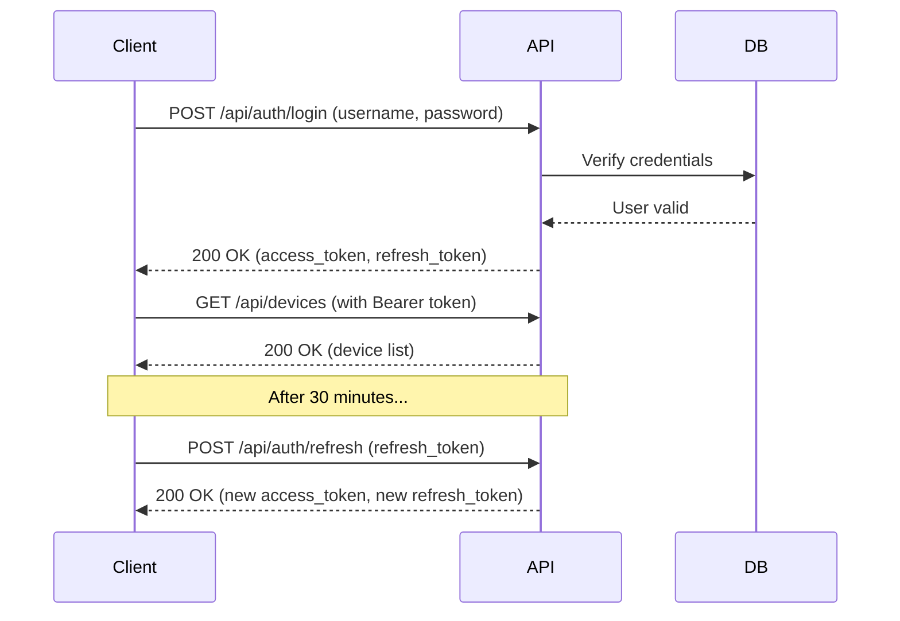
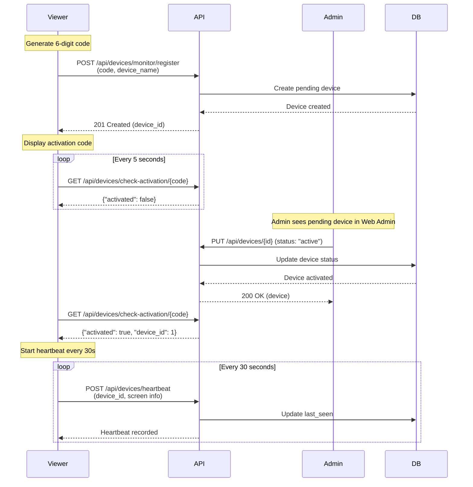
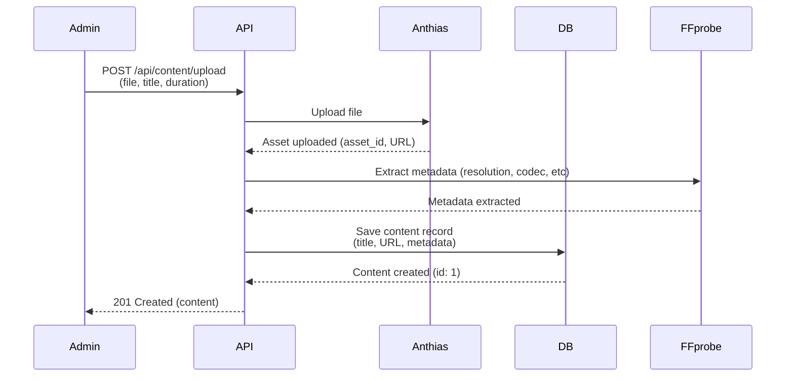

# Smart TV Digital Signage API Documentation

**Version:** 1.0.0
**Base URL:** http://192.168.5.12:8001
**Framework:** FastAPI (Python 3.8+)
**Database:** PostgreSQL 15+
**Media Storage:** Anthias CMS (port 8000)

---

## Table of Contents

1. [Overview](#overview)
2. [Endpoint Summary](#endpoint-summary)
3. [Authentication](#authentication)
4. [Response Standards](#response-standards)
5. [API Categories](#api-categories)
6. [Common Use Cases](#common-use-cases)
7. [Error Handling](#error-handling)
8. [Rate Limiting](#rate-limiting)
9. [WebSocket Support](#websocket-support)
10. [Testing](#testing)

---

## Overview

The Smart TV Digital Signage API provides comprehensive backend services for managing digital signage across multiple display devices including:

- **WebOS TVs** (LG Smart TVs)
- **Browser-based Monitors** (Chrome, Firefox, Safari, Edge)
- **Android TV devices**
- **Tizen TVs** (Samsung Smart TVs)

### Key Features

- ✅ **Multi-Device Support** - Manage TVs, monitors, and browser displays
- ✅ **Content Management** - Upload images/videos with automatic metadata extraction
- ✅ **Playlist System** - Create dynamic playlists with scheduling
- ✅ **Device Monitoring** - Real-time heartbeat tracking and online/offline status
- ✅ **Tag-Based Grouping** - Organize devices using tags for bulk operations
- ✅ **Remote Commands** - Send reload, reset, and speed test commands to devices
- ✅ **Speed Testing** - Built-in network speed testing for device diagnostics
- ✅ **JWT Authentication** - Secure token-based authentication
- ✅ **Quick Wins Standards** - Standardized response format and error handling

### Architecture

```
┌─────────────────┐
│   Web Admin     │ ← Admin interface (React on port 3000)
│   (React/Vite)  │
└────────┬────────┘
         │
         │ HTTP/REST
         ↓
┌─────────────────┐
│  Backend API    │ ← FastAPI on port 8001
│   (FastAPI)     │
└────────┬────────┘
         │
         ├─→ PostgreSQL (port 5433) ← Metadata storage
         │
         ├─→ Anthias CMS (port 8000) ← Media file storage
         │
         └─→ Viewer (port 8080) ← Device displays
                  ↓
         ┌────────────────────┐
         │  TV/Monitor Devices │
         │  (Chrome, webOS, etc)│
         └────────────────────┘
```

---

## Endpoint Summary

**Total Endpoints:** 92

### By Category

| Category | Endpoints | Description |
|----------|-----------|-------------|
| **Devices** | 20 | Device registration, management, commands, heartbeat |
| **Playlists** | 14 | Playlist CRUD, content management, assignments |
| **Content** | 10 | Upload, manage, assign media content |
| **Tags** | 9 | Tag management and device grouping |
| **Firebird Integration** | 8 | External database integration |
| **Speed Test** | 5 | Network speed testing |
| **Authentication** | 4 | Login, token refresh, user info |
| **Settings** | 4 | System configuration |
| **Device Logs** | 4 | Activity logging |
| **Client** | 2 | Device playlist fetching |

---

## Authentication

### JWT Bearer Token Authentication

Most endpoints require JWT authentication using Bearer token:

```http
Authorization: Bearer <access_token>
```

### Authentication Flow



### Token Expiry

- **Access Token:** 30 minutes
- **Refresh Token:** 7 days

### Endpoints

#### 1. Login

```http
POST /api/auth/login
Content-Type: application/json

{
  "username": "admin",
  "password": "password123"
}
```

**Response:**
```json
{
  "access_token": "eyJhbGciOiJIUzI1NiIsInR5cCI6IkpXVCJ9...",
  "refresh_token": "eyJhbGciOiJIUzI1NiIsInR5cCI6IkpXVCJ9...",
  "token_type": "bearer",
  "expires_in": 1800
}
```

#### 2. Refresh Token

```http
POST /api/auth/refresh
Content-Type: application/json

{
  "refresh_token": "eyJhbGciOiJIUzI1NiIsInR5cCI6IkpXVCJ9..."
}
```

#### 3. Get Current User

```http
GET /api/auth/me
Authorization: Bearer <access_token>
```

**Response:**
```json
{
  "id": 1,
  "username": "admin",
  "email": "admin@example.com",
  "full_name": "Administrator",
  "is_active": true,
  "is_superuser": true,
  "created_at": "2025-10-27T10:00:00Z",
  "updated_at": "2025-10-27T10:00:00Z"
}
```

#### 4. Logout

```http
POST /api/auth/logout
Authorization: Bearer <access_token>
```

**Note:** Logout is client-side only (token is discarded by client).

---

## Response Standards

This API follows **Quick Wins** standardized response format.

### Success Response

```json
{
  "success": true,
  "data": {
    "id": 1,
    "name": "Example Resource",
    "status": "active"
  },
  "meta": {
    "timestamp": "2025-10-27T10:30:00Z",
    "request_id": "550e8400-e29b-41d4-a716-446655440000"
  }
}
```

### Error Response

```json
{
  "success": false,
  "error": {
    "code": "NOT_FOUND",
    "message": "Device with ID 999 not found",
    "details": {
      "resource_type": "device",
      "resource_id": 999
    }
  },
  "meta": {
    "timestamp": "2025-10-27T10:30:00Z",
    "request_id": "550e8400-e29b-41d4-a716-446655440000"
  }
}
```

### Common Error Codes

| Code | HTTP Status | Description |
|------|-------------|-------------|
| `VALIDATION_ERROR` | 400 | Invalid input data |
| `UNAUTHORIZED` | 401 | Missing or invalid authentication |
| `FORBIDDEN` | 403 | Insufficient permissions |
| `NOT_FOUND` | 404 | Resource not found |
| `CONFLICT` | 409 | Resource conflict (duplicate) |
| `INTERNAL_SERVER_ERROR` | 500 | Server error |

---

## API Categories

### 1. Devices API

Manage device registration, activation, monitoring, and remote commands.

#### Device Registration Flow



#### Key Endpoints

| Method | Endpoint | Auth | Description |
|--------|----------|------|-------------|
| `POST` | `/api/devices/monitor/register` | ❌ No | Device self-registration |
| `GET` | `/api/devices/check-activation/{code}` | ❌ No | Check activation status |
| `POST` | `/api/devices/heartbeat` | ❌ No | Send device heartbeat |
| `GET` | `/api/devices` | ✅ Yes | List all devices |
| `GET` | `/api/devices/{id}` | ✅ Yes | Get device details |
| `PUT` | `/api/devices/{id}` | ✅ Yes | Update device (activate, rename) |
| `DELETE` | `/api/devices/{id}` | ✅ Yes | Delete device |
| `POST` | `/api/devices/{id}/release` | ✅ Yes | Release device (reset) |
| `POST` | `/api/devices/{id}/commands` | ✅ Yes | Queue command |
| `GET` | `/api/devices/{id}/commands/pending` | ❌ No | Get pending commands |
| `POST` | `/api/devices/{id}/commands/{cmd_id}/execute` | ❌ No | Mark command as executed |

#### Device Commands

| Command | Description | Effect on Device |
|---------|-------------|------------------|
| `reset` | Clear localStorage and reload | Clears all data, shows activation screen |
| `reload` | Reload page | Refreshes page without clearing data |
| `refresh` | Refresh playlist | Re-fetches content playlist |
| `run_speed_test` | Run speed test | Measures download/upload speed |

**Example: Queue Reset Command**

```http
POST /api/devices/1/commands
Authorization: Bearer <token>
Content-Type: application/json

{
  "command_type": "reset",
  "reason": "device_maintenance"
}
```

---

### 2. Content API

Upload, manage, and assign media content (images/videos).

#### Content Upload Flow



#### Key Endpoints

| Method | Endpoint | Description |
|--------|----------|-------------|
| `POST` | `/api/content/upload` | Upload image/video |
| `GET` | `/api/content` | List all content |
| `GET` | `/api/content/{id}` | Get content details |
| `PATCH` | `/api/content/{id}` | Update content metadata |
| `DELETE` | `/api/content/{id}` | Delete content |
| `POST` | `/api/content/{id}/assign` | Assign to device/tag |
| `DELETE` | `/api/content/{id}/assign` | Unassign from device/tag |
| `GET` | `/api/content/{id}/assignments` | Get all assignments |
| `GET` | `/api/content/{id}/image` | Serve image file |
| `GET` | `/api/content/{id}/video` | Serve video file |

#### Supported Formats

| Type | Formats |
|------|---------|
| **Images** | JPEG, PNG, GIF, WebP |
| **Videos** | MP4, WebM, AVI, MOV |

#### Metadata Extraction

The API automatically extracts metadata using FFprobe:

- **Resolution** (width x height)
- **Duration** (for videos)
- **Codec** (H.264, VP8, etc)
- **FPS** (frames per second)
- **Bitrate** (video and audio)
- **Audio codec**
- **Sample rate**

**Example: Upload Content**

```http
POST /api/content/upload
Authorization: Bearer <token>
Content-Type: multipart/form-data

--boundary
Content-Disposition: form-data; name="file"; filename="banner.jpg"
Content-Type: image/jpeg

<binary data>
--boundary
Content-Disposition: form-data; name="title"

Welcome Banner
--boundary
Content-Disposition: form-data; name="duration"

10
--boundary--
```

**Response:**
```json
{
  "id": 1,
  "title": "Welcome Banner",
  "content_type": "image",
  "anthias_url": "http://192.168.5.12:8000/assets/abc123",
  "anthias_asset_id": "abc123",
  "duration": 10,
  "file_size": 2048576,
  "mime_type": "image/jpeg",
  "resolution": "1920x1080",
  "width": 1920,
  "height": 1080,
  "is_active": true,
  "created_at": "2025-10-27T10:30:00Z"
}
```

---

### 3. Playlists API

Create and manage content playlists with scheduling.

#### Playlist Structure

```
Playlist
├── name: "Morning Announcements"
├── description: "Daily morning announcements"
├── is_active: true
├── priority: 10
├── schedule: { ... }
└── content_items: [
    ├── Content 1 (duration: 10s, order: 0)
    ├── Content 2 (duration: 15s, order: 1)
    └── Content 3 (duration: 20s, order: 2)
]
```

#### Key Endpoints

| Method | Endpoint | Description |
|--------|----------|-------------|
| `GET` | `/api/playlists` | List all playlists |
| `POST` | `/api/playlists` | Create playlist |
| `GET` | `/api/playlists/{id}` | Get playlist details |
| `PATCH` | `/api/playlists/{id}` | Update playlist |
| `DELETE` | `/api/playlists/{id}` | Delete playlist |
| `GET` | `/api/playlists/{id}/content` | Get playlist content |
| `POST` | `/api/playlists/{id}/content` | Add content to playlist |
| `DELETE` | `/api/playlists/{id}/content/{item_id}` | Remove content |
| `PATCH` | `/api/playlists/{id}/reorder` | Reorder content |
| `POST` | `/api/playlists/{id}/assign/devices` | Assign to devices |
| `POST` | `/api/playlists/{id}/assign/tags` | Assign to tags |
| `GET` | `/api/playlists/{id}/assignments` | Get assignments |

**Example: Create Playlist**

```http
POST /api/playlists
Authorization: Bearer <token>
Content-Type: application/json

{
  "name": "Morning Announcements",
  "description": "Daily morning announcements",
  "is_active": true,
  "priority": 10
}
```

**Example: Add Content to Playlist**

```http
POST /api/playlists/1/content
Authorization: Bearer <token>
Content-Type: application/json

{
  "content_ids": [1, 2, 3]
}
```

**Example: Reorder Playlist Content**

```http
PATCH /api/playlists/1/reorder
Authorization: Bearer <token>
Content-Type: application/json

{
  "content_items": [
    {"id": 1, "order_index": 0, "duration": 10},
    {"id": 2, "order_index": 1, "duration": 15},
    {"id": 3, "order_index": 2, "duration": 20}
  ]
}
```

---

### 4. Tags API

Organize devices using tags for bulk content assignment.

#### Tag Use Cases

- **Location-based**: "Floor 1", "Floor 2", "Lobby", "Cafeteria"
- **Department**: "HR", "IT", "Marketing", "Sales"
- **Display Type**: "Portrait", "Landscape", "4K", "HD"
- **Content Category**: "News", "Announcements", "Ads", "Weather"

#### Key Endpoints

| Method | Endpoint | Description |
|--------|----------|-------------|
| `GET` | `/api/tags` | List all tags |
| `POST` | `/api/tags` | Create tag |
| `GET` | `/api/tags/{id}` | Get tag details |
| `PATCH` | `/api/tags/{id}` | Update tag |
| `DELETE` | `/api/tags/{id}` | Delete tag |
| `POST` | `/api/tags/{id}/assign` | Assign devices to tag |
| `DELETE` | `/api/tags/{id}/assign` | Remove devices from tag |
| `GET` | `/api/tags/{id}/devices` | Get tag devices |
| `GET` | `/api/tags/{id}/content` | Get tag content |

**Example: Create Tag**

```http
POST /api/tags
Authorization: Bearer <token>
Content-Type: application/json

{
  "tag_name": "Lobby",
  "description": "All lobby displays",
  "color": "#3B82F6"
}
```

**Example: Assign Devices to Tag**

```http
POST /api/tags/1/assign
Authorization: Bearer <token>
Content-Type: application/json

{
  "device_ids": [1, 2, 3]
}
```

---

### 5. Client API (for Devices)

Client-facing endpoints for TV/Monitor devices to fetch content.

**Note:** These endpoints do NOT require authentication.

#### Get Device Playlist

```http
GET /api/client/playlist?device_id=1
```

**Response:**
```json
{
  "device_id": 1,
  "device_name": "Reception Display",
  "playlist_count": 3,
  "playlist": [
    {
      "content_id": 1,
      "title": "Welcome Banner",
      "content_type": "image",
      "url": "http://192.168.5.12:8000/assets/abc123",
      "duration": 10,
      "priority": 5
    },
    {
      "content_id": 2,
      "title": "Company Video",
      "content_type": "video",
      "url": "http://192.168.5.12:8000/assets/def456",
      "duration": 30,
      "priority": 3
    }
  ]
}
```

---

## Common Use Cases

### Use Case 1: Register and Activate a New Monitor

```bash
# Step 1: Device self-registers with 6-digit code
curl -X POST http://192.168.5.12:8001/api/devices/monitor/register \
  -H "Content-Type: application/json" \
  -d '{
    "activation_code": "123456",
    "device_name": "Lobby Display",
    "platform": "Chrome"
  }'

# Response: {"id": 1, "status": "pending", ...}

# Step 2: Device polls for activation (every 5 seconds)
curl http://192.168.5.12:8001/api/devices/check-activation/123456

# Response: {"activated": false, "device_id": 1}

# Step 3: Admin activates device (via Web Admin)
curl -X PUT http://192.168.5.12:8001/api/devices/1 \
  -H "Authorization: Bearer $TOKEN" \
  -H "Content-Type: application/json" \
  -d '{"status": "active"}'

# Step 4: Device detects activation
curl http://192.168.5.12:8001/api/devices/check-activation/123456

# Response: {"activated": true, "device_id": 1}

# Step 5: Device starts heartbeat (every 30 seconds)
curl -X POST http://192.168.5.12:8001/api/devices/heartbeat \
  -H "Content-Type: application/json" \
  -d '{
    "device_id": 1,
    "screen_width": 1920,
    "screen_height": 1080
  }'
```

### Use Case 2: Upload Content and Assign to Devices

```bash
# Step 1: Upload content
curl -X POST http://192.168.5.12:8001/api/content/upload \
  -H "Authorization: Bearer $TOKEN" \
  -F "file=@banner.jpg" \
  -F "title=Welcome Banner" \
  -F "duration=10"

# Response: {"id": 1, "title": "Welcome Banner", ...}

# Step 2: Assign content to device
curl -X POST http://192.168.5.12:8001/api/content/1/assign \
  -H "Authorization: Bearer $TOKEN" \
  -H "Content-Type: application/json" \
  -d '{
    "device_id": 1,
    "priority": 5
  }'
```

### Use Case 3: Create Playlist and Assign to Tag

```bash
# Step 1: Create playlist
curl -X POST http://192.168.5.12:8001/api/playlists \
  -H "Authorization: Bearer $TOKEN" \
  -H "Content-Type: application/json" \
  -d '{
    "name": "Morning Announcements",
    "is_active": true,
    "priority": 10
  }'

# Response: {"id": 1, "name": "Morning Announcements", ...}

# Step 2: Add content to playlist
curl -X POST http://192.168.5.12:8001/api/playlists/1/content \
  -H "Authorization: Bearer $TOKEN" \
  -H "Content-Type: application/json" \
  -d '{"content_ids": [1, 2, 3]}'

# Step 3: Assign playlist to tag
curl -X POST http://192.168.5.12:8001/api/playlists/1/assign/tags \
  -H "Authorization: Bearer $TOKEN" \
  -H "Content-Type: application/json" \
  -d '{"tag_ids": [1]}'
```

### Use Case 4: Send Remote Command to Device

```bash
# Queue reload command
curl -X POST http://192.168.5.12:8001/api/devices/1/commands \
  -H "Authorization: Bearer $TOKEN" \
  -H "Content-Type: application/json" \
  -d '{
    "command_type": "reload",
    "reason": "content_updated"
  }'

# Device polls for commands (during heartbeat)
curl http://192.168.5.12:8001/api/devices/1/commands/pending

# Response: {"commands": [{"id": 1, "command_type": "reload", ...}]}

# Device executes command and marks as executed
curl -X POST http://192.168.5.12:8001/api/devices/1/commands/1/execute
```

---

## Error Handling

### HTTP Status Codes

| Code | Status | Description |
|------|--------|-------------|
| 200 | OK | Request successful |
| 201 | Created | Resource created successfully |
| 204 | No Content | Request successful, no response body |
| 400 | Bad Request | Invalid input data |
| 401 | Unauthorized | Missing or invalid authentication |
| 403 | Forbidden | Insufficient permissions |
| 404 | Not Found | Resource not found |
| 409 | Conflict | Resource conflict (duplicate) |
| 422 | Unprocessable Entity | Validation error |
| 500 | Internal Server Error | Server error |

### Error Response Format

```json
{
  "success": false,
  "error": {
    "code": "VALIDATION_ERROR",
    "message": "Invalid input data",
    "details": {
      "field": "email",
      "issue": "Invalid email format"
    }
  },
  "meta": {
    "timestamp": "2025-10-27T10:30:00Z",
    "request_id": "550e8400-e29b-41d4-a716-446655440000"
  }
}
```

### Common Errors

#### 401 Unauthorized

```json
{
  "detail": "Not authenticated"
}
```

**Solution:** Include valid Bearer token in Authorization header.

#### 404 Not Found

```json
{
  "detail": "Device with ID 999 not found"
}
```

**Solution:** Verify resource ID exists.

#### 409 Conflict

```json
{
  "detail": "Device with IP 192.168.5.100 already registered"
}
```

**Solution:** Check for duplicate resources.

---

## Rate Limiting

Currently, there is no rate limiting implemented. This will be added in a future version.

**Recommended Limits (Future):**
- **Authentication:** 5 requests per minute
- **General API:** 100 requests per minute
- **Heartbeat:** 3 requests per minute (every 30 seconds)

---

## WebSocket Support

WebSocket endpoint for real-time communication:

```
ws://192.168.5.12:8001/api/ws/{device_id}
```

**Use Cases:**
- Real-time content updates
- Live device status monitoring
- Push notifications to devices

**Example (JavaScript):**

```javascript
const ws = new WebSocket('ws://192.168.5.12:8001/api/ws/1');

ws.onopen = () => {
  console.log('WebSocket connected');
};

ws.onmessage = (event) => {
  const data = JSON.parse(event.data);
  console.log('Message received:', data);
};

ws.onerror = (error) => {
  console.error('WebSocket error:', error);
};

ws.onclose = () => {
  console.log('WebSocket disconnected');
};
```

---

## Testing

### Using cURL

```bash
# Login
TOKEN=$(curl -X POST http://192.168.5.12:8001/api/auth/login \
  -H "Content-Type: application/json" \
  -d '{"username":"admin","password":"password"}' \
  | jq -r '.access_token')

# List devices
curl http://192.168.5.12:8001/api/devices \
  -H "Authorization: Bearer $TOKEN"
```

### Using Postman

1. Import OpenAPI spec from: `http://192.168.5.12:8001/openapi.json`
2. Create environment variable `TOKEN`
3. Add pre-request script to auto-refresh token
4. Test endpoints using collection runner

### Using Python

```python
import requests

# Login
response = requests.post(
    'http://192.168.5.12:8001/api/auth/login',
    json={'username': 'admin', 'password': 'password'}
)
token = response.json()['access_token']

# List devices
headers = {'Authorization': f'Bearer {token}'}
response = requests.get(
    'http://192.168.5.12:8001/api/devices',
    headers=headers
)
devices = response.json()
print(devices)
```

### Automated Testing

Run the test suite:

```bash
cd backend
pytest tests/
```

---

## API Reference

For complete API reference with all endpoints, schemas, and examples:

- **OpenAPI Spec (JSON):** http://192.168.5.12:8001/openapi.json
- **Swagger UI:** http://192.168.5.12:8001/docs
- **ReDoc:** http://192.168.5.12:8001/redoc
- **Enhanced OpenAPI Spec (YAML):** `/backend/docs/openapi-enhanced.yaml`

---

## Support

For issues, questions, or feature requests:

- **Email:** support@example.com
- **GitHub Issues:** https://github.com/yourusername/signate/issues
- **Documentation:** http://192.168.5.12:8001/docs

---

**Last Updated:** 2025-10-27
**API Version:** 1.0.0
