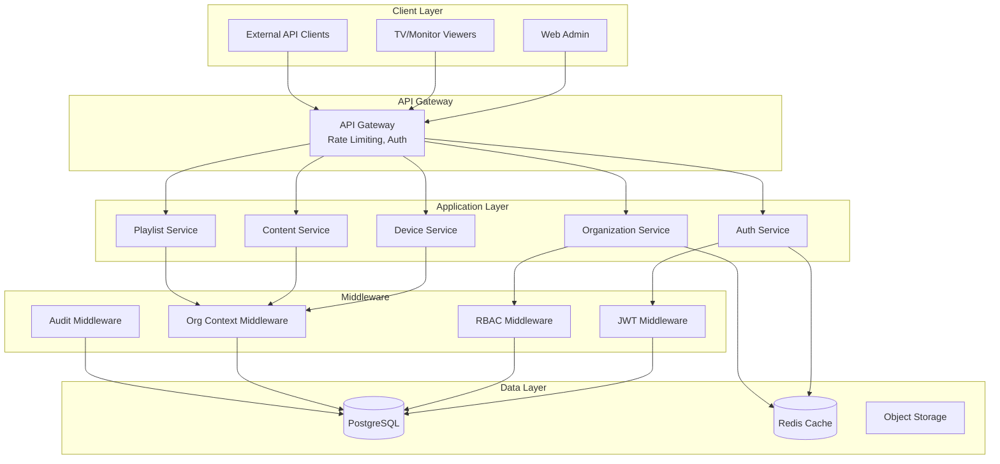

# Multi-Tenant Backend API Architecture

## Table of Contents
1. [Architecture Overview](#architecture-overview)
2. [Database Models](#database-models)
3. [API Endpoints](#api-endpoints)
4. [Authentication & Authorization](#authentication--authorization)
5. [Middleware Architecture](#middleware-architecture)
6. [Pydantic Schemas](#pydantic-schemas)
7. [Migration Strategy](#migration-strategy)
8. [Implementation Examples](#implementation-examples)

---

## Architecture Overview

### Core Design Principles
- **Multi-tenancy**: Organization-based data isolation
- **Role-Based Access Control (RBAC)**: Fine-grained permissions
- **JWT Authentication**: Stateless, scalable authentication
- **API Versioning**: `/api/v1/` prefix for future compatibility
- **RESTful Design**: Consistent HTTP methods and status codes
- **Dependency Injection**: Clean, testable code architecture

### System Architecture Diagram



---

## Database Models

### New Models Required

```python
# backend/app/models/organization.py
from sqlalchemy import Column, Integer, String, Boolean, DateTime, JSON
from sqlalchemy.orm import relationship
from sqlalchemy.sql import func
from app.core.database import Base

class Organization(Base):
    __tablename__ = "organizations"

    id = Column(Integer, primary_key=True, index=True)
    name = Column(String(100), nullable=False)
    slug = Column(String(100), unique=True, nullable=False, index=True)
    description = Column(String(500))

    # Organization settings
    settings = Column(JSON, default={})
    max_devices = Column(Integer, default=10)
    max_users = Column(Integer, default=5)
    max_storage_gb = Column(Integer, default=10)

    # Subscription/billing (future)
    subscription_tier = Column(String(50), default='free')
    subscription_expires_at = Column(DateTime)

    # Status
    is_active = Column(Boolean, default=True)

    # Timestamps
    created_at = Column(DateTime, server_default=func.now())
    updated_at = Column(DateTime, onupdate=func.now())

    # Relationships
    users = relationship("UserOrganization", back_populates="organization")
    devices = relationship("Device", back_populates="organization")
    content = relationship("Content", back_populates="organization")
    playlists = relationship("Playlist", back_populates="organization")
    roles = relationship("Role", back_populates="organization")


# backend/app/models/role.py
from sqlalchemy import Column, Integer, String, Boolean, JSON, ForeignKey
from sqlalchemy.orm import relationship
from app.core.database import Base

class Role(Base):
    __tablename__ = "roles"

    id = Column(Integer, primary_key=True, index=True)
    name = Column(String(50), nullable=False)
    display_name = Column(String(100))
    description = Column(String(500))

    # Organization-specific role or system role
    organization_id = Column(Integer, ForeignKey("organizations.id"), nullable=True)
    is_system_role = Column(Boolean, default=False)

    # Permissions as JSON
    permissions = Column(JSON, default={})

    # Relationships
    organization = relationship("Organization", back_populates="roles")
    user_roles = relationship("UserRole", back_populates="role")


# backend/app/models/user_organization.py
from sqlalchemy import Column, Integer, ForeignKey, DateTime, Boolean, String
from sqlalchemy.orm import relationship
from sqlalchemy.sql import func
from app.core.database import Base

class UserOrganization(Base):
    __tablename__ = "user_organizations"

    id = Column(Integer, primary_key=True, index=True)
    user_id = Column(Integer, ForeignKey("users.id"), nullable=False)
    organization_id = Column(Integer, ForeignKey("organizations.id"), nullable=False)

    # User's role in this organization
    role_id = Column(Integer, ForeignKey("roles.id"), nullable=False)

    # Is this the user's primary/default organization?
    is_primary = Column(Boolean, default=False)

    # Status in organization
    is_active = Column(Boolean, default=True)
    invited_by = Column(Integer, ForeignKey("users.id"))
    invitation_token = Column(String(100))
    invitation_expires_at = Column(DateTime)

    # Timestamps
    joined_at = Column(DateTime, server_default=func.now())
    left_at = Column(DateTime)

    # Relationships
    user = relationship("User", back_populates="organizations", foreign_keys=[user_id])
    organization = relationship("Organization", back_populates="users")
    role = relationship("Role")


# backend/app/models/permission.py
from sqlalchemy import Column, Integer, String, JSON
from app.core.database import Base

class Permission(Base):
    __tablename__ = "permissions"

    id = Column(Integer, primary_key=True, index=True)
    resource = Column(String(50), nullable=False)  # devices, content, playlists, etc.
    action = Column(String(50), nullable=False)    # create, read, update, delete, manage
    scope = Column(String(50), default='organization')  # organization, own, all
    conditions = Column(JSON)  # Additional conditions

    # Unique constraint
    __table_args__ = (
        UniqueConstraint('resource', 'action', 'scope', name='_permission_uc'),
    )
```

### Updated Existing Models

```python
# Add to existing models (Device, Content, Playlist, etc.)
class Device(Base):
    # ... existing fields ...

    # Add organization reference
    organization_id = Column(Integer, ForeignKey("organizations.id"), nullable=False)
    organization = relationship("Organization", back_populates="devices")

    # Add created_by for audit
    created_by = Column(Integer, ForeignKey("users.id"))
    creator = relationship("User", foreign_keys=[created_by])


class Content(Base):
    # ... existing fields ...

    # Add organization reference
    organization_id = Column(Integer, ForeignKey("organizations.id"), nullable=False)
    organization = relationship("Organization", back_populates="content")

    # Add ownership and sharing
    created_by = Column(Integer, ForeignKey("users.id"))
    is_shared = Column(Boolean, default=False)
    shared_with_orgs = Column(JSON, default=[])  # List of org IDs


class User(Base):
    # ... existing fields ...

    # Remove single role field, use UserOrganization instead
    # role = Column(String(20), default='viewer', nullable=False)  # REMOVE

    # Add relationships
    organizations = relationship("UserOrganization", back_populates="user")

    # Super admin flag (system-wide admin)
    is_super_admin = Column(Boolean, default=False)
```

---

## API Endpoints

### Authentication Endpoints

```yaml
/api/v1/auth:
  /login:
    POST: Login with username/password
    Request: {username, password, organization_slug?}
    Response: {access_token, refresh_token, user, organization}

  /logout:
    POST: Logout (invalidate tokens)
    Headers: Authorization: Bearer {token}

  /refresh:
    POST: Refresh access token
    Request: {refresh_token}
    Response: {access_token, refresh_token}

  /password/reset:
    POST: Request password reset
    Request: {email}

  /password/reset/confirm:
    POST: Confirm password reset
    Request: {token, new_password}

  /password/change:
    POST: Change password (authenticated)
    Request: {current_password, new_password}

  /verify-email:
    POST: Verify email address
    Request: {token}
```

### Organization Management

```yaml
/api/v1/organizations:
  /:
    GET: List user's organizations
    POST: Create new organization (requires permission)

  /{org_id}:
    GET: Get organization details
    PUT: Update organization
    DELETE: Delete organization (super admin only)

  /{org_id}/stats:
    GET: Organization statistics (devices, content, users)

  /{org_id}/settings:
    GET: Get organization settings
    PUT: Update organization settings

  /switch:
    POST: Switch active organization
    Request: {organization_id}
```

### User Management

```yaml
/api/v1/users:
  /:
    GET: List users in organization
    POST: Create new user (invite)

  /me:
    GET: Get current user profile
    PUT: Update current user profile

  /{user_id}:
    GET: Get user details
    PUT: Update user (admin only)
    DELETE: Remove user from organization

  /{user_id}/roles:
    GET: Get user roles
    PUT: Update user roles

  /invite:
    POST: Invite user to organization
    Request: {email, role_id, message?}

  /invite/accept:
    POST: Accept invitation
    Request: {token}
```

### Role & Permission Management

```yaml
/api/v1/roles:
  /:
    GET: List available roles
    POST: Create custom role (admin only)

  /{role_id}:
    GET: Get role details
    PUT: Update role
    DELETE: Delete role

  /{role_id}/permissions:
    GET: Get role permissions
    PUT: Update role permissions

/api/v1/permissions:
  /:
    GET: List all available permissions

  /check:
    POST: Check user permission
    Request: {resource, action, resource_id?}
```

### Organization-Scoped Resources

All existing endpoints should be scoped to organization:

```yaml
/api/v1/devices:
  /:
    GET: List organization's devices
    POST: Register new device

  /{device_id}:
    GET: Get device (must belong to org)
    PUT: Update device
    DELETE: Delete device

/api/v1/content:
  /:
    GET: List organization's content
    POST: Upload new content

  /{content_id}:
    GET: Get content (must belong to org or be shared)
    PUT: Update content
    DELETE: Delete content

  /{content_id}/share:
    POST: Share content with other organizations

/api/v1/playlists:
  # Similar pattern - all scoped to organization
```

---

## Authentication & Authorization

### JWT Token Structure

```python
# Access Token Payload
{
    "user_id": 123,
    "username": "john.doe",
    "organization_id": 456,  # Current active organization
    "organization_slug": "acme-corp",
    "role_id": 2,
    "permissions": ["devices:read", "devices:create", "content:read"],
    "is_super_admin": false,
    "exp": 1234567890,
    "iat": 1234567890,
    "type": "access"
}

# Refresh Token Payload (minimal)
{
    "user_id": 123,
    "exp": 1234567890,
    "iat": 1234567890,
    "type": "refresh"
}
```

### Dependency Injection Pattern

```python
# backend/app/core/deps.py
from typing import Optional, List
from fastapi import Depends, HTTPException, status
from sqlalchemy.orm import Session

class OrganizationContext:
    """Organization context for multi-tenant requests"""

    def __init__(self, user: User, organization: Organization, role: Role, permissions: List[str]):
        self.user = user
        self.organization = organization
        self.role = role
        self.permissions = permissions

    def has_permission(self, resource: str, action: str) -> bool:
        """Check if user has specific permission"""
        return f"{resource}:{action}" in self.permissions


async def get_current_context(
    token: str = Depends(oauth2_scheme),
    db: Session = Depends(get_db)
) -> OrganizationContext:
    """Get current user's organization context"""
    payload = verify_token(token)

    user = db.query(User).filter(User.id == payload["user_id"]).first()
    if not user or not user.is_active:
        raise HTTPException(status_code=401, detail="User not found or inactive")

    org = db.query(Organization).filter(
        Organization.id == payload["organization_id"]
    ).first()
    if not org or not org.is_active:
        raise HTTPException(status_code=403, detail="Organization not found or inactive")

    # Get user's role in organization
    user_org = db.query(UserOrganization).filter(
        UserOrganization.user_id == user.id,
        UserOrganization.organization_id == org.id
    ).first()

    if not user_org or not user_org.is_active:
        raise HTTPException(status_code=403, detail="User not member of organization")

    role = db.query(Role).filter(Role.id == user_org.role_id).first()

    return OrganizationContext(
        user=user,
        organization=org,
        role=role,
        permissions=payload.get("permissions", [])
    )


def require_permission(resource: str, action: str):
    """Decorator to check permissions"""
    async def permission_checker(
        context: OrganizationContext = Depends(get_current_context)
    ):
        if not context.has_permission(resource, action):
            raise HTTPException(
                status_code=403,
                detail=f"Missing permission: {resource}:{action}"
            )
        return context
    return permission_checker


# Usage in endpoints
@router.get("/devices")
async def list_devices(
    context: OrganizationContext = Depends(require_permission("devices", "read")),
    db: Session = Depends(get_db)
):
    devices = db.query(Device).filter(
        Device.organization_id == context.organization.id
    ).all()
    return devices
```

---

## Middleware Architecture

### Request Flow

```python
# backend/app/middleware/organization.py
from starlette.middleware.base import BaseHTTPMiddleware
from starlette.requests import Request

class OrganizationMiddleware(BaseHTTPMiddleware):
    """Add organization context to all requests"""

    async def dispatch(self, request: Request, call_next):
        # Extract organization from JWT or header
        org_id = None

        if "authorization" in request.headers:
            token = request.headers["authorization"].replace("Bearer ", "")
            payload = verify_token_no_exception(token)
            if payload:
                org_id = payload.get("organization_id")

        # Add to request state
        request.state.organization_id = org_id

        response = await call_next(request)
        return response


# backend/app/middleware/audit.py
class AuditMiddleware(BaseHTTPMiddleware):
    """Log all API requests for audit trail"""

    async def dispatch(self, request: Request, call_next):
        start_time = time.time()

        # Capture request info
        audit_log = {
            "path": request.url.path,
            "method": request.method,
            "user_id": getattr(request.state, "user_id", None),
            "organization_id": getattr(request.state, "organization_id", None),
            "ip_address": request.client.host,
            "timestamp": datetime.utcnow()
        }

        response = await call_next(request)

        # Add response info
        audit_log["status_code"] = response.status_code
        audit_log["response_time"] = time.time() - start_time

        # Log to database or logging service
        await log_audit_event(audit_log)

        return response


# backend/app/middleware/rate_limit.py
from fastapi_limiter import FastAPILimiter
from fastapi_limiter.depends import RateLimiter

class RateLimitMiddleware:
    """Rate limiting per organization"""

    @staticmethod
    async def get_identifier(request: Request) -> str:
        """Get rate limit identifier (org_id + user_id)"""
        org_id = getattr(request.state, "organization_id", "anonymous")
        user_id = getattr(request.state, "user_id", "anonymous")
        return f"{org_id}:{user_id}"

    @staticmethod
    def apply_limits():
        """Apply different rate limits based on subscription tier"""
        return RateLimiter(
            times=100,  # requests
            seconds=60  # per minute
        )
```

---

## Pydantic Schemas

### Authentication Schemas

```python
# backend/app/schemas/auth.py
from pydantic import BaseModel, EmailStr, Field, validator
from typing import Optional, List
from datetime import datetime

class LoginRequest(BaseModel):
    username: str = Field(..., min_length=3, max_length=50)
    password: str = Field(..., min_length=8)
    organization_slug: Optional[str] = None  # Optional org selection

    class Config:
        schema_extra = {
            "example": {
                "username": "john.doe",
                "password": "SecurePass123!",
                "organization_slug": "acme-corp"
            }
        }


class TokenResponse(BaseModel):
    access_token: str
    refresh_token: str
    token_type: str = "bearer"
    expires_in: int
    user: 'UserResponse'
    organization: 'OrganizationResponse'


class PasswordResetRequest(BaseModel):
    email: EmailStr


class PasswordResetConfirm(BaseModel):
    token: str
    new_password: str = Field(..., min_length=8, regex="^(?=.*[a-z])(?=.*[A-Z])(?=.*\d)")

    @validator('new_password')
    def validate_password(cls, v):
        if len(v) < 8:
            raise ValueError('Password must be at least 8 characters')
        if not any(char.isdigit() for char in v):
            raise ValueError('Password must contain at least one digit')
        if not any(char.isupper() for char in v):
            raise ValueError('Password must contain at least one uppercase letter')
        return v
```

### Organization Schemas

```python
# backend/app/schemas/organization.py
from pydantic import BaseModel, Field, validator
from typing import Optional, Dict, Any, List
from datetime import datetime

class OrganizationBase(BaseModel):
    name: str = Field(..., min_length=2, max_length=100)
    slug: str = Field(..., min_length=2, max_length=100, regex="^[a-z0-9-]+$")
    description: Optional[str] = Field(None, max_length=500)

    @validator('slug')
    def validate_slug(cls, v):
        if not v.replace('-', '').isalnum():
            raise ValueError('Slug must contain only lowercase letters, numbers, and hyphens')
        return v.lower()


class OrganizationCreate(OrganizationBase):
    settings: Optional[Dict[str, Any]] = {}
    max_devices: int = Field(10, ge=1, le=1000)
    max_users: int = Field(5, ge=1, le=100)
    max_storage_gb: int = Field(10, ge=1, le=1000)


class OrganizationUpdate(BaseModel):
    name: Optional[str] = Field(None, min_length=2, max_length=100)
    description: Optional[str] = Field(None, max_length=500)
    settings: Optional[Dict[str, Any]] = None
    is_active: Optional[bool] = None


class OrganizationResponse(OrganizationBase):
    id: int
    settings: Dict[str, Any]
    max_devices: int
    max_users: int
    max_storage_gb: int
    subscription_tier: str
    subscription_expires_at: Optional[datetime]
    is_active: bool
    created_at: datetime
    updated_at: Optional[datetime]

    # Computed fields
    device_count: int = 0
    user_count: int = 0
    content_count: int = 0
    storage_used_gb: float = 0.0

    class Config:
        orm_mode = True


class OrganizationStats(BaseModel):
    total_devices: int
    active_devices: int
    total_content: int
    total_playlists: int
    total_users: int
    storage_used_gb: float
    last_activity: Optional[datetime]
```

### User & Role Schemas

```python
# backend/app/schemas/user.py
class UserBase(BaseModel):
    username: str = Field(..., min_length=3, max_length=50)
    email: EmailStr
    full_name: Optional[str] = Field(None, max_length=100)
    phone: Optional[str] = Field(None, max_length=20)


class UserCreate(UserBase):
    password: str = Field(..., min_length=8)
    organization_id: Optional[int] = None
    role_id: Optional[int] = None


class UserUpdate(BaseModel):
    email: Optional[EmailStr] = None
    full_name: Optional[str] = Field(None, max_length=100)
    phone: Optional[str] = Field(None, max_length=20)
    is_active: Optional[bool] = None


class UserInvite(BaseModel):
    email: EmailStr
    role_id: int
    message: Optional[str] = Field(None, max_length=500)
    send_email: bool = True


class UserResponse(UserBase):
    id: int
    is_active: bool
    is_super_admin: bool
    created_at: datetime
    last_login: Optional[datetime]
    organizations: List['UserOrganizationInfo']
    current_organization: Optional['OrganizationResponse']
    current_role: Optional['RoleResponse']

    class Config:
        orm_mode = True


# backend/app/schemas/role.py
class RoleBase(BaseModel):
    name: str = Field(..., min_length=2, max_length=50)
    display_name: str = Field(..., min_length=2, max_length=100)
    description: Optional[str] = Field(None, max_length=500)


class RoleCreate(RoleBase):
    permissions: Dict[str, List[str]] = Field(
        ...,
        description="Permissions map: {resource: [actions]}"
    )
    organization_id: Optional[int] = None


class RoleUpdate(BaseModel):
    display_name: Optional[str] = None
    description: Optional[str] = None
    permissions: Optional[Dict[str, List[str]]] = None


class RoleResponse(RoleBase):
    id: int
    organization_id: Optional[int]
    is_system_role: bool
    permissions: Dict[str, List[str]]
    user_count: int = 0

    class Config:
        orm_mode = True


class PermissionCheck(BaseModel):
    resource: str
    action: str
    resource_id: Optional[int] = None

    class Config:
        schema_extra = {
            "example": {
                "resource": "devices",
                "action": "update",
                "resource_id": 123
            }
        }
```

### Request/Response Patterns

```python
# backend/app/schemas/common.py
from pydantic import BaseModel, Field
from typing import Generic, TypeVar, Optional, List
from datetime import datetime

T = TypeVar('T')

class PaginationParams(BaseModel):
    """Common pagination parameters"""
    page: int = Field(1, ge=1)
    per_page: int = Field(20, ge=1, le=100)
    sort_by: Optional[str] = None
    sort_order: str = Field('asc', regex='^(asc|desc)$')


class PaginatedResponse(BaseModel, Generic[T]):
    """Paginated response wrapper"""
    items: List[T]
    total: int
    page: int
    per_page: int
    pages: int

    class Config:
        schema_extra = {
            "example": {
                "items": [],
                "total": 100,
                "page": 1,
                "per_page": 20,
                "pages": 5
            }
        }


class ErrorResponse(BaseModel):
    """Standard error response"""
    error: str
    message: str
    details: Optional[Dict[str, Any]] = None
    timestamp: datetime = Field(default_factory=datetime.utcnow)
    request_id: Optional[str] = None

    class Config:
        schema_extra = {
            "example": {
                "error": "ValidationError",
                "message": "Invalid input data",
                "details": {"field": "email", "error": "Invalid email format"},
                "timestamp": "2024-01-01T12:00:00Z"
            }
        }


class SuccessResponse(BaseModel):
    """Standard success response"""
    success: bool = True
    message: str
    data: Optional[Dict[str, Any]] = None

    class Config:
        schema_extra = {
            "example": {
                "success": True,
                "message": "Operation completed successfully",
                "data": {}
            }
        }
```

---

## Migration Strategy

### Phase 1: Database Migration

```sql
-- migrations/006_add_multi_tenancy.sql

-- 1. Create organization tables
CREATE TABLE organizations (
    id SERIAL PRIMARY KEY,
    name VARCHAR(100) NOT NULL,
    slug VARCHAR(100) UNIQUE NOT NULL,
    description VARCHAR(500),
    settings JSONB DEFAULT '{}',
    max_devices INTEGER DEFAULT 10,
    max_users INTEGER DEFAULT 5,
    max_storage_gb INTEGER DEFAULT 10,
    subscription_tier VARCHAR(50) DEFAULT 'free',
    subscription_expires_at TIMESTAMP,
    is_active BOOLEAN DEFAULT TRUE,
    created_at TIMESTAMP DEFAULT CURRENT_TIMESTAMP,
    updated_at TIMESTAMP
);

CREATE INDEX idx_organizations_slug ON organizations(slug);
CREATE INDEX idx_organizations_active ON organizations(is_active);

-- 2. Create roles table
CREATE TABLE roles (
    id SERIAL PRIMARY KEY,
    name VARCHAR(50) NOT NULL,
    display_name VARCHAR(100),
    description VARCHAR(500),
    organization_id INTEGER REFERENCES organizations(id) ON DELETE CASCADE,
    is_system_role BOOLEAN DEFAULT FALSE,
    permissions JSONB DEFAULT '{}',
    created_at TIMESTAMP DEFAULT CURRENT_TIMESTAMP
);

CREATE INDEX idx_roles_org ON roles(organization_id);

-- 3. Create user_organizations junction table
CREATE TABLE user_organizations (
    id SERIAL PRIMARY KEY,
    user_id INTEGER NOT NULL REFERENCES users(id) ON DELETE CASCADE,
    organization_id INTEGER NOT NULL REFERENCES organizations(id) ON DELETE CASCADE,
    role_id INTEGER NOT NULL REFERENCES roles(id),
    is_primary BOOLEAN DEFAULT FALSE,
    is_active BOOLEAN DEFAULT TRUE,
    invited_by INTEGER REFERENCES users(id),
    invitation_token VARCHAR(100),
    invitation_expires_at TIMESTAMP,
    joined_at TIMESTAMP DEFAULT CURRENT_TIMESTAMP,
    left_at TIMESTAMP,
    UNIQUE(user_id, organization_id)
);

CREATE INDEX idx_user_orgs_user ON user_organizations(user_id);
CREATE INDEX idx_user_orgs_org ON user_organizations(organization_id);

-- 4. Add organization_id to existing tables
ALTER TABLE devices ADD COLUMN organization_id INTEGER;
ALTER TABLE content ADD COLUMN organization_id INTEGER;
ALTER TABLE playlists ADD COLUMN organization_id INTEGER;
ALTER TABLE tags ADD COLUMN organization_id INTEGER;

-- 5. Create default organization for existing data
INSERT INTO organizations (name, slug, description)
VALUES ('Default Organization', 'default', 'Migrated from single-tenant system');

-- 6. Create default roles
INSERT INTO roles (name, display_name, description, is_system_role, permissions)
VALUES
    ('super_admin', 'Super Admin', 'Full system access', TRUE,
     '{"*": ["*"]}'),
    ('admin', 'Admin', 'Organization admin', TRUE,
     '{"organizations": ["read", "update"], "users": ["*"], "devices": ["*"], "content": ["*"], "playlists": ["*"]}'),
    ('editor', 'Editor', 'Content editor', TRUE,
     '{"devices": ["read", "update"], "content": ["*"], "playlists": ["*"]}'),
    ('viewer', 'Viewer', 'Read-only access', TRUE,
     '{"devices": ["read"], "content": ["read"], "playlists": ["read"]}');

-- 7. Migrate existing data
UPDATE devices SET organization_id = 1 WHERE organization_id IS NULL;
UPDATE content SET organization_id = 1 WHERE organization_id IS NULL;
UPDATE playlists SET organization_id = 1 WHERE organization_id IS NULL;
UPDATE tags SET organization_id = 1 WHERE organization_id IS NULL;

-- 8. Migrate existing users to organization
INSERT INTO user_organizations (user_id, organization_id, role_id, is_primary)
SELECT
    u.id,
    1,  -- Default organization
    CASE
        WHEN u.role = 'admin' THEN 2  -- Admin role
        WHEN u.role = 'editor' THEN 3  -- Editor role
        ELSE 4  -- Viewer role
    END,
    TRUE
FROM users u;

-- 9. Add foreign key constraints
ALTER TABLE devices
    ALTER COLUMN organization_id SET NOT NULL,
    ADD FOREIGN KEY (organization_id) REFERENCES organizations(id) ON DELETE CASCADE;

ALTER TABLE content
    ALTER COLUMN organization_id SET NOT NULL,
    ADD FOREIGN KEY (organization_id) REFERENCES organizations(id) ON DELETE CASCADE;

ALTER TABLE playlists
    ALTER COLUMN organization_id SET NOT NULL,
    ADD FOREIGN KEY (organization_id) REFERENCES organizations(id) ON DELETE CASCADE;

ALTER TABLE tags
    ALTER COLUMN organization_id SET NOT NULL,
    ADD FOREIGN KEY (organization_id) REFERENCES organizations(id) ON DELETE CASCADE;

-- 10. Add indexes for performance
CREATE INDEX idx_devices_org ON devices(organization_id);
CREATE INDEX idx_content_org ON content(organization_id);
CREATE INDEX idx_playlists_org ON playlists(organization_id);
CREATE INDEX idx_tags_org ON tags(organization_id);

-- 11. Add audit columns
ALTER TABLE devices ADD COLUMN created_by INTEGER REFERENCES users(id);
ALTER TABLE content ADD COLUMN created_by INTEGER REFERENCES users(id);
ALTER TABLE playlists ADD COLUMN created_by INTEGER REFERENCES users(id);
```

### Phase 2: API Migration

```python
# backend/app/api/v1/__init__.py
"""
API v1 with multi-tenancy support
Gradually migrate endpoints from /api to /api/v1
"""

from fastapi import APIRouter
from app.api.v1 import (
    auth,
    organizations,
    users,
    roles,
    devices,
    content,
    playlists
)

router = APIRouter(prefix="/api/v1")

router.include_router(auth.router, prefix="/auth", tags=["Authentication"])
router.include_router(organizations.router, prefix="/organizations", tags=["Organizations"])
router.include_router(users.router, prefix="/users", tags=["Users"])
router.include_router(roles.router, prefix="/roles", tags=["Roles"])
router.include_router(devices.router, prefix="/devices", tags=["Devices"])
router.include_router(content.router, prefix="/content", tags=["Content"])
router.include_router(playlists.router, prefix="/playlists", tags=["Playlists"])
```

### Phase 3: Backward Compatibility

```python
# backend/app/core/compatibility.py
"""
Backward compatibility layer for existing API clients
"""

from fastapi import Request, HTTPException
from app.core.deps import get_current_context

class BackwardCompatibilityMiddleware:
    """
    Middleware to support existing clients during migration
    """

    async def __call__(self, request: Request, call_next):
        # Auto-select default organization for old endpoints
        if request.url.path.startswith("/api/") and not request.url.path.startswith("/api/v1/"):
            # Add default org header if not present
            if "x-organization-id" not in request.headers:
                request.headers = request.headers.mutablecopy()
                request.headers["x-organization-id"] = "1"  # Default org

        response = await call_next(request)
        return response
```

---

## Implementation Examples

### Complete Endpoint Example

```python
# backend/app/api/v1/devices.py
from typing import List, Optional
from fastapi import APIRouter, Depends, HTTPException, Query, status
from sqlalchemy.orm import Session
from app.core.database import get_db
from app.core.deps import OrganizationContext, require_permission
from app.schemas.device import DeviceCreate, DeviceUpdate, DeviceResponse
from app.schemas.common import PaginatedResponse, SuccessResponse
from app.models import Device
from app.services.activity_logger import log_activity

router = APIRouter()

@router.get("/", response_model=PaginatedResponse[DeviceResponse])
async def list_devices(
    context: OrganizationContext = Depends(require_permission("devices", "read")),
    db: Session = Depends(get_db),
    page: int = Query(1, ge=1),
    per_page: int = Query(20, ge=1, le=100),
    search: Optional[str] = None,
    status: Optional[str] = None
):
    """
    List all devices in the organization

    Requires: devices:read permission
    """
    query = db.query(Device).filter(
        Device.organization_id == context.organization.id
    )

    # Apply filters
    if search:
        query = query.filter(
            Device.device_name.ilike(f"%{search}%")
        )
    if status:
        query = query.filter(Device.status == status)

    # Pagination
    total = query.count()
    devices = query.offset((page - 1) * per_page).limit(per_page).all()

    return PaginatedResponse(
        items=[DeviceResponse.from_orm(d) for d in devices],
        total=total,
        page=page,
        per_page=per_page,
        pages=(total + per_page - 1) // per_page
    )


@router.post("/", response_model=DeviceResponse, status_code=status.HTTP_201_CREATED)
async def create_device(
    device_data: DeviceCreate,
    context: OrganizationContext = Depends(require_permission("devices", "create")),
    db: Session = Depends(get_db)
):
    """
    Register a new device

    Requires: devices:create permission
    """
    # Check organization device limit
    device_count = db.query(Device).filter(
        Device.organization_id == context.organization.id
    ).count()

    if device_count >= context.organization.max_devices:
        raise HTTPException(
            status_code=status.HTTP_403_FORBIDDEN,
            detail=f"Device limit reached ({context.organization.max_devices})"
        )

    # Create device
    device = Device(
        **device_data.dict(),
        organization_id=context.organization.id,
        created_by=context.user.id
    )

    db.add(device)
    db.commit()
    db.refresh(device)

    # Log activity
    await log_activity(
        db=db,
        user_id=context.user.id,
        organization_id=context.organization.id,
        action="device.created",
        resource_type="device",
        resource_id=device.id,
        details={"device_name": device.device_name}
    )

    return DeviceResponse.from_orm(device)


@router.get("/{device_id}", response_model=DeviceResponse)
async def get_device(
    device_id: int,
    context: OrganizationContext = Depends(require_permission("devices", "read")),
    db: Session = Depends(get_db)
):
    """
    Get device details

    Requires: devices:read permission
    """
    device = db.query(Device).filter(
        Device.id == device_id,
        Device.organization_id == context.organization.id
    ).first()

    if not device:
        raise HTTPException(
            status_code=status.HTTP_404_NOT_FOUND,
            detail="Device not found"
        )

    return DeviceResponse.from_orm(device)


@router.put("/{device_id}", response_model=DeviceResponse)
async def update_device(
    device_id: int,
    device_data: DeviceUpdate,
    context: OrganizationContext = Depends(require_permission("devices", "update")),
    db: Session = Depends(get_db)
):
    """
    Update device configuration

    Requires: devices:update permission
    """
    device = db.query(Device).filter(
        Device.id == device_id,
        Device.organization_id == context.organization.id
    ).first()

    if not device:
        raise HTTPException(
            status_code=status.HTTP_404_NOT_FOUND,
            detail="Device not found"
        )

    # Update fields
    for field, value in device_data.dict(exclude_unset=True).items():
        setattr(device, field, value)

    db.commit()
    db.refresh(device)

    # Log activity
    await log_activity(
        db=db,
        user_id=context.user.id,
        organization_id=context.organization.id,
        action="device.updated",
        resource_type="device",
        resource_id=device.id,
        details=device_data.dict(exclude_unset=True)
    )

    return DeviceResponse.from_orm(device)


@router.delete("/{device_id}", response_model=SuccessResponse)
async def delete_device(
    device_id: int,
    context: OrganizationContext = Depends(require_permission("devices", "delete")),
    db: Session = Depends(get_db)
):
    """
    Delete a device

    Requires: devices:delete permission
    """
    device = db.query(Device).filter(
        Device.id == device_id,
        Device.organization_id == context.organization.id
    ).first()

    if not device:
        raise HTTPException(
            status_code=status.HTTP_404_NOT_FOUND,
            detail="Device not found"
        )

    device_name = device.device_name
    db.delete(device)
    db.commit()

    # Log activity
    await log_activity(
        db=db,
        user_id=context.user.id,
        organization_id=context.organization.id,
        action="device.deleted",
        resource_type="device",
        resource_id=device_id,
        details={"device_name": device_name}
    )

    return SuccessResponse(
        message=f"Device '{device_name}' deleted successfully"
    )
```

### Service Layer Example

```python
# backend/app/services/organization_service.py
from typing import Optional, List
from sqlalchemy.orm import Session
from app.models import Organization, User, UserOrganization, Role
from app.schemas.organization import OrganizationCreate
from app.core.security import generate_slug

class OrganizationService:
    """Service for organization management"""

    @staticmethod
    async def create_organization(
        db: Session,
        org_data: OrganizationCreate,
        owner: User
    ) -> Organization:
        """Create new organization and add owner as admin"""

        # Generate unique slug if not provided
        if not org_data.slug:
            org_data.slug = generate_slug(org_data.name)

            # Ensure slug is unique
            counter = 1
            base_slug = org_data.slug
            while db.query(Organization).filter(Organization.slug == org_data.slug).first():
                org_data.slug = f"{base_slug}-{counter}"
                counter += 1

        # Create organization
        org = Organization(**org_data.dict())
        db.add(org)
        db.flush()

        # Get admin role
        admin_role = db.query(Role).filter(
            Role.name == "admin",
            Role.is_system_role == True
        ).first()

        # Add owner as admin
        user_org = UserOrganization(
            user_id=owner.id,
            organization_id=org.id,
            role_id=admin_role.id,
            is_primary=True,
            is_active=True
        )
        db.add(user_org)

        db.commit()
        db.refresh(org)

        return org

    @staticmethod
    async def get_user_organizations(
        db: Session,
        user: User
    ) -> List[Organization]:
        """Get all organizations user belongs to"""

        user_orgs = db.query(UserOrganization).filter(
            UserOrganization.user_id == user.id,
            UserOrganization.is_active == True
        ).all()

        org_ids = [uo.organization_id for uo in user_orgs]

        return db.query(Organization).filter(
            Organization.id.in_(org_ids),
            Organization.is_active == True
        ).all()

    @staticmethod
    async def switch_organization(
        db: Session,
        user: User,
        organization_id: int
    ) -> Optional[Organization]:
        """Switch user's active organization"""

        # Check if user is member of organization
        user_org = db.query(UserOrganization).filter(
            UserOrganization.user_id == user.id,
            UserOrganization.organization_id == organization_id,
            UserOrganization.is_active == True
        ).first()

        if not user_org:
            return None

        # Update primary organization
        db.query(UserOrganization).filter(
            UserOrganization.user_id == user.id
        ).update({"is_primary": False})

        user_org.is_primary = True
        db.commit()

        return db.query(Organization).filter(
            Organization.id == organization_id
        ).first()
```

---

## Testing Strategy

### Unit Tests

```python
# backend/tests/test_organizations.py
import pytest
from fastapi.testclient import TestClient
from app.main import app
from app.core.database import get_db
from tests.utils import create_test_user, create_test_org, get_auth_headers

client = TestClient(app)

class TestOrganizationAPI:

    def test_create_organization(self, db_session):
        """Test creating new organization"""
        user = create_test_user(db_session)
        headers = get_auth_headers(user)

        response = client.post(
            "/api/v1/organizations",
            headers=headers,
            json={
                "name": "Test Org",
                "slug": "test-org",
                "description": "Test organization"
            }
        )

        assert response.status_code == 201
        data = response.json()
        assert data["name"] == "Test Org"
        assert data["slug"] == "test-org"

    def test_list_user_organizations(self, db_session):
        """Test listing user's organizations"""
        user = create_test_user(db_session)
        org1 = create_test_org(db_session, "Org 1", owner=user)
        org2 = create_test_org(db_session, "Org 2", owner=user)
        headers = get_auth_headers(user, org1.id)

        response = client.get("/api/v1/organizations", headers=headers)

        assert response.status_code == 200
        data = response.json()
        assert len(data) == 2
        assert {org["name"] for org in data} == {"Org 1", "Org 2"}

    def test_organization_isolation(self, db_session):
        """Test that users can't access other org's data"""
        user1 = create_test_user(db_session, "user1")
        user2 = create_test_user(db_session, "user2")
        org1 = create_test_org(db_session, "Org 1", owner=user1)
        org2 = create_test_org(db_session, "Org 2", owner=user2)

        # User1 tries to access Org2's devices
        headers = get_auth_headers(user1, org1.id)
        response = client.get(
            f"/api/v1/organizations/{org2.id}/devices",
            headers=headers
        )

        assert response.status_code == 403
```

---

## Security Considerations

1. **Data Isolation**: All queries must filter by organization_id
2. **Permission Checks**: Every endpoint must validate permissions
3. **Token Security**: Use short-lived access tokens (15 min) with refresh tokens
4. **Rate Limiting**: Implement per-organization rate limits
5. **Audit Logging**: Log all state-changing operations
6. **Input Validation**: Strict Pydantic schemas for all inputs
7. **SQL Injection**: Use ORM, avoid raw SQL
8. **CORS**: Configure strict CORS policies
9. **Secrets Management**: Use environment variables, never commit secrets
10. **Password Policy**: Enforce strong passwords, implement account lockout

---

## Performance Optimizations

1. **Database Indexes**: Add indexes on organization_id for all tables
2. **Query Optimization**: Use select_related/prefetch_related for joins
3. **Caching**: Cache organization and role data in Redis
4. **Connection Pooling**: Configure appropriate database connection pool
5. **Async Operations**: Use async/await for I/O operations
6. **Pagination**: Always paginate list endpoints
7. **Lazy Loading**: Load related data only when needed
8. **Background Tasks**: Use Celery for long-running operations
9. **CDN**: Serve static content via CDN
10. **API Response Compression**: Enable gzip compression

---

## Monitoring & Observability

```python
# backend/app/core/monitoring.py
from prometheus_client import Counter, Histogram, Gauge
import time

# Metrics
request_count = Counter(
    'api_requests_total',
    'Total API requests',
    ['method', 'endpoint', 'status', 'organization']
)

request_duration = Histogram(
    'api_request_duration_seconds',
    'API request duration',
    ['method', 'endpoint', 'organization']
)

active_organizations = Gauge(
    'active_organizations_total',
    'Total active organizations'
)

class MetricsMiddleware:
    """Collect API metrics"""

    async def __call__(self, request, call_next):
        start_time = time.time()

        # Process request
        response = await call_next(request)

        # Record metrics
        duration = time.time() - start_time
        org_id = getattr(request.state, 'organization_id', 'unknown')

        request_count.labels(
            method=request.method,
            endpoint=request.url.path,
            status=response.status_code,
            organization=org_id
        ).inc()

        request_duration.labels(
            method=request.method,
            endpoint=request.url.path,
            organization=org_id
        ).observe(duration)

        return response
```

---

## Deployment Considerations

1. **Environment Variables**: Separate configs for dev/staging/prod
2. **Database Migrations**: Use Alembic for schema versioning
3. **Zero-Downtime Deployments**: Blue-green or rolling deployments
4. **Health Checks**: Implement readiness and liveness probes
5. **Backup Strategy**: Regular database backups with point-in-time recovery
6. **Disaster Recovery**: Multi-region deployment for critical systems
7. **Load Balancing**: Use nginx or cloud load balancer
8. **Auto-Scaling**: Configure based on CPU/memory metrics
9. **Logging**: Centralized logging with ELK or CloudWatch
10. **Secrets Rotation**: Regular rotation of API keys and tokens