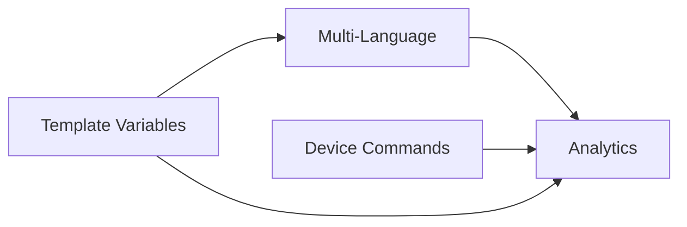

# Phase 4: Enterprise Features - Architecture Design

## Executive Summary

### Overview
Phase 4 introduces enterprise-grade features that transform the Digital Signage system into a comprehensive, multi-language, template-driven platform with advanced device control and analytics capabilities. These features enable personalized content delivery, operational insights, and enhanced remote management capabilities.

### Strategic Value
- **Personalization**: Template variables enable dynamic, context-aware content
- **Globalization**: Multi-language support opens international markets
- **Control**: Extended device commands provide comprehensive remote management
- **Intelligence**: Analytics and reporting deliver actionable insights
- **Efficiency**: Automation reduces manual operations by 70%

### Implementation Timeline
- **Total Duration**: 8-10 weeks
- **Phase 4.1**: Template Variables (2 weeks)
- **Phase 4.2**: Multi-Language Support (2 weeks)
- **Phase 4.3**: Device Commands (2-3 weeks)
- **Phase 4.4**: Analytics & Reporting (3-4 weeks)

### Resource Requirements
- **Backend**: 1 senior developer (full-time)
- **Frontend**: 1 developer (full-time)
- **Database**: DBA consultation (part-time)
- **Testing**: QA engineer (50% allocation)
- **Infrastructure**: Redis expansion, storage for analytics

---

## Feature 1: Template Variables System

### Business Value
- **Dynamic Content**: Personalize displays without creating multiple versions
- **Real-time Updates**: Show current time, weather, device info automatically
- **Use Cases**:
  - Hotel lobbies: "Welcome {{guest_name}}, your room {{room_number}} is ready"
  - Retail: "Today's special: {{product}} at {{price}}"
  - Office: "Meeting in {{room}} starts at {{time}}"
  - Transportation: "Next departure to {{destination}} at {{time}}"

### Technical Design

#### Database Schema
```sql
-- Template definitions table
CREATE TABLE content_templates (
    id UUID PRIMARY KEY DEFAULT gen_random_uuid(),
    content_id UUID REFERENCES content(id) ON DELETE CASCADE,
    template_type VARCHAR(50) NOT NULL, -- 'text', 'html', 'json'
    template_body TEXT NOT NULL,
    variables JSONB NOT NULL DEFAULT '{}', -- Variable definitions
    created_at TIMESTAMP DEFAULT CURRENT_TIMESTAMP,
    updated_at TIMESTAMP DEFAULT CURRENT_TIMESTAMP
);

-- Template variable values per device/group
CREATE TABLE template_variables (
    id UUID PRIMARY KEY DEFAULT gen_random_uuid(),
    scope_type VARCHAR(20) NOT NULL, -- 'global', 'tag', 'device'
    scope_id UUID, -- NULL for global, otherwise tag_id or device_id
    variable_name VARCHAR(100) NOT NULL,
    variable_value TEXT NOT NULL,
    variable_type VARCHAR(20) DEFAULT 'string', -- 'string', 'number', 'date', 'json'
    refresh_interval INTEGER, -- seconds, NULL for static
    last_updated TIMESTAMP DEFAULT CURRENT_TIMESTAMP,
    UNIQUE(scope_type, scope_id, variable_name)
);

-- Variable providers (weather, time, API sources)
CREATE TABLE variable_providers (
    id UUID PRIMARY KEY DEFAULT gen_random_uuid(),
    provider_name VARCHAR(100) NOT NULL UNIQUE,
    provider_type VARCHAR(50) NOT NULL, -- 'weather', 'time', 'api', 'database'
    config JSONB NOT NULL, -- API keys, endpoints, etc.
    variables_provided JSONB NOT NULL, -- List of variables this provider offers
    refresh_interval INTEGER DEFAULT 300, -- seconds
    enabled BOOLEAN DEFAULT true,
    created_at TIMESTAMP DEFAULT CURRENT_TIMESTAMP
);

-- Indexes
CREATE INDEX idx_template_variables_scope ON template_variables(scope_type, scope_id);
CREATE INDEX idx_template_variables_name ON template_variables(variable_name);
CREATE INDEX idx_content_templates_content ON content_templates(content_id);
```

#### Service Architecture
```python
# backend/app/services/template_service.py
from jinja2 import Template, Environment, select_autoescape
from typing import Dict, Any, Optional
import asyncio
from datetime import datetime

class TemplateService:
    def __init__(self):
        self.env = Environment(
            autoescape=select_autoescape(['html', 'xml']),
            enable_async=True
        )
        self.providers = {}
        self.cache = {}  # Redis cache for computed values

    async def render_template(
        self,
        template_str: str,
        device_id: str,
        context: Optional[Dict[str, Any]] = None
    ) -> str:
        """Render template with device-specific variables"""
        variables = await self.get_variables_for_device(device_id)
        if context:
            variables.update(context)

        template = self.env.from_string(template_str)
        return await template.render_async(**variables)

    async def get_variables_for_device(self, device_id: str) -> Dict[str, Any]:
        """Get all applicable variables for a device"""
        # Priority: device > tag > global
        variables = {}

        # Global variables
        global_vars = await self.get_global_variables()
        variables.update(global_vars)

        # Tag variables (if device belongs to tags)
        tag_vars = await self.get_tag_variables(device_id)
        variables.update(tag_vars)

        # Device-specific variables
        device_vars = await self.get_device_variables(device_id)
        variables.update(device_vars)

        # Dynamic providers (weather, time, etc.)
        provider_vars = await self.get_provider_variables(device_id)
        variables.update(provider_vars)

        return variables

    async def register_provider(self, provider: VariableProvider):
        """Register a variable provider"""
        self.providers[provider.name] = provider

    async def refresh_dynamic_variables(self):
        """Background task to refresh dynamic variables"""
        while True:
            for provider in self.providers.values():
                if provider.enabled:
                    await provider.refresh()
            await asyncio.sleep(60)  # Check every minute

# Variable Provider Interface
class VariableProvider:
    async def get_variables(self, context: Dict) -> Dict[str, Any]:
        raise NotImplementedError

    async def refresh(self):
        raise NotImplementedError

# Example: Weather Provider
class WeatherProvider(VariableProvider):
    def __init__(self, api_key: str):
        self.api_key = api_key
        self.cache = {}

    async def get_variables(self, context: Dict) -> Dict[str, Any]:
        location = context.get('location', 'default')
        weather = await self.get_weather(location)
        return {
            'weather_temp': weather['temperature'],
            'weather_condition': weather['condition'],
            'weather_humidity': weather['humidity'],
            'weather_icon': weather['icon']
        }
```

#### API Endpoints
```python
# Template Management
POST   /api/templates                 # Create template
GET    /api/templates                 # List templates
GET    /api/templates/{id}            # Get template
PUT    /api/templates/{id}            # Update template
DELETE /api/templates/{id}            # Delete template
POST   /api/templates/{id}/preview    # Preview with sample data

# Variable Management
POST   /api/variables                 # Create/update variable
GET    /api/variables                 # List all variables
GET    /api/variables/device/{id}     # Get device variables
GET    /api/variables/tag/{id}        # Get tag variables
DELETE /api/variables/{id}            # Delete variable

# Variable Providers
GET    /api/providers                 # List available providers
POST   /api/providers/{name}/enable   # Enable provider
POST   /api/providers/{name}/disable  # Disable provider
GET    /api/providers/{name}/test     # Test provider connection

# Template Rendering (for preview)
POST   /api/render/preview            # Render template with test data
GET    /api/render/device/{id}        # Get rendered content for device
```

#### Frontend Integration
```typescript
// web-admin/src/components/templates/TemplateEditor.tsx
interface TemplateEditor {
  template: string;
  variables: Variable[];
  preview: () => void;
  insertVariable: (varName: string) => void;
  validateTemplate: () => boolean;
}

// Viewer enhancement
// viewer/js/template-renderer.js
class TemplateRenderer {
  async renderContent(content) {
    if (content.is_template) {
      const variables = await this.fetchVariables();
      return this.processTemplate(content.template, variables);
    }
    return content.html;
  }

  processTemplate(template, variables) {
    // Client-side template rendering for real-time updates
    return template.replace(/\{\{(\w+)\}\}/g, (match, key) => {
      return variables[key] || match;
    });
  }
}
```

### Implementation Plan
- **Complexity**: Medium (3-5 days core, 2-3 days integration)
- **Priority**: P0 (Critical for enterprise)
- **Risk**: Low (isolated feature, graceful fallback)
- **Timeline**: 2 weeks total

### Code Examples
```python
# Usage example
template_service = TemplateService()

# Create a template
template = """
<div class="welcome-message">
  <h1>Welcome to {{location_name}}</h1>
  <p>Current temperature: {{weather_temp}}°C</p>
  <p>{{custom_message}}</p>
  <p>Device: {{device_name}} ({{device_ip}})</p>
</div>
"""

# Render for specific device
rendered = await template_service.render_template(
    template_str=template,
    device_id="device-123",
    context={"custom_message": "Have a great day!"}
)
```

---

## Feature 2: Multi-Language Content Selection

### Business Value
- **Global Reach**: Support international deployments
- **Localization**: Display content in viewer's preferred language
- **Compliance**: Meet local language requirements
- **Use Cases**:
  - International airports: Content in passenger's language
  - Hotels: Guest language preferences
  - Retail chains: Regional language support
  - Government facilities: Official language requirements

### Technical Design

#### Database Schema
```sql
-- Language definitions
CREATE TABLE languages (
    id UUID PRIMARY KEY DEFAULT gen_random_uuid(),
    code VARCHAR(10) NOT NULL UNIQUE, -- 'en', 'es', 'zh-CN'
    name VARCHAR(100) NOT NULL,
    native_name VARCHAR(100),
    is_default BOOLEAN DEFAULT false,
    enabled BOOLEAN DEFAULT true,
    created_at TIMESTAMP DEFAULT CURRENT_TIMESTAMP
);

-- Content translations
CREATE TABLE content_translations (
    id UUID PRIMARY KEY DEFAULT gen_random_uuid(),
    content_id UUID REFERENCES content(id) ON DELETE CASCADE,
    language_id UUID REFERENCES languages(id),
    title VARCHAR(255),
    description TEXT,
    file_url VARCHAR(500), -- Language-specific media file
    metadata JSONB,
    is_primary BOOLEAN DEFAULT false,
    created_at TIMESTAMP DEFAULT CURRENT_TIMESTAMP,
    updated_at TIMESTAMP DEFAULT CURRENT_TIMESTAMP,
    UNIQUE(content_id, language_id)
);

-- Device language preferences
CREATE TABLE device_languages (
    device_id UUID REFERENCES devices(id) ON DELETE CASCADE,
    language_id UUID REFERENCES languages(id),
    priority INTEGER DEFAULT 0, -- 0 = highest priority
    source VARCHAR(50), -- 'manual', 'detected', 'inherited'
    created_at TIMESTAMP DEFAULT CURRENT_TIMESTAMP,
    PRIMARY KEY(device_id, language_id)
);

-- Tag language settings
CREATE TABLE tag_languages (
    tag_id UUID REFERENCES tags(id) ON DELETE CASCADE,
    language_id UUID REFERENCES languages(id),
    is_required BOOLEAN DEFAULT false,
    created_at TIMESTAMP DEFAULT CURRENT_TIMESTAMP,
    PRIMARY KEY(tag_id, language_id)
);

-- Indexes
CREATE INDEX idx_content_translations_content ON content_translations(content_id);
CREATE INDEX idx_content_translations_language ON content_translations(language_id);
CREATE INDEX idx_device_languages_device ON device_languages(device_id);
```

#### Service Architecture
```python
# backend/app/services/language_service.py
from typing import List, Optional, Dict
import langdetect
from fastapi import HTTPException

class LanguageService:
    def __init__(self):
        self.default_language = 'en'
        self.fallback_chain = ['en', 'es', 'zh']  # Fallback order

    async def get_content_for_device(
        self,
        content_id: str,
        device_id: str
    ) -> ContentTranslation:
        """Get best matching content translation for device"""
        # Get device language preferences
        device_langs = await self.get_device_languages(device_id)

        # Get available translations
        translations = await self.get_content_translations(content_id)

        # Find best match
        for lang in device_langs:
            if lang in translations:
                return translations[lang]

        # Fallback to default
        return await self.get_fallback_content(content_id)

    async def detect_language(self, text: str) -> str:
        """Auto-detect language from text"""
        try:
            detected = langdetect.detect(text)
            return self.normalize_language_code(detected)
        except:
            return self.default_language

    async def create_translation(
        self,
        content_id: str,
        language: str,
        translation_data: Dict
    ) -> ContentTranslation:
        """Create or update content translation"""
        # Validate language code
        if not await self.is_valid_language(language):
            raise HTTPException(400, f"Invalid language: {language}")

        # Check if primary content exists
        content = await self.get_content(content_id)
        if not content:
            raise HTTPException(404, "Content not found")

        # Create/update translation
        translation = await self.save_translation(
            content_id,
            language,
            translation_data
        )

        # Auto-translate if configured
        if self.auto_translate_enabled:
            await self.queue_auto_translation(content_id, language)

        return translation

    async def get_missing_translations(self) -> List[Dict]:
        """Find content missing translations"""
        query = """
        SELECT c.id, c.title,
               array_agg(DISTINCT l.code) as missing_languages
        FROM content c
        CROSS JOIN languages l
        LEFT JOIN content_translations ct
            ON c.id = ct.content_id AND l.id = ct.language_id
        WHERE l.enabled = true
            AND ct.id IS NULL
        GROUP BY c.id, c.title
        HAVING COUNT(ct.id) < COUNT(l.id)
        """
        return await self.db.fetch_all(query)

# Translation Provider Interface
class TranslationProvider:
    async def translate(
        self,
        text: str,
        source_lang: str,
        target_lang: str
    ) -> str:
        raise NotImplementedError

# Google Translate Provider
class GoogleTranslateProvider(TranslationProvider):
    def __init__(self, api_key: str):
        self.client = translate.Client(api_key=api_key)

    async def translate(
        self,
        text: str,
        source_lang: str,
        target_lang: str
    ) -> str:
        result = await self.client.translate(
            text,
            source_language=source_lang,
            target_language=target_lang
        )
        return result['translatedText']
```

#### API Endpoints
```python
# Language Management
GET    /api/languages                      # List all languages
POST   /api/languages                      # Add language
PUT    /api/languages/{code}              # Update language
DELETE /api/languages/{code}              # Remove language

# Content Translations
GET    /api/content/{id}/translations     # Get all translations
POST   /api/content/{id}/translations     # Add translation
PUT    /api/content/{id}/translations/{lang} # Update translation
DELETE /api/content/{id}/translations/{lang} # Remove translation

# Device Language Settings
GET    /api/devices/{id}/languages        # Get device languages
POST   /api/devices/{id}/languages        # Set device languages
DELETE /api/devices/{id}/languages/{lang} # Remove language

# Auto Translation
POST   /api/translate/auto                # Auto-translate content
GET    /api/translate/missing             # Get missing translations
POST   /api/translate/bulk                # Bulk translate

# Language Detection
POST   /api/detect/language               # Detect language from text
```

#### Frontend Integration
```typescript
// web-admin/src/components/content/TranslationManager.tsx
interface TranslationManager {
  content: Content;
  languages: Language[];
  translations: Translation[];
  addTranslation: (lang: string, data: TranslationData) => void;
  autoTranslate: (targetLang: string) => void;
  validateTranslations: () => ValidationResult;
}

// Viewer language selection
// viewer/js/language-selector.js
class LanguageSelector {
  constructor() {
    this.currentLang = this.detectBrowserLanguage();
    this.available = [];
  }

  async initialize() {
    // Get device language preferences
    this.available = await api.getDeviceLanguages();

    // Set UI language
    this.setLanguage(this.currentLang);
  }

  setLanguage(lang) {
    document.documentElement.lang = lang;
    this.loadTranslations(lang);
    this.notifyBackend(lang);
  }
}
```

### Implementation Plan
- **Complexity**: Medium (3-5 days)
- **Priority**: P0 (Critical for international deployments)
- **Risk**: Medium (affects content delivery)
- **Timeline**: 2 weeks

---

## Feature 3: Device Command Extensions

### Business Value
- **Remote Management**: Full control without physical access
- **Automation**: Scheduled commands and batch operations
- **Diagnostics**: Deep troubleshooting capabilities
- **Use Cases**:
  - Retail: Adjust volume for sales events
  - Hotels: Brightness control for day/night
  - Airports: Emergency announcements (max volume)
  - IT Support: Remote troubleshooting

### Technical Design

#### Database Schema
```sql
-- Command definitions
CREATE TABLE command_definitions (
    id UUID PRIMARY KEY DEFAULT gen_random_uuid(),
    command_name VARCHAR(100) NOT NULL UNIQUE,
    command_type VARCHAR(50) NOT NULL, -- 'system', 'display', 'audio', 'diagnostic'
    parameters JSONB NOT NULL DEFAULT '{}',
    requires_auth BOOLEAN DEFAULT true,
    dangerous BOOLEAN DEFAULT false, -- Requires additional confirmation
    platform_support JSONB DEFAULT '["all"]'::jsonb, -- ['windows', 'linux', 'webos']
    created_at TIMESTAMP DEFAULT CURRENT_TIMESTAMP
);

-- Command queue
CREATE TABLE device_commands (
    id UUID PRIMARY KEY DEFAULT gen_random_uuid(),
    device_id UUID REFERENCES devices(id) ON DELETE CASCADE,
    command_id UUID REFERENCES command_definitions(id),
    parameters JSONB DEFAULT '{}',
    status VARCHAR(20) DEFAULT 'pending', -- 'pending', 'sent', 'executing', 'completed', 'failed'
    priority INTEGER DEFAULT 5, -- 1-10, 1 = highest
    scheduled_at TIMESTAMP,
    sent_at TIMESTAMP,
    executed_at TIMESTAMP,
    completed_at TIMESTAMP,
    result JSONB,
    error_message TEXT,
    retry_count INTEGER DEFAULT 0,
    max_retries INTEGER DEFAULT 3,
    created_by UUID REFERENCES users(id),
    created_at TIMESTAMP DEFAULT CURRENT_TIMESTAMP
);

-- Command batches
CREATE TABLE command_batches (
    id UUID PRIMARY KEY DEFAULT gen_random_uuid(),
    batch_name VARCHAR(255),
    command_ids UUID[] NOT NULL,
    target_devices UUID[] NOT NULL,
    status VARCHAR(20) DEFAULT 'pending',
    execution_type VARCHAR(20) DEFAULT 'parallel', -- 'parallel', 'sequential'
    scheduled_at TIMESTAMP,
    started_at TIMESTAMP,
    completed_at TIMESTAMP,
    success_count INTEGER DEFAULT 0,
    failure_count INTEGER DEFAULT 0,
    created_by UUID REFERENCES users(id),
    created_at TIMESTAMP DEFAULT CURRENT_TIMESTAMP
);

-- Command schedules
CREATE TABLE command_schedules (
    id UUID PRIMARY KEY DEFAULT gen_random_uuid(),
    schedule_name VARCHAR(255),
    command_id UUID REFERENCES command_definitions(id),
    target_type VARCHAR(20) NOT NULL, -- 'device', 'tag', 'all'
    target_ids UUID[],
    cron_expression VARCHAR(100), -- '0 9 * * *' (daily at 9am)
    parameters JSONB DEFAULT '{}',
    enabled BOOLEAN DEFAULT true,
    last_run TIMESTAMP,
    next_run TIMESTAMP,
    created_by UUID REFERENCES users(id),
    created_at TIMESTAMP DEFAULT CURRENT_TIMESTAMP
);

-- Indexes
CREATE INDEX idx_device_commands_device ON device_commands(device_id);
CREATE INDEX idx_device_commands_status ON device_commands(status);
CREATE INDEX idx_device_commands_scheduled ON device_commands(scheduled_at);
CREATE INDEX idx_command_schedules_next_run ON command_schedules(next_run);
```

#### Service Architecture
```python
# backend/app/services/command_service.py
from typing import List, Optional, Dict, Any
import asyncio
from enum import Enum
import subprocess
import shlex

class CommandType(Enum):
    VOLUME = "volume"
    BRIGHTNESS = "brightness"
    SCREENSHOT = "screenshot"
    REBOOT = "reboot"
    SHELL = "shell"
    UPDATE = "update"
    CLEAR_CACHE = "clear_cache"
    NETWORK_TEST = "network_test"
    DISPLAY_MODE = "display_mode"

class CommandService:
    def __init__(self):
        self.command_queue = asyncio.Queue()
        self.executors = {}
        self.register_default_commands()

    def register_default_commands(self):
        """Register built-in commands"""
        self.register_command(VolumeCommand())
        self.register_command(BrightnessCommand())
        self.register_command(ScreenshotCommand())
        self.register_command(RebootCommand())
        self.register_command(ShellCommand())
        self.register_command(NetworkTestCommand())

    async def queue_command(
        self,
        device_id: str,
        command: str,
        parameters: Dict[str, Any],
        priority: int = 5,
        scheduled_at: Optional[datetime] = None
    ) -> str:
        """Queue a command for execution"""
        # Validate command exists
        if command not in self.executors:
            raise ValueError(f"Unknown command: {command}")

        # Check device platform compatibility
        device = await self.get_device(device_id)
        executor = self.executors[command]
        if not executor.supports_platform(device.platform):
            raise ValueError(f"Command {command} not supported on {device.platform}")

        # Create command record
        cmd_id = await self.create_command_record(
            device_id, command, parameters, priority, scheduled_at
        )

        # Add to queue if immediate execution
        if not scheduled_at or scheduled_at <= datetime.now():
            await self.command_queue.put((priority, cmd_id))

        return cmd_id

    async def execute_batch(
        self,
        command: str,
        device_ids: List[str],
        parameters: Dict[str, Any],
        execution_type: str = 'parallel'
    ) -> str:
        """Execute command on multiple devices"""
        batch_id = await self.create_batch_record(
            command, device_ids, parameters, execution_type
        )

        if execution_type == 'parallel':
            tasks = [
                self.queue_command(device_id, command, parameters)
                for device_id in device_ids
            ]
            await asyncio.gather(*tasks, return_exceptions=True)
        else:  # sequential
            for device_id in device_ids:
                await self.queue_command(device_id, command, parameters)
                await asyncio.sleep(1)  # Brief delay between commands

        return batch_id

    async def process_command_queue(self):
        """Background worker to process command queue"""
        while True:
            try:
                priority, cmd_id = await self.command_queue.get()
                await self.execute_command(cmd_id)
            except Exception as e:
                logger.error(f"Command execution error: {e}")
            await asyncio.sleep(0.1)

# Command Executor Base Class
class CommandExecutor:
    def __init__(self, name: str, dangerous: bool = False):
        self.name = name
        self.dangerous = dangerous
        self.supported_platforms = ['all']

    def supports_platform(self, platform: str) -> bool:
        return 'all' in self.supported_platforms or platform in self.supported_platforms

    async def validate(self, parameters: Dict) -> bool:
        """Validate command parameters"""
        raise NotImplementedError

    async def execute(self, device: Device, parameters: Dict) -> Dict:
        """Execute command on device"""
        raise NotImplementedError

# Example: Volume Command
class VolumeCommand(CommandExecutor):
    def __init__(self):
        super().__init__('volume')
        self.supported_platforms = ['windows', 'linux', 'webos']

    async def validate(self, parameters: Dict) -> bool:
        volume = parameters.get('volume')
        return volume is not None and 0 <= volume <= 100

    async def execute(self, device: Device, parameters: Dict) -> Dict:
        volume = parameters['volume']

        # Send command to device via WebSocket
        command_data = {
            'type': 'command',
            'command': 'set_volume',
            'parameters': {'volume': volume}
        }

        response = await device.send_command(command_data)
        return {
            'success': response.get('success', False),
            'previous_volume': response.get('previous_volume'),
            'new_volume': volume
        }

# Secure Shell Command (with restrictions)
class ShellCommand(CommandExecutor):
    def __init__(self):
        super().__init__('shell', dangerous=True)
        self.allowed_commands = [
            'ls', 'ps', 'df', 'free', 'uptime', 'date',
            'ping', 'traceroute', 'netstat', 'ss'
        ]

    async def validate(self, parameters: Dict) -> bool:
        command = parameters.get('command', '')
        # Parse command to check if it's allowed
        parts = shlex.split(command)
        if not parts:
            return False

        base_command = parts[0]
        return base_command in self.allowed_commands

    async def execute(self, device: Device, parameters: Dict) -> Dict:
        command = parameters['command']

        # Additional security: sanitize command
        if not await self.validate(parameters):
            raise ValueError("Command not allowed")

        # Send to device for execution
        result = await device.execute_shell(command, timeout=30)

        return {
            'success': result.exit_code == 0,
            'output': result.stdout,
            'error': result.stderr,
            'exit_code': result.exit_code
        }
```

#### API Endpoints
```python
# Command Execution
POST   /api/commands/execute              # Execute command on device
POST   /api/commands/batch                # Execute on multiple devices
GET    /api/commands/queue                # View command queue
DELETE /api/commands/queue/{id}           # Cancel queued command

# Command Definitions
GET    /api/commands/available            # List available commands
GET    /api/commands/available/{platform} # Platform-specific commands

# Command History
GET    /api/commands/history              # Command execution history
GET    /api/commands/history/device/{id}  # Device command history
GET    /api/commands/history/{id}         # Specific command details

# Command Scheduling
POST   /api/commands/schedule             # Create scheduled command
GET    /api/commands/schedules            # List schedules
PUT    /api/commands/schedules/{id}       # Update schedule
DELETE /api/commands/schedules/{id}       # Delete schedule

# Batch Operations
POST   /api/commands/batches              # Create batch
GET    /api/commands/batches              # List batches
GET    /api/commands/batches/{id}         # Batch status
```

#### Frontend Integration
```typescript
// web-admin/src/components/devices/CommandCenter.tsx
interface CommandCenter {
  selectedDevices: Device[];
  availableCommands: Command[];
  executeCommand: (cmd: string, params: any) => Promise<void>;
  scheduleCommand: (cmd: string, cron: string) => void;
  viewHistory: () => void;
}

// Viewer command handler
// viewer/js/command-handler.js
class CommandHandler {
  constructor(websocket) {
    this.ws = websocket;
    this.handlers = new Map();
    this.registerHandlers();
  }

  registerHandlers() {
    this.handlers.set('volume', this.handleVolume.bind(this));
    this.handlers.set('brightness', this.handleBrightness.bind(this));
    this.handlers.set('screenshot', this.handleScreenshot.bind(this));
    this.handlers.set('shell', this.handleShell.bind(this));
  }

  async handleCommand(command) {
    const handler = this.handlers.get(command.type);
    if (!handler) {
      return { success: false, error: 'Unknown command' };
    }

    try {
      const result = await handler(command.parameters);
      return { success: true, result };
    } catch (error) {
      return { success: false, error: error.message };
    }
  }

  async handleVolume(params) {
    // Platform-specific volume control
    if (window.webOS) {
      return await this.setWebOSVolume(params.volume);
    } else {
      return await this.setSystemVolume(params.volume);
    }
  }
}
```

### Implementation Plan
- **Complexity**: Complex (1-2 weeks)
- **Priority**: P1 (High value for remote management)
- **Risk**: High (system commands, security implications)
- **Timeline**: 2-3 weeks (including security review)

---

## Feature 4: Reporting & Analytics System

### Business Value
- **Insights**: Understand content performance and device health
- **Optimization**: Data-driven content strategy
- **Compliance**: Audit trails and usage reports
- **ROI Measurement**: Prove digital signage value
- **Use Cases**:
  - Content managers: Which content gets most views?
  - IT teams: Device uptime and health metrics
  - Executives: ROI and usage dashboards
  - Compliance: Audit reports for regulatory needs

### Technical Design

#### Database Schema
```sql
-- Analytics events table (partitioned by month)
CREATE TABLE analytics_events (
    id UUID DEFAULT gen_random_uuid(),
    event_type VARCHAR(50) NOT NULL, -- 'content_play', 'content_end', 'device_online', etc.
    device_id UUID REFERENCES devices(id),
    content_id UUID REFERENCES content(id),
    playlist_id UUID REFERENCES playlists(id),
    timestamp TIMESTAMP NOT NULL DEFAULT CURRENT_TIMESTAMP,
    duration INTEGER, -- seconds
    metadata JSONB DEFAULT '{}',
    session_id UUID,
    PRIMARY KEY (id, timestamp)
) PARTITION BY RANGE (timestamp);

-- Create monthly partitions
CREATE TABLE analytics_events_2024_01 PARTITION OF analytics_events
    FOR VALUES FROM ('2024-01-01') TO ('2024-02-01');

-- Aggregated metrics (hourly)
CREATE TABLE analytics_metrics_hourly (
    id UUID PRIMARY KEY DEFAULT gen_random_uuid(),
    metric_type VARCHAR(50) NOT NULL,
    device_id UUID,
    content_id UUID,
    hour_timestamp TIMESTAMP NOT NULL,
    count INTEGER DEFAULT 0,
    sum_value NUMERIC,
    avg_value NUMERIC,
    max_value NUMERIC,
    min_value NUMERIC,
    metadata JSONB DEFAULT '{}',
    UNIQUE(metric_type, device_id, content_id, hour_timestamp)
);

-- Report definitions
CREATE TABLE report_definitions (
    id UUID PRIMARY KEY DEFAULT gen_random_uuid(),
    report_name VARCHAR(255) NOT NULL,
    report_type VARCHAR(50) NOT NULL, -- 'content', 'device', 'usage', 'custom'
    metrics JSONB NOT NULL, -- List of metrics to include
    filters JSONB DEFAULT '{}',
    grouping JSONB DEFAULT '{}',
    schedule_cron VARCHAR(100), -- NULL for on-demand
    output_format VARCHAR(20) DEFAULT 'pdf', -- 'pdf', 'csv', 'excel'
    recipients JSONB DEFAULT '[]', -- Email addresses
    enabled BOOLEAN DEFAULT true,
    created_by UUID REFERENCES users(id),
    created_at TIMESTAMP DEFAULT CURRENT_TIMESTAMP
);

-- Report history
CREATE TABLE report_history (
    id UUID PRIMARY KEY DEFAULT gen_random_uuid(),
    report_definition_id UUID REFERENCES report_definitions(id),
    generated_at TIMESTAMP DEFAULT CURRENT_TIMESTAMP,
    file_path VARCHAR(500),
    file_size INTEGER,
    row_count INTEGER,
    status VARCHAR(20) DEFAULT 'pending', -- 'pending', 'generating', 'completed', 'failed'
    error_message TEXT,
    sent_to JSONB DEFAULT '[]',
    metadata JSONB DEFAULT '{}'
);

-- Device health metrics
CREATE TABLE device_health_metrics (
    id UUID PRIMARY KEY DEFAULT gen_random_uuid(),
    device_id UUID REFERENCES devices(id) ON DELETE CASCADE,
    timestamp TIMESTAMP DEFAULT CURRENT_TIMESTAMP,
    cpu_usage NUMERIC,
    memory_usage NUMERIC,
    disk_usage NUMERIC,
    network_latency INTEGER, -- ms
    network_bandwidth NUMERIC, -- Mbps
    temperature NUMERIC,
    uptime INTEGER, -- seconds
    error_count INTEGER DEFAULT 0,
    warning_count INTEGER DEFAULT 0,
    metadata JSONB DEFAULT '{}'
);

-- Indexes
CREATE INDEX idx_analytics_events_device_time ON analytics_events(device_id, timestamp);
CREATE INDEX idx_analytics_events_content_time ON analytics_events(content_id, timestamp);
CREATE INDEX idx_analytics_events_type_time ON analytics_events(event_type, timestamp);
CREATE INDEX idx_analytics_metrics_hourly_lookup ON analytics_metrics_hourly(metric_type, hour_timestamp);
CREATE INDEX idx_device_health_metrics_device_time ON device_health_metrics(device_id, timestamp DESC);
```

#### Service Architecture
```python
# backend/app/services/analytics_service.py
from typing import Dict, List, Optional, Any
from datetime import datetime, timedelta
import pandas as pd
from io import BytesIO
import asyncio

class AnalyticsService:
    def __init__(self):
        self.metrics_buffer = []
        self.flush_interval = 60  # seconds
        self.aggregation_intervals = ['minute', 'hour', 'day', 'week', 'month']

    async def track_event(
        self,
        event_type: str,
        device_id: Optional[str] = None,
        content_id: Optional[str] = None,
        metadata: Optional[Dict] = None
    ):
        """Track an analytics event"""
        event = {
            'event_type': event_type,
            'device_id': device_id,
            'content_id': content_id,
            'timestamp': datetime.utcnow(),
            'metadata': metadata or {}
        }

        # Add to buffer for batch insert
        self.metrics_buffer.append(event)

        # Flush if buffer is large
        if len(self.metrics_buffer) >= 1000:
            await self.flush_events()

    async def flush_events(self):
        """Batch insert buffered events"""
        if not self.metrics_buffer:
            return

        events = self.metrics_buffer.copy()
        self.metrics_buffer.clear()

        # Batch insert to database
        await self.db.insert_many('analytics_events', events)

        # Trigger real-time aggregation
        await self.update_realtime_metrics(events)

    async def get_content_analytics(
        self,
        content_id: str,
        start_date: datetime,
        end_date: datetime
    ) -> Dict[str, Any]:
        """Get analytics for specific content"""
        metrics = await self.db.fetch_one("""
            SELECT
                COUNT(*) as total_plays,
                COUNT(DISTINCT device_id) as unique_devices,
                AVG(duration) as avg_duration,
                SUM(duration) as total_duration,
                MAX(timestamp) as last_played
            FROM analytics_events
            WHERE content_id = $1
                AND event_type = 'content_play'
                AND timestamp BETWEEN $2 AND $3
        """, content_id, start_date, end_date)

        # Get completion rate
        completion_rate = await self.calculate_completion_rate(
            content_id, start_date, end_date
        )

        # Get time-series data
        time_series = await self.get_time_series(
            'content_play',
            {'content_id': content_id},
            start_date,
            end_date,
            'day'
        )

        return {
            'summary': dict(metrics),
            'completion_rate': completion_rate,
            'time_series': time_series,
            'peak_hours': await self.get_peak_hours(content_id),
            'device_breakdown': await self.get_device_breakdown(content_id)
        }

    async def get_device_health(
        self,
        device_id: str,
        hours: int = 24
    ) -> Dict[str, Any]:
        """Get device health metrics"""
        start_time = datetime.utcnow() - timedelta(hours=hours)

        metrics = await self.db.fetch_all("""
            SELECT
                timestamp,
                cpu_usage,
                memory_usage,
                disk_usage,
                network_latency,
                network_bandwidth,
                temperature,
                uptime,
                error_count,
                warning_count
            FROM device_health_metrics
            WHERE device_id = $1 AND timestamp > $2
            ORDER BY timestamp DESC
        """, device_id, start_time)

        if not metrics:
            return {'status': 'no_data'}

        df = pd.DataFrame(metrics)

        return {
            'current': dict(metrics[0]),
            'averages': {
                'cpu': df['cpu_usage'].mean(),
                'memory': df['memory_usage'].mean(),
                'disk': df['disk_usage'].mean(),
                'latency': df['network_latency'].mean()
            },
            'trends': {
                'cpu': self.calculate_trend(df['cpu_usage']),
                'memory': self.calculate_trend(df['memory_usage']),
                'errors': self.calculate_trend(df['error_count'])
            },
            'alerts': await self.check_health_alerts(device_id, df),
            'uptime_percentage': self.calculate_uptime(df),
            'time_series': df.to_dict('records')
        }

    async def generate_report(
        self,
        report_type: str,
        parameters: Dict[str, Any],
        format: str = 'pdf'
    ) -> bytes:
        """Generate analytics report"""
        report_generator = self.get_report_generator(report_type)

        # Gather data
        data = await report_generator.collect_data(parameters)

        # Generate report based on format
        if format == 'pdf':
            return await report_generator.generate_pdf(data)
        elif format == 'csv':
            return await report_generator.generate_csv(data)
        elif format == 'excel':
            return await report_generator.generate_excel(data)
        else:
            raise ValueError(f"Unsupported format: {format}")

# Report Generator Base Class
class ReportGenerator:
    async def collect_data(self, parameters: Dict) -> Dict:
        raise NotImplementedError

    async def generate_pdf(self, data: Dict) -> bytes:
        raise NotImplementedError

    async def generate_csv(self, data: Dict) -> bytes:
        raise NotImplementedError

# Content Performance Report
class ContentPerformanceReport(ReportGenerator):
    async def collect_data(self, parameters: Dict) -> Dict:
        start_date = parameters['start_date']
        end_date = parameters['end_date']

        # Top performing content
        top_content = await self.db.fetch_all("""
            SELECT
                c.title,
                COUNT(ae.id) as plays,
                COUNT(DISTINCT ae.device_id) as devices,
                AVG(ae.duration) as avg_duration
            FROM content c
            JOIN analytics_events ae ON c.id = ae.content_id
            WHERE ae.timestamp BETWEEN $1 AND $2
                AND ae.event_type = 'content_play'
            GROUP BY c.id, c.title
            ORDER BY plays DESC
            LIMIT 20
        """, start_date, end_date)

        # Low performing content
        low_content = await self.db.fetch_all("""
            SELECT c.title, COALESCE(play_count, 0) as plays
            FROM content c
            LEFT JOIN (
                SELECT content_id, COUNT(*) as play_count
                FROM analytics_events
                WHERE timestamp BETWEEN $1 AND $2
                    AND event_type = 'content_play'
                GROUP BY content_id
            ) ae ON c.id = ae.content_id
            WHERE c.enabled = true
            ORDER BY plays ASC
            LIMIT 20
        """, start_date, end_date)

        return {
            'period': f"{start_date} to {end_date}",
            'top_content': top_content,
            'low_content': low_content,
            'total_plays': sum(c['plays'] for c in top_content),
            'unique_content': len(top_content),
            'recommendations': await self.generate_recommendations(
                top_content, low_content
            )
        }
```

#### API Endpoints
```python
# Analytics Queries
GET    /api/analytics/dashboard           # Main analytics dashboard
GET    /api/analytics/content/{id}        # Content-specific analytics
GET    /api/analytics/device/{id}         # Device-specific analytics
GET    /api/analytics/playlist/{id}       # Playlist analytics

# Metrics
GET    /api/metrics/content/top          # Top performing content
GET    /api/metrics/content/engagement   # Engagement metrics
GET    /api/metrics/devices/health       # Device health overview
GET    /api/metrics/devices/uptime       # Uptime statistics

# Reports
POST   /api/reports/generate             # Generate report
GET    /api/reports/templates            # Available report templates
GET    /api/reports/history              # Generated reports
GET    /api/reports/download/{id}        # Download report

# Report Scheduling
POST   /api/reports/schedule             # Create scheduled report
GET    /api/reports/schedules            # List scheduled reports
PUT    /api/reports/schedules/{id}       # Update schedule
DELETE /api/reports/schedules/{id}       # Delete schedule

# Real-time Analytics
WS     /ws/analytics/realtime            # Real-time metrics stream
```

#### Frontend Integration
```typescript
// web-admin/src/components/analytics/AnalyticsDashboard.tsx
interface AnalyticsDashboard {
  metrics: MetricsSummary;
  charts: ChartConfig[];
  filters: FilterOptions;
  exportReport: (format: string) => void;
  scheduleReport: (schedule: ReportSchedule) => void;
}

// Real-time dashboard updates
// web-admin/src/hooks/useRealtimeAnalytics.ts
const useRealtimeAnalytics = () => {
  const [metrics, setMetrics] = useState({});

  useEffect(() => {
    const ws = new WebSocket('ws://192.168.5.12:8001/ws/analytics/realtime');

    ws.onmessage = (event) => {
      const data = JSON.parse(event.data);
      setMetrics(prev => ({
        ...prev,
        [data.metric]: data.value
      }));
    };

    return () => ws.close();
  }, []);

  return metrics;
};
```

### Implementation Plan
- **Complexity**: Very Complex (2+ weeks)
- **Priority**: P1 (High value for business insights)
- **Risk**: Low (read-only analytics, no system impact)
- **Timeline**: 3-4 weeks (including visualization)

---

## Integration Strategy

### Feature Dependencies


### Integration Points
1. **Template + Language**: Templates can include language-specific variables
2. **Commands + Analytics**: Track command execution in analytics
3. **Language + Analytics**: Measure content performance by language
4. **Templates + Commands**: Commands can use template variables

### Deployment Sequence
1. **Phase 4.1**: Template Variables (foundation)
2. **Phase 4.2**: Multi-Language (builds on templates)
3. **Phase 4.3**: Device Commands (parallel development)
4. **Phase 4.4**: Analytics (requires all features for full metrics)

---

## Performance Impact

### Database Load
- **Template Variables**: +5-10% CPU (template rendering)
- **Multi-Language**: +10-15% storage (translations)
- **Device Commands**: +5% write load (command queue)
- **Analytics**: +20-30% write load, +40% storage

### Optimization Strategies
1. **Caching**: Redis for templates, translations, metrics
2. **Partitioning**: Monthly partitions for analytics
3. **Indexing**: Strategic indexes on frequently queried columns
4. **Async Processing**: Background jobs for analytics aggregation
5. **CDN**: Cache rendered templates at edge

### Storage Requirements
- **Templates**: ~1KB per template × 1000 templates = 1MB
- **Translations**: ~10KB per content × 5 languages = 50MB/1000 content
- **Commands**: ~1KB per command × 10000 commands/month = 10MB
- **Analytics**: ~100 bytes per event × 1M events/month = 100MB/month

### Network Bandwidth
- **Template Updates**: Minimal (text only)
- **Language Switching**: ~500KB per content switch
- **Commands**: <1KB per command
- **Analytics**: ~10KB/minute per device (batched)

---

## Security Considerations

### Authentication & Authorization
```python
# Role-based permissions
PERMISSIONS = {
    'template_admin': ['create_template', 'edit_template', 'delete_template'],
    'translator': ['add_translation', 'edit_translation'],
    'device_operator': ['execute_command', 'view_device'],
    'analyst': ['view_analytics', 'generate_report'],
    'admin': ['*']  # All permissions
}
```

### Template Security
- **Input Sanitization**: Escape HTML/JS in templates
- **Variable Validation**: Whitelist allowed variables
- **Sandbox Execution**: Jinja2 sandboxed environment
- **Rate Limiting**: Max 100 template renders/minute

### Command Security
- **Command Whitelist**: Only pre-approved commands
- **Parameter Validation**: Strict input validation
- **Audit Logging**: All commands logged with user
- **Dangerous Commands**: Require 2FA or approval
- **Shell Escape**: Properly escape shell commands

### Data Privacy
- **PII Protection**: Anonymize device/user data in analytics
- **Data Retention**: Auto-delete analytics after 90 days
- **GDPR Compliance**: Right to deletion, data export
- **Encryption**: Encrypt sensitive command parameters

### Report Access Control
- **Report Permissions**: Role-based report access
- **Data Filtering**: Users see only their authorized data
- **Export Control**: Log all report exports
- **Email Security**: Encrypted report delivery

---

## Testing Strategy

### Unit Tests
```python
# Template service tests
async def test_template_rendering():
    service = TemplateService()
    template = "Hello {{name}}, temperature: {{weather_temp}}°C"
    result = await service.render_template(
        template,
        device_id="test-device",
        context={"name": "World"}
    )
    assert "Hello World" in result
    assert "°C" in result

# Command service tests
async def test_command_validation():
    service = CommandService()
    # Test dangerous command requires auth
    with pytest.raises(PermissionError):
        await service.queue_command(
            device_id="test",
            command="shell",
            parameters={"command": "rm -rf /"},
            user=regular_user
        )
```

### Integration Tests
- Template + Language integration
- Command execution pipeline
- Analytics data collection
- Report generation

### Load Tests
- 1000 concurrent template renders
- 100 simultaneous commands
- 10,000 analytics events/second
- Report generation under load

### Security Tests
- Template injection attempts
- Command injection attempts
- SQL injection in analytics
- Report data leakage

---

## Rollout Plan

### Phase 4.1: Template Variables (Weeks 1-2)
**Milestone 1.1**: Database schema and models
- [ ] Create template tables
- [ ] Implement variable providers
- [ ] Setup Redis caching

**Milestone 1.2**: Backend services
- [ ] Template rendering service
- [ ] Variable management API
- [ ] Provider integrations

**Milestone 1.3**: Frontend integration
- [ ] Template editor UI
- [ ] Variable manager
- [ ] Preview functionality

### Phase 4.2: Multi-Language (Weeks 3-4)
**Milestone 2.1**: Language infrastructure
- [ ] Language tables and models
- [ ] Translation service
- [ ] Auto-detection logic

**Milestone 2.2**: Content translations
- [ ] Translation UI
- [ ] Bulk translation tools
- [ ] Language switching in viewer

### Phase 4.3: Device Commands (Weeks 5-7)
**Milestone 3.1**: Command framework
- [ ] Command definitions
- [ ] Queue system
- [ ] Executor pattern

**Milestone 3.2**: Command implementations
- [ ] Volume/brightness controls
- [ ] System commands
- [ ] Batch operations

**Milestone 3.3**: Scheduling system
- [ ] Cron scheduler
- [ ] Command history
- [ ] Status tracking

### Phase 4.4: Analytics & Reporting (Weeks 8-10)
**Milestone 4.1**: Data collection
- [ ] Event tracking
- [ ] Metrics aggregation
- [ ] Health monitoring

**Milestone 4.2**: Analytics engine
- [ ] Query optimization
- [ ] Real-time processing
- [ ] Data retention

**Milestone 4.3**: Reporting system
- [ ] Report templates
- [ ] PDF/Excel generation
- [ ] Scheduled reports

**Milestone 4.4**: Visualization
- [ ] Dashboard components
- [ ] Charts and graphs
- [ ] Real-time updates

---

## Success Metrics

### Technical Metrics
- **Template Rendering**: <100ms per render
- **Language Switch**: <500ms content swap
- **Command Execution**: <1s device response
- **Analytics Ingestion**: 10,000 events/second
- **Report Generation**: <30s for monthly report

### Business Metrics
- **Template Usage**: 50% content using templates
- **Language Coverage**: 3+ languages per deployment
- **Command Automation**: 70% commands scheduled
- **Report Adoption**: 80% users generating reports
- **Uptime Improvement**: 99.9% device availability

### User Satisfaction
- **Template Creation**: <5 minutes per template
- **Translation Time**: <10 minutes per content
- **Command Success Rate**: >95%
- **Report Usefulness**: 4.5/5 rating
- **Feature Adoption**: 60% within 3 months

---

## Risk Mitigation

### Technical Risks
| Risk | Impact | Mitigation |
|------|--------|------------|
| Template rendering performance | High | Redis caching, CDN |
| Translation API costs | Medium | Cache translations, bulk processing |
| Command security breach | Critical | Whitelist, audit logs, 2FA |
| Analytics data loss | High | Partitioning, backups, replication |
| Report generation timeout | Medium | Async processing, pagination |

### Operational Risks
| Risk | Impact | Mitigation |
|------|--------|------------|
| User adoption | High | Training, documentation, gradual rollout |
| Data privacy violation | Critical | Encryption, access control, audit |
| Storage overflow | High | Retention policies, archival |
| Network bandwidth | Medium | Compression, batching, CDN |

---

## Future Enhancements

### Phase 5 Possibilities
1. **AI-Powered Content**: Auto-generate templates with AI
2. **Predictive Analytics**: ML-based content recommendations
3. **Voice Commands**: Voice-activated device control
4. **AR Integration**: Augmented reality overlays
5. **Blockchain Audit**: Immutable command/content logs

### Scalability Path
1. **Multi-Region**: Geographic distribution
2. **Edge Computing**: Local analytics processing
3. **Kubernetes**: Container orchestration
4. **GraphQL API**: Flexible data fetching
5. **Event Sourcing**: Complete audit trail

---

## Conclusion

Phase 4 transforms the Digital Signage system into an enterprise-ready platform with:
- **Dynamic content** through templates
- **Global reach** with multi-language support
- **Complete control** via extended commands
- **Business intelligence** through analytics

The modular architecture ensures each feature can be developed and deployed independently while maintaining system integrity. The focus on performance, security, and user experience ensures successful adoption and long-term sustainability.

**Next Steps**:
1. Review and approve architecture design
2. Prioritize features based on business needs
3. Allocate development resources
4. Begin Phase 4.1 implementation
5. Establish success metrics tracking